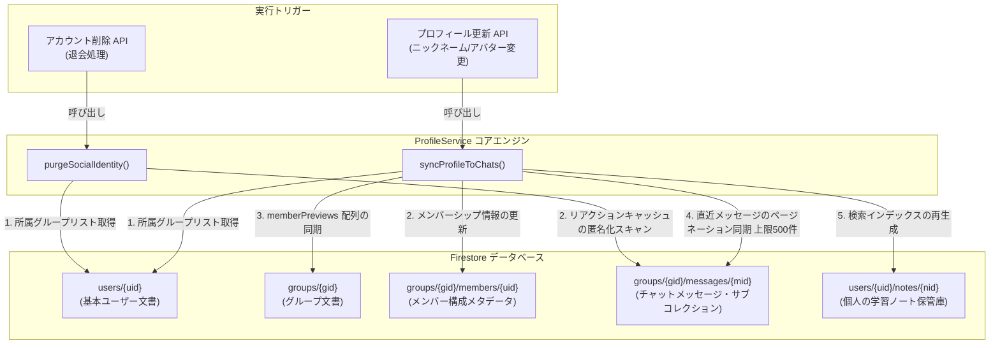

# ユーザープロフィール同期 & アカウント削除パイプライン — 詳細設計ガイド

## 概要

**scripture-habit** におけるユーザープロフィールの同期およびアカウント削除処理は、サーバーレスの調整クラスである **`ProfileService`** ([`profile-service.ts`](../../../scripture-habit/api_internal/services/profile-service.ts)) によって一元管理されています。このサービスは、ユーザーがニックネームやアバターを変更した際に、変更内容を安全かつ低コストでシステム全体に伝播させる役割を担うと同時に、アカウント削除（退会）時に過去のグループ会話スレッドを壊すことなく、個人の識別情報（PII: 個人を特定できる情報）を安全に消去する役割を果たします。

システムは、高速バッチ書き込み、ページネーションカーソル、および局所的な検索インデックスの再構築プロセスを採用することで、Firestore の読み書きコストを最小限に抑え、大規模なグループチャット内でのパフォーマンスボトルネックを防いでいます。



---

## 1. プロフィール同期エンジン (`syncProfileToChats`)

ユーザーがニックネームやアバター写真を変更した際、グループ内の全メッセージ履歴を無条件で書き換えると、膨大なドキュメント読み書きが発生してコストがかさみ、処理速度も低下します。これを回避するため、このエンジンは厳格な **「アクティブ・ホライズン（活動範囲の境界）」** ポリシーを適用しています。

### 1.1 同期範囲の制限 & 一括バッチ処理

同期処理の範囲とトランザクションは以下のように制御されています。
- **範囲制限**: 同期スキャナーは、ユーザーが参加している各グループの**直近 500 件のメッセージ**のみを処理対象とします。これにより、古い履歴に無駄なデータベース処理を発生させることなく、現在進行形のチャット画面における整合性を担保します。
- **バッチ処理のしきい値**: Firestore の一括バッチ（Batch Write）を使用し、**450操作ごと**に分割してコミットします。これにより、Firestore の制限である「1トランザクションにつき500操作まで」を安全に下回るようにしています。
- **ページネーションによるカーソルクエリ**: メモリ使用量を抑えるため、**100メッセージ**ずつのセグメントに分け、カーソル（`startAfter`）を用いて順次取得します。

```typescript
let messagesProcessed = 0;
let lastMsgDoc = null;
const MAX_MESSAGES_PER_GROUP = 500; 

while (messagesProcessed < MAX_MESSAGES_PER_GROUP) {
    let query = db.collection('groups').doc(gid).collection('messages')
        .where('senderId', '==', uid)
        .orderBy('createdAt', 'desc')
        .limit(100);
    
    if (lastMsgDoc) {
        query = query.startAfter(lastMsgDoc);
    }

    const messagesSnap = await query.get();
    if (messagesSnap.empty) break;

    for (const mDoc of messagesSnap.docs) {
        // バッチ処理への追加とコミット...
    }
    
    messagesProcessed += messagesSnap.size;
    lastMsgDoc = messagesSnap.docs[messagesSnap.size - 1];
}
```

### 1.2 複数エンティティの動的同期

プロフィール変更時、システムは Firestore 内のいくつかの異なるドキュメントを同期します。

#### A. グループメンバーシップ文書の更新
グループ内のメンバー固有ドキュメント (`groups/{gid}/members/{uid}`) を即座に更新します。
```typescript
const memberUpdate: Record<string, string | undefined> = {};
if (updates.nickname) memberUpdate.nickname = updates.nickname;
if (updates.photoURL) memberUpdate.photoURL = updates.photoURL;

if (Object.keys(memberUpdate).length > 0) {
    currentBatch.set(gSnap.ref.collection('members').doc(uid), memberUpdate, { merge: true });
    currentBatchSize++;
}
```

#### B. グループドキュメント側のプレビュー (`memberPreviews`)
グループ画面などで、メンバーサブコレクションを毎度フェッチせずに一覧表示できるよう、グループの親ドキュメント内にプレビュー用のキャッシュ配列が保持されています。変更されたプロフィール情報をこのキャッシュにも動的に反映します。
```typescript
const previews = gData.memberPreviews || [];
const userIdx = previews.findIndex((p: MemberPreview) => p.uid === uid);
if (userIdx !== -1) {
    const newPreviews = [...previews];
    if (updates.nickname) newPreviews[userIdx].nickname = updates.nickname;
    if (updates.photoURL) newPreviews[userIdx].photoURL = updates.photoURL;
    groupUpdates.memberPreviews = newPreviews;
}
```

#### C. 直近アクティビティ履歴の同期
該当ユーザーが「最後にノートを投稿した人」または「最後にメッセージを送信した人」である場合、グループ文書のサマリーフィールドに保持されている古いニックネームを書き換えます。
```typescript
if (updates.nickname && gData.lastNoteByUid === uid) {
    groupUpdates.lastNoteByNickname = updates.nickname;
}
if (updates.nickname && gData.lastMessageByUid === uid) {
    groupUpdates.lastMessageByNickname = updates.nickname;
}
```

#### D. メッセージ上のリアクションプレビュー情報の書き換え
メッセージについたリアクション（絵文字）をアバター付きで高速表示するために、各メッセージ文書に `reactionPreviews` が保持されています。同期エンジンは、直近メッセージ内のプレビューキャッシュから該当ユーザーの `uid` を探し出し、ニックネームとアバター情報をピンポイントで書き換え、他ユーザーの情報を壊さないようにします。

```typescript
if (mData.reactionPreviews) {
    const rp = { ...mData.reactionPreviews };
    let rpChanged = false;
    for (const emoji of Object.keys(rp)) {
        const previews = (rp[emoji] || []) as ReactionPreview[];
        const myIdx = previews.findIndex(p => p.uid === uid);
        if (myIdx !== -1) {
            if (updates.nickname) previews[myIdx].nickname = updates.nickname;
            if (updates.photoURL) previews[myIdx].photoURL = updates.photoURL;
            rp[emoji] = previews;
            rpChanged = true;
        }
    }
    if (rpChanged) msgUpdate.reactionPreviews = rp;
}
```

---

## 2. 検索インデックスの自動再構築

各ユーザーの学習ノート（Study Note）には、リアルタイムオートコンプリート検索（発表者名での部分一致検索など）を実現するために、`searchTokens` という前方一致用のインデックス文字配列が用意されています。

ユーザーがニックネームを変更した際、インデックス検索が壊れないよう、過去に書いたすべての学習ノートのトークン配列が自動で再計算され更新されます。

```typescript
const updatedTokens = buildNoteSearchTokens({
    scripture: nData.scripture || '',
    chapter:   nData.chapter || '',
    comment:   nData.comment || '',
    title:     nData.title || '',
    speaker:   updates.nickname  // 同期された最新の名前をインデックスに挿入
});

currentBatch.update(nDoc.ref, {
    speaker: updates.nickname,
    searchTokens: updatedTokens
});
```

---

## 3. 個人情報の匿名化処理 (`purgeSocialIdentity`)

プライバシー法（GDPR等）に従い、ユーザーがアカウントを削除（退会）した際には個人を特定できるデータを速やかにデータベースから抹消する必要があります。しかし、そのユーザーが過去に送信したメッセージフキダシや付与したリアクションスタンプまで完全にドキュメントごと削除してしまうと、グループチャットの会話スレッドが虫食い状態になり、前後の文脈が読めなくなってしまいます。

この問題を解決するため、システムは **「ソーシャル匿名化パイプライン」** を採用しています。会話の流れをそのまま維持した状態で、個人のアイデンティティ情報のみを汎用的なプレースホルダーに置き換えます。

```
[アクティブなメッセージ上のリアクションプレビュー]
  リアクション情報: { uid: "user_999", nickname: "山田 太郎", photoUrl: "https://taro.jpg" }
                       │
                       ▼ (アカウント削除コールバックのトリガー)
  リアクション情報: { uid: "user_999", nickname: "...", photoUrl: "" }
```

`purgeSocialIdentity` が呼び出されると以下のプロセスを実行します。
1. **所属先の特定**: 削除対象のユーザープロフィールから、参加していたグループID一覧を抽出します。
2. **チャットログのスキャン**: それらのグループのメッセージサブコレクションを100文書単位でループ走査します。
3. **プレビュー情報のクリーンアップ**: メッセージのリアクションプレビュー内に削除ユーザーの `uid` が見つかった場合、その部分の個人データを以下のように書き換えます。
   - `nickname` を汎用的な伏字記号（`"..."`）に置き換える。
   - `photoURL`（アバター画像URL）を空文字列（`""`）にクリアする。
4. **スタンプ総数の維持**: スタンプの合計カウントは変化しません。また、同じユーザーが再度同一スタンプを二重に押せないようにするため、内部的な `reactions[emoji]` の UID 配列内には値が残されますが、一般公開されるニックネームや画像のプロフィール情報からは完全に個人情報が剥奪されます。

```typescript
for (const mDoc of recentMsgs.docs) {
    const mData = mDoc.data() as MessageDocument;
    if (mData.reactionPreviews) {
        const rp = { ...mData.reactionPreviews };
        let rpChanged = false;

        for (const emoji of Object.keys(rp)) {
            const previews = (rp[emoji] || []) as ReactionPreview[];
            const myIdx = previews.findIndex(p => p.uid === uid);
            if (myIdx !== -1) {
                previews[myIdx].nickname = '...';  // 名前を伏字に変更
                previews[myIdx].photoURL = '';     // 画像URLをクリア
                rp[emoji] = previews;
                rpChanged = true;
            }
        }

        if (rpChanged) {
            batch.update(mDoc.ref, { reactionPreviews: rp });
            hasChanges = true;
            opsInBatch++;
        }
    }
}
```

このアプローチにより、高いプライバシー遵守（データ削除権の履行）と、既存のコミュニティ内の健全な会話履歴の保存という二つの相反する要件を、低い Firestore 操作コストでスマートに解決しています。
