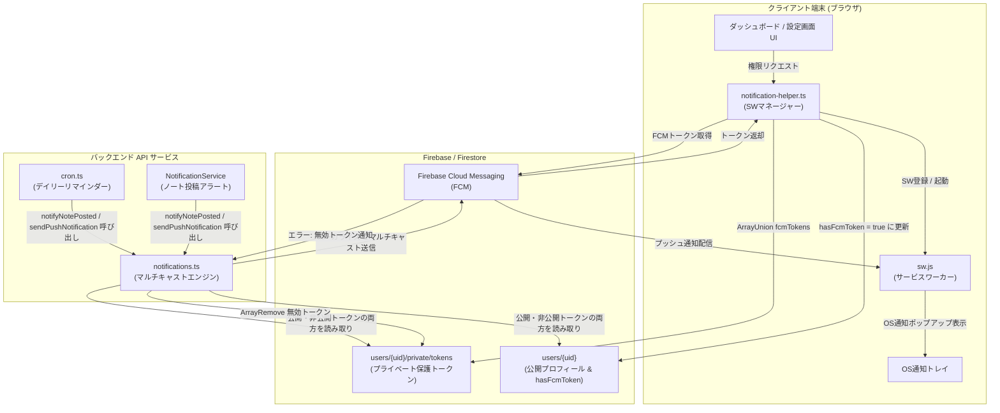
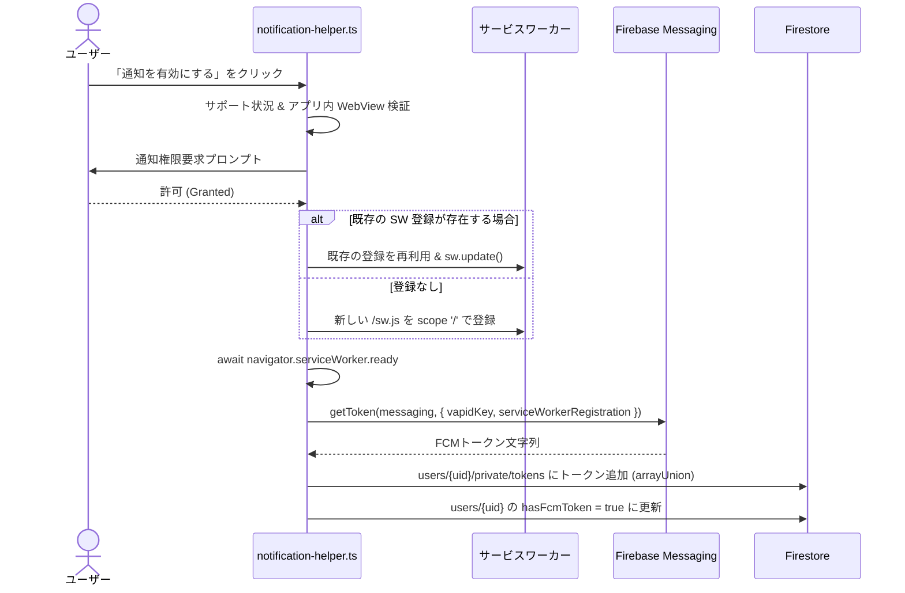
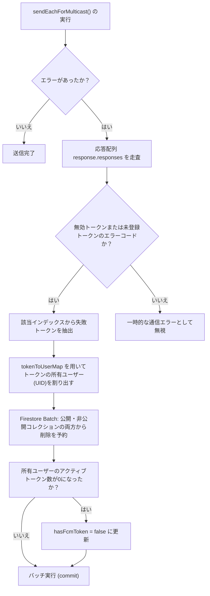

# プッシュ通知システム — 詳細設計ガイド

## 概要

**scripture-habit** のプッシュ通知システムは、Firebase Cloud Messaging (FCM) を基盤とした、セキュアでタイムゾーン対応かつ多言語対応の配信エンジンです。デイリー学習のリマインダー、継続（ストリーク）の警告、そしてグループメンバー間での学習ノート共有時のリアルタイム通知を届けることで、ユーザーのエンゲージメントと習慣化を強力にサポートします。

システムは主に2つのレイヤーで構成されています。フロントエンド側では権限要求、サービスワーカー（Service Worker）のライフサイクル、OS通知トレイの整理を管理し、バックエンド側ではローカライズ配信、500トークン制限に伴うチャンク分割、無効なトークンの自己修復クリーンアップ処理といった堅牢なマルチキャスト配信エンジンを提供します。



---

## 1. フロントエンドのトークン・ライフサイクル & サービスワーカー管理

プッシュ通知 API に関連するクライアント側の処理はすべて、[`notification-helper.ts`](../../scripture-habit/src/utils/notification-helper.ts) で制御されています。

### 1.1 ブラウザサポートの検証とアプリ内ブラウザ（WebView）ガード

ネイティブの通知権限プロンプトを表示する前に、ヘルパーはブラウザがプッシュ通知をサポートしているかを評価し、サンドボックス環境で制限されているユーザーに対して適切な案内を行います。

- **ブラウザ機能チェック**: グローバル名前空間内で `'serviceWorker'`, `'Notification'`, `'PushManager'` の存在を確認します。
- **アプリ内 WebView 検出**: LINE、Facebook、Instagram、Telegram などのアプリ内 WebView シグネチャをユーザーエージェント文字列から検出します。これらのプラットフォームの WebView はバックエンドのプッシュ登録をブロックすることが多いため、トースト通知を表示し、SafariやChromeなどの標準ブラウザで開き直すよう案内します。

```typescript
const isInAppBrowser = (): boolean => {
    const ua = window.navigator.userAgent || window.navigator.vendor || (window as any).opera || '';
    return (ua.indexOf('FBAN') > -1) || (ua.indexOf('FBAV') > -1) ||
           (ua.indexOf('Instagram') > -1) || (ua.indexOf('Line') > -1) ||
           (ua.indexOf('Twitter') > -1) || (ua.indexOf('Telegram') > -1);
};
```

### 1.2 権限要求 & 2層の Firestore トークン登録

ブラウザが通知に対応しており、ユーザーが `Notification.requestPermission()` で権限を許可した場合、ヘルパーはサービスワーカーの登録とトークンの保存を行います。



```typescript
// 1. サービスワーカーの初期化と準備完了待機
let registration: ServiceWorkerRegistration;
const existingRegs = await navigator.serviceWorker.getRegistrations();
const ourReg = existingRegs.find(r => r.scope.includes(window.location.host));

if (ourReg) {
    registration = ourReg;
    await registration.update();
} else {
    registration = await navigator.serviceWorker.register('/sw.js', { scope: '/' });
}
await navigator.serviceWorker.ready;

// 2. サービスワーカーに関連付けられた VAPID キーを使用してトークンを取得
const token = await getToken(messaging, {
    vapidKey: VAPID_KEY,
    serviceWorkerRegistration: registration
});
```

セキュリティとクエリパフォーマンスを両立するため、トークンは2つの場所に保存されます。
1. **プライベート・トークン・ボルト** (`users/{uid}/private/tokens`): Firestore セキュリティルールによって、認証された所有者本人のみが読み書きできるように制限されたサブコレクション内のドキュメントです。第三者やグループメンバーによってデバイスの登録トークンが盗まれるのを防止します。
2. **公開ステータスフラグ** (`users/{uid}/hasFcmToken`): ユーザーの公開プロフィールドキュメントにあるシンプルな boolean フィールドです。これにより、バックエンドのデイリー cron リマインダーなどが、セキュリティで保護されたサブコレクションをいちいち全件検索することなく、インデックススキャンのみで安価に対象ユーザーを特定できます。

### 1.3 フラグ同期の自己修復機能 (`syncFcmTokenFlag`)

ブラウザ側で既に通知許可が与えられているにもかかわらず、データベース側のフラグが欠落している場合（DB移行やテスト環境のリセット後など）、クライアントアプリの起動時にバックグラウンドで自己修復処理が走ります。

```typescript
export const syncFcmTokenFlag = async (userId: string | null | undefined, currentFlagStatus?: boolean): Promise<void> => {
    if (!userId) return;
    if (!('serviceWorker' in navigator) || !('Notification' in window) || !('PushManager' in window)) return;
    
    // Only proceed if permission is already granted natively
    if (Notification.permission === 'granted') {
        try {
            const registration = await navigator.serviceWorker.getRegistration();
            if (registration && messaging) {
                const token = await getToken(messaging, {
                    vapidKey: VAPID_KEY,
                    serviceWorkerRegistration: registration
                });
                
                if (token) {
                    // Verify if this token is actually registered in the database
                    const privateRef = doc(db, 'users', userId, 'private', 'tokens');
                    const privateSnap = await getDoc(privateRef);
                    const existingTokens: string[] = privateSnap.exists() ? (privateSnap.data()?.fcmTokens || []) : [];
                    
                    const isTokenRegistered = existingTokens.includes(token);
                    
                    if (!isTokenRegistered || currentFlagStatus !== true) {
                        console.log('[NotificationHelper] Token not registered or flag mismatch. Syncing...');
                        
                        await setDoc(privateRef, {
                            fcmTokens: arrayUnion(token)
                        }, { merge: true });
                        
                        const userRef = doc(db, 'users', userId);
                        await updateDoc(userRef, {
                            hasFcmToken: true
                        });
                        console.log('[NotificationHelper] Successfully healed missing/expired FCM token flag and registered token for user.');
                    }
                }
            }
        } catch (e) {
            console.warn('[NotificationHelper] Failed to sync FCM token flag', e);
        }
    }
};
```

---

## 2. 通知トレイの動的なクリーンアップ管理

ユーザーの通知トレイを不要なアラートで溢れさせないために、システムは表示中のプッシュ通知を状況に応じてコード側から削除します。

### 2.1 アプリ起動時のストリーク警告の消去

デイリー学習リマインダーや継続（ストリーク）が途切れる警告は、ユーザーがアプリを開いた瞬間に不要になります（すでにアプリを開いて聖書を読もうとしているため）。

```typescript
export const clearAllNotifications = async (): Promise<void> => {
    if (!('serviceWorker' in navigator)) return;
    try {
        const registration = await navigator.serviceWorker.getRegistration();
        if (registration) {
            const notifications = await registration.getNotifications();
            let clearedCount = 0;
            notifications.forEach(notification => {
                // ストリーク警告通知（streak_reminder）のみを閉じる（チャット通知は残す）
                if (notification.data?.type === 'streak_reminder') {
                    notification.close();
                    clearedCount++;
                }
            });
        }
    } catch (e) {
        console.warn('[NotificationHelper] 通知のクリーンアップに失敗しました', e);
    }
};
```

### 2.2 グループチャット画面に入った時のグループ通知の消去

ユーザーが特定のグループチャット画面を開いたとき、ロック画面やシステムトレイにそのグループの新着メッセージ通知が残っているのは煩わしいものです。しかし、関係のない他グループの通知まで一律で消してしまってはいけません。

```typescript
export const clearGroupNotifications = async (groupId: string): Promise<void> => {
    if (!('serviceWorker' in navigator) || !groupId) return;
    try {
        const registration = await navigator.serviceWorker.getRegistration();
        if (registration) {
            const notifications = await registration.getNotifications();
            notifications.forEach(notification => {
                // 開いたグループID（groupId）と一致する通知のみを選択的に閉じる
                if (notification.data?.groupId === groupId) {
                    notification.close();
                }
            });
        }
    } catch (e) {
        console.warn(`[NotificationHelper] グループ ${groupId} の通知消去に失敗しました`, e);
    }
};
```

---

## 3. バックエンドのマルチキャスト送信アーキテクチャ

イベント（ノートの投稿など）が発生すると、バックエンドは [`notifications.ts`](../../scripture-habit/api_internal/lib/notifications.ts) を呼び出してターゲットユーザーを割り出し、言語をローカライズした上でプッシュ通知をマルチキャストします。

### 3.1 公開と非公開トークンプールの結合解決

通知送信時、システムは下位互換性を担保しつつ、公開プロフィール内の `fcmTokens` 配列と、新しい非公開サブコレクション `private/tokens` 内の配列の両方をフェッチし、重複のないように結合したトークンリストを作ります。

```typescript
export async function getUserFcmTokensAndLanguage(uid: string): Promise<{ tokens: string[], language?: string }> {
    const tokens: string[] = [];
    const userDoc = await db.collection('users').doc(uid).get();
    const userData = userDoc.data();
    let language: string | undefined;
    if (userDoc.exists && userData) {
        language = userData.language;
        if (userData.fcmTokens) {
            tokens.push(...(userData.fcmTokens as string[]));
        }
    }
    const privateDoc = await db.collection('users').doc(uid).collection('private').doc('tokens').get();
    const privateData = privateDoc.data();
    if (privateDoc.exists && privateData && privateData.fcmTokens) {
        tokens.push(...(privateData.fcmTokens as string[]));
    }
    return { tokens: [...new Set(tokens)], language };
}
```

### 3.2 500トークンごとのチャンク分割と並行配信

Firebase Cloud Messaging は、1回のマルチキャストリクエストで送信できるデバイストークン数が **最大500個** に制限されています。そのため、送信エンジンはリストをチャンクに細分化して送信します。

```typescript
const CHUNK_SIZE = 500;
for (let i = 0; i < uniqueTokens.length; i += CHUNK_SIZE) {
    const chunk = uniqueTokens.slice(i, i + CHUNK_SIZE);
    const message = {
        notification: {
            title: payload.title,
            body: payload.body,
        },
        data: {
            title: payload.title,
            body: payload.body,
            ...(payload.data || {}),
        },
        tokens: chunk,
    };
    
    // sendEachForMulticast メソッドは、チャンク内の各トークンの個別成功/失敗ステータスを報告します
    const response = await messaging.sendEachForMulticast(message);
    totalSuccess += response.successCount;
    totalFailure += response.failureCount;
}
```

### 3.3 言語に応じた動的ローカライズ配信

同じグループでもメンバーのシステム言語は異なる場合があります。バックエンドの送信処理では、メンバーを言語別にグルーピングし、言語に応じた i18n 辞書（ロケールカタログ）から対応するメッセージテンプレートを引っ張ってきて動的にメッセージを構築します。

```typescript
const tokensByLang = new Map<string, string[]>();

memberDocs.forEach((uDoc, idx) => {
    const userData = uDoc.data();
    const lang = (userData?.language || 'en').split('-')[0].toLowerCase();
    
    if (!tokensByLang.has(lang)) tokensByLang.set(lang, []);
    const langTokens = tokensByLang.get(lang)!;
    
    // 公開/非公開トークンを言語別のプールに格納...
});

for (const [lang, langTokens] of tokensByLang.entries()) {
    if (langTokens.length === 0) continue;

    // 言語キーに応じたテキスト辞書引き (i18n の t メソッドを使用)
    const resolvedTitle = payload.titleKey ? t(lang, payload.titleKey) : payload.title;
    const resolvedBody = payload.bodyKey ? t(lang, payload.bodyKey, payload.bodyReplacements) : payload.body;

    const payloadWithLang = {
        title: resolvedTitle,
        body: resolvedBody,
        data: { ...(payload.data || {}), lang }
    };

    await sendPushNotification(langTokens, payloadWithLang);
}
```

---

## 4. トークンの自己修復と自動クリーンアップサイクル

アンインストールされたアプリや、古くなって無効化されたデバイストークンがデータベースに残っていると、送信効率が落ち、不要な API エラーが増加します。そのため、配信エンジンには自動的にデッドトークンを排除するクローズドループが搭載されています。



マルチキャスト送信の結果判定時に以下のクリーンアップ処理が行われます。
1. **エラーコードの判別**: `response.failureCount > 0` の場合、返ってきた個別の送信結果をスキャンします。
2. **無効デバイスの特定**: エラー理由が「無効なトークン（`messaging/invalid-registration-token`）」や「未登録トークン（`messaging/registration-token-not-registered`）」である場合、該当デバイスからアプリが消去されたと判断します。
3. **Firestore バッチ削除**: `tokenToUserMap` と `tokenSourceMap` を参照してトークンの所有者を割り出し、公開コレクション `users/{uid}` と非公開のトークン保管用ドキュメントの両方から、そのトークンをアトミックに削除（`FieldValue.arrayRemove`）します。
4. **公開ステータスフラグの自動修復**: ユーザーに紐づくすべてのデバイストークンが失敗し、有効なトークン数が0になった場合、公開プロフィールドキュメントの `hasFcmToken` フラグを `false` に更新して、無駄な配信スキャンを防止します。

```typescript
if (failedTokens.length > 0) {
    const batch = db.batch();
    failedTokens.forEach(t => {
        const uid = tokenToUserMap.get(t);
        const source = tokenSourceMap.get(t);
        if (uid) {
            const targetRef = source === 'private'
                ? db.collection('users').doc(uid).collection('private').doc('tokens')
                : db.collection('users').doc(uid);
            batch.update(targetRef, { fcmTokens: admin.firestore.FieldValue.arrayRemove(t) });

            // ユーザーのアクティブなトークン残数を追跡し、0になったら hasFcmToken を false に更新
            const activeTokensSet = userActiveTokens.get(uid);
            if (activeTokensSet) {
                activeTokensSet.delete(t);
                if (activeTokensSet.size === 0) {
                    batch.update(db.collection('users').doc(uid), {
                        hasFcmToken: false
                    });
                }
            }
        }
    });
    await batch.commit();
}
```

### 4.1 独立したトークンクリーンアップ関数 (`cleanupTokens`)

配信プロセス以外（他のAPIルートやバッチ処理など）で失敗トークンを個別にクリーンアップするための独立したユーティリティ関数 `cleanupTokens` も提供されています。この関数でも、残トークンが0になった場合に `hasFcmToken = false` を設定する自己修復が行われます。

```typescript
export async function cleanupTokens(uid: string, failedTokens: string[]) {
    if (!failedTokens.length) return;
    const batch = db.batch();
    const userRef = db.collection('users').doc(uid);
    const privateRef = userRef.collection('private').doc('tokens');

    // クリーンアップ後の残存トークンをチェック
    const { tokens } = await getUserFcmTokensAndLanguage(uid);
    const remainingTokens = tokens.filter(t => !failedTokens.includes(t));

    failedTokens.forEach(token => {
        batch.update(userRef, { fcmTokens: admin.firestore.FieldValue.arrayRemove(token) });
        batch.update(privateRef, { fcmTokens: admin.firestore.FieldValue.arrayRemove(token) });
    });

    if (remainingTokens.length === 0) {
        batch.update(userRef, { hasFcmToken: false });
    }

    await batch.commit();
}
```

この処理のおかげで、余計なデータベースメンテナンスを行うことなく、常にアクティブで有効なデバイストークンだけが自動的に残り続け、プッシュ通知の高い到達率と高速な配信パフォーマンスが担保されています。
