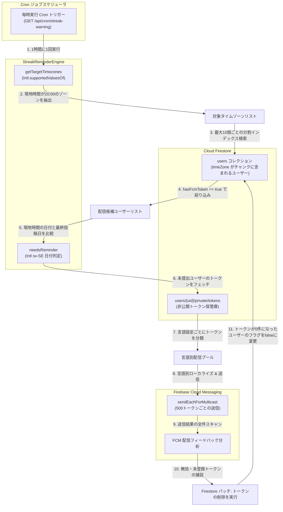

# タイムゾーン対応ストリーク自動リマインダー設計 — 詳細設計ガイド

## 概要

**scripture-habit** のデイリー学習ルーティンは、聖書を読んでノートを共有する「ストリーク（継続日数）」機能によって強力に維持されています。ユーザーが世界各地の異なるタイムゾーンに分散しているため、通知は単一の UTC 時刻で一斉送信するのではなく、ユーザーの現地時間で正確に **夜の8:00（20:00）** に届ける必要があります。

このタイムゾーン対応リマインダーシステムは、[`cron.ts`](../../scripture-habit/api_internal/routes/cron.ts) 内の `/api/streak-warning` エンドポイントおよび時間計算ユーティリティ **`StreakReminderEngine`** ([`streak-reminder.ts`](../../scripture-habit/api_internal/lib/streak-reminder.ts)) によって制御されています。Node.js / ブラウザ標準の Internationalization (Intl) API、Firestore のインデックス上限を回避する分割クエリ、およびプッシュ通知の失敗結果から自動的にデッドトークンを排除する自己修復ループが活用されています。



---

## 1. 高精度なタイムゾーン評価 & 現地時間マッピング

タイムゾーンを手動で静的なオフセット値（UTC+9 など）としてデータベースに保持すると、サマータイム（Daylight Saving Time）の開始・終了時に通知時間が1時間ズレてしまいます。これを防ぐため、`StreakReminderEngine` は実行環境のネイティブな国際化（Intl） API を用いて動的に現地時間を計算します。

### 1.1 配信対象タイムゾーンの特定 (`getTargetTimezones`)
毎時の Cron ジョブ実行時、スケジューラはシステムがサポートするすべての標準タイムゾーンリストを `Intl.supportedValuesOf('timeZone')` から取得します。そして、それぞれのゾーンが現在「夜の20時」を迎えているかを評価します。

```typescript
static getTargetTimezones(now: Date, targetHour: number): string[] {
    // 1. システムがサポートする全標準タイムゾーンを取得
    const allTimezones = (Intl as any).supportedValuesOf('timeZone') as string[];
    const targetZones: string[] = [];

    for (const tz of allTimezones) {
        try {
            // 2. 指定タイムゾーン用の24時間表示フォーマッタをインスタンス化
            const formatter = new Intl.DateTimeFormat('en-US', {
                timeZone: tz,
                hour: 'numeric',
                hour12: false, // 24時間表記を強制
            });
            
            const hourStr = formatter.format(now);
            let hour = parseInt(hourStr, 10);
            
            // 3. 例外補正: Intl API は深夜0時を 24 と返却することがあるため 0 に正規化
            if (hour === 24) hour = 0; 

            // 4. 指定時刻と一致するか確認
            if (hour === targetHour) {
                targetZones.push(tz);
            }
        } catch {
            // 無効または認識できないタイムゾーンは静かにスキップ
        }
    }
    return targetZones;
}
```

これにより、手動でオフセットテーブルを管理することなく、サマータイムも自動考慮された天文学的に正確な現地時間判定が行われます。

### 1.2 現地時間基準での活動提出判定 (`needsReminder`)
ユーザーが「今日すでにノートを投稿したか」を判定するには、現在のシステム基準時間（UTC）をユーザーのローカルな「日付」に直して比較する必要があります。エンジンはスウェーデン表記（`sv-SE`）を指定して日付をフォーマットすることで、自動的に標準的な `YYYY-MM-DD` 形式の文字列を生成し、ユーザーの最終投稿日と比較します。

```typescript
static needsReminder(lastPostDate: string | null | undefined, now: Date, timeZone: string): boolean {
    let today: string;
    try {
        // スウェーデンロケールを用いて YYYY-MM-DD 形式の日付文字列を生成
        const formatter = new Intl.DateTimeFormat('sv-SE', { 
            timeZone: timeZone, 
            year: 'numeric', 
            month: '2-digit', 
            day: '2-digit' 
        });
        today = formatter.format(now);
    } catch {
        today = now.toISOString().split('T')[0]; // パース失敗時は標準UTCでフォールバック
    }

    // ユーザーの最終投稿日が現地時間の本日と一致しているなら、今日のタスクは完了済み
    if (lastPostDate === today) {
        return false;
    }

    return true; // 未投稿のためリマインダーが必要
}
```

---

## 2. 制限を回避する分割クエリ

Firestore の `in` オペレーターを用いたクエリは、**最大10個の値**しか配列に渡せない制限があります。夜の20時を迎えるタイムゾーンの数が10を超えることは珍しくないため、Cronジョブ側でリストを10要素ごとのチャンクに分割し、並行してクエリを発火させます。

```typescript
const MAX_TIMEZONES_PER_QUERY = 10;
const eligibleUsers: { id: string, data: admin.firestore.DocumentData }[] = [];

// タイムゾーンリストを10要素ずつの配列に分割
for (let i = 0; i < targetTimezones.length; i += MAX_TIMEZONES_PER_QUERY) {
    const tzChunk = targetTimezones.slice(i, i + MAX_TIMEZONES_PER_QUERY);
    
    // 分割されたタイムゾーン群に対してクエリを実行
    const snapshot = await db.collection('users')
        .where('timeZone', 'in', tzChunk)
        .get();

    snapshot.forEach(doc => {
        const data = doc.data();
        // 公開ステータスフラグが true のユーザーのみを収集（通知OFFのユーザーは無駄に読まない）
        if (data.hasFcmToken === true) {
            eligibleUsers.push({ id: doc.id, data });
        }
    });
}
```

`hasFcmToken === true` というインデックス用の公開フラグだけで絞り込みを行うことで、通知を無効化しているユーザーのプライベートサブコレクション（トークン保管庫）を無駄に読み取ることなく、Firestore の Read コストを劇的に節約しています。

---

## 3. 言語別のローライズ一括配信

配信対象ユーザーが確定すると、次は彼らの言語設定（`language`）ごとにグループ化されます。これにより、言語に対応するバックエンド locale 辞書から正しい翻訳テキストを引き出して、多言語プッシュを一括送信（Multicast）します。

```typescript
// トークンを言語別に格納するマップ
const tokensByLang: Record<string, { token: string, uid: string }[]> = {};

for (const user of eligibleUsers) {
    const { data } = user;
    const needsReminder = StreakReminderEngine.needsReminder(data.lastPostDate, now, data.timeZone);
    
    if (needsReminder) {
        // 非公開サブコレクションからデバイストークンをロード
        const tokensDoc = await db.collection('users').doc(user.id).collection('private').doc('tokens').get();
        const fcmTokens = tokensDoc.data()?.fcmTokens || [];

        if (fcmTokens.length === 0) continue;

        const lang = data.language || 'en';
        if (!tokensByLang[lang]) tokensByLang[lang] = [];

        for (const token of fcmTokens) {
            tokensByLang[lang].push({ token, uid: user.id });
        }
    }
}
```

---

## 4. デッドトークンの自己修復自動排除サイクル

スマートフォンの機種変更やアプリのアンインストールにより、無効になったデバイストークンがデータベースに残ったままになると、配信スループットが低下し無駄な API エラーが増加します。配信エンジンは送信時のエラーフィードバックをスキャンし、不要になったデッドトークンを Firestore から自動的に削除する自己修復システムを備えています。

```typescript
// 言語別に 500 トークン単位 (FCM制限) にチャンク化してマルチキャスト送信
for (const [lang, allTokensToSend] of Object.entries(tokensByLang)) {
    if (allTokensToSend.length === 0) continue;

    const title = t(lang, 'notifications.streak_warning_title');
    const body = t(lang, 'notifications.streak_warning_body');

    for (let i = 0; i < allTokensToSend.length; i += 500) {
        const chunkMapping = allTokensToSend.slice(i, i + 500);
        const chunk = chunkMapping.map(tk => tk.token);

        const message = {
            notification: { title, body },
            data: { type: 'streak_reminder' },
            tokens: chunk
        };

        const response = await messaging.sendEachForMulticast(message);

        if (response.failureCount > 0) {
            for (let idx = 0; idx < response.responses.length; idx++) {
                const resp = response.responses[idx];
                if (!resp.success) {
                    const errorString = resp.error?.code;
                    // デバイスからアプリが削除されている等の恒久的な無効エラーを検知
                    if (errorString === 'messaging/invalid-registration-token' ||
                        errorString === 'messaging/registration-token-not-registered') {
                        
                        const invalidToken = chunk[idx];
                        const uid = chunkMapping[idx].uid;
                        
                        // バッチ処理に削除タスクを追加
                        batch.update(db.collection('users').doc(uid).collection('private').doc('tokens'), {
                            fcmTokens: admin.firestore.FieldValue.arrayRemove(invalidToken)
                        });
                        batchOpCount++;

                        // メモリ上でこのユーザーに紐づくトークンの残り個数を確認
                        const activeTokensSet = userActiveTokens.get(uid);
                        if (activeTokensSet) {
                            activeTokensSet.delete(invalidToken);
                            if (activeTokensSet.size === 0) {
                                // 自己修復: 有効なトークンがゼロになった場合、公開hasFcmTokenフラグをfalseにして次回から検索除外
                                batch.update(db.collection('users').doc(uid), {
                                    hasFcmToken: false
                                });
                                batchOpCount++;
                            }
                        }

                        if (batchOpCount >= 400) {
                            await batch.commit();
                            batch = db.batch();
                            batchOpCount = 0;
                        }
                    }
                }
            }
        }
    }
}
```

このアプローチにより、手動でトークンクリーニング用の複雑なメンテナンスタスクを組むことなく、常に有効なトークンのみが確実に残り続け、配信の高速性とデータベースクエリの省コスト性が高度に自動維持されています。
