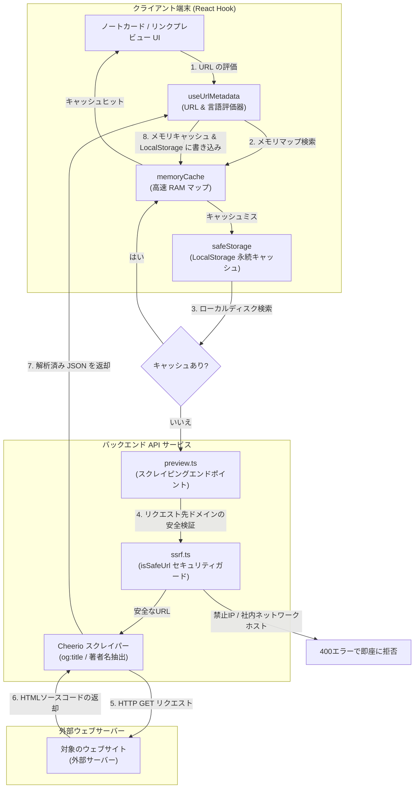
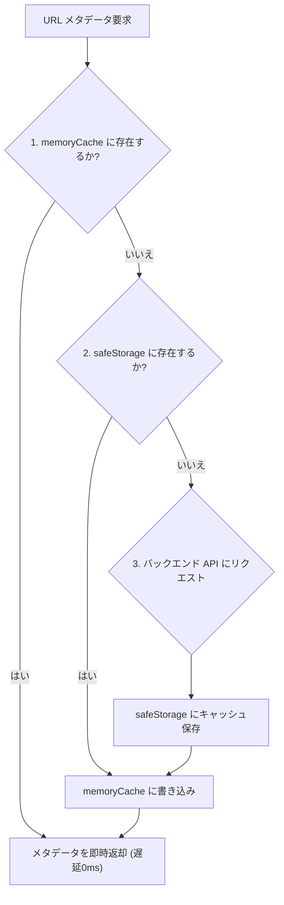

# URL メタデータ抽出 & 発表者自動解析システム — 詳細設計ガイド

## 概要

ユーザーが聖書ノートにYouTube動画、教会の説教記事、ブログなどの外部リンクを添付した際、アプリケーションは自動的にそのURLを解析し、タイトル、概要、サムネイル画像、発言者名（Speaker）などのメタデータを抽出します。このプロセスを極めて高速かつセキュア、そして低負荷で実行するために、**scripture-habit** は強力なバックエンド・スクレイピング・サーバーと、フロントエンド側の **2階層キャッシュパイプライン** を備えています。

この仕組みは、クライアント側の React フック **`useUrlMetadata`** ([`use-url-metadata.ts`](../../scripture-habit/src/hooks/use-url-metadata.ts)) と、サーバーサイドの Express ルーターである **`preview.ts`** ([`preview.ts`](../../scripture-habit/api_internal/routes/preview.ts)) によって共同制御されています。インフラへの踏み台攻撃を防ぐための SSRF（Server-Side Request Forgery）保護フィルターや、言語のローカライズ失敗時に備えたデュアルフェッチ（Dual-Fetch）フォールバック処理を搭載しています。



---

## 1. フロントエンドの2階層キャッシュパイプライン

アプリが描画されるたびに外部のスクレイピングAPIを呼び出すと、大量の不要な通信が発生し、ネットワークのレイテンシーによってUIの表示が遅れてしまいます。これを防止するため、クライアント側には厳格な **2階層キャッシュ（Two-Tier Caching）** が構築されています。

### 1.1 インメモリキャッシュ（第1階層）
最上位レイヤーとして、永続化されないグローバルな JavaScript オブジェクト（RAM）に、読み込まれたメタデータを保持します。
```typescript
const memoryCache: Record<string, UrlMetadata> = {};
```
RAM 上からの読み出しとなるため、同じURLが画面上に複数レンダリングされたり、再描画が発生したりしても、**遅延 0ms（瞬時）** でデータを即座に取得でき、ディスクI/Oすら発生しません。

### 1.2 ローカルストレージキャッシュ（第2階層）
メモリ上にキャッシュが存在しない場合、フックはディスクに裏打ちされた `safeStorage`（JSON パースエラーによるクラッシュ防止機能を備えた LocalStorage ヘルパー）を検索します。
```typescript
const cached = safeStorage.get<UrlMetadata>(cacheKey);
if (cached) {
    memoryCache[cacheKey] = cached; // 次回読み出しのためにメモリキャッシュにコピー
    setData(cached);
    return;
}
```

### 1.3 キャッシュ検索の優先フロー
`useUrlMetadata` フックが読み込まれた際の検索の優先順位は以下の通りです。



---

## 2. サーバーサイド踏み台攻撃（SSRF）防止フィルター

もしバックエンドのスクレイパーサーバーが、クライアントから送られてきた任意のURLを何も検証せずにそのままフェッチ（取得）しにいってしまうと、悪意あるユーザーによってサーバー自身の内部ネットワークの走査や、ローカルで動いている別サービス（例：`http://localhost:8080` や AWS のメタデータエンドポイント `http://169.254.169.254`）への不正リクエストに悪用される危険性があります。これを **SSRF（Server-Side Request Forgery）** 脆弱性と呼びます。

サーバーインフラを保護するため、**scripture-habit** はすべての外部リクエストを事前に安全フィルター **`isSafeUrl`** ([`ssrf.ts`](../../scripture-habit/api_internal/lib/ssrf.ts)) に通して検証します。

```typescript
export function isSafeUrl(urlStr: string): boolean {
    try {
        const parsedUrl = new URL(urlStr);
        // 1. プロトコルは http および https のみに強制制限
        if (parsedUrl.protocol !== 'http:' && parsedUrl.protocol !== 'https:') return false;

        let hostname = parsedUrl.hostname.toLowerCase();
        if (hostname.startsWith('[') && hostname.endsWith(']')) {
            hostname = hostname.slice(1, -1); // IPv6の角括弧を除去
        }

        // 2. プライベートIP、ローカルホスト、クラウドメタデータサーバー等の禁止リスト
        const blockedPatterns: (string | RegExp)[] = [
            'localhost',
            '::1',
            /^127\./,                                      // ループバック IPv4
            /^169\.254\./,                                  // リンクローカル / クラウドメタデータ
            /^10\./,                                        // プライベート RFC 1918 クラスA
            /^172\.(1[6-9]|2[0-9]|3[0-1])\./,               // プライベート RFC 1918 クラスB
            /^192\.168\./,                                  // プライベート RFC 1918 クラスC
            /^fe80:/,                                       // IPv6 リンクローカル
            /^fc00:/,                                       // IPv6 ユニークローカルユニキャスト
            /^fd00:/,                                       // IPv6 プライベートユニークローカル
            /\.internal$/,                                  // 社内用内部DNSドメイン
            /\.local$/                                      // ローカルネットワーク用ドメイン
        ];

        // 3. ホスト名が禁止パターンに該当するか検証
        return !blockedPatterns.some(pattern => {
            if (typeof pattern === 'string') return hostname === pattern;
            return pattern.test(hostname);
        });
    } catch {
        return false; // パースできない不正なURLは安全のためすべてブロック
    }
}
```

禁止されたプライベートネットワーク帯に該当するURLは即座に弾かれ、API側から `400 Bad Request` エラーが返されるため、内部インフラに対する踏み台調査やポートスキャンを未然に鉄壁にガードしています。

---

## 3. デュアルフェッチ（Dual-Fetch）フォールバックと言語マッピング

聖書や説教記事などを教会の公式サイトから取得する場合、ユーザーの言語に応じてコンテンツがローカライズされます。システムは、フロントエンドが保持している2文字のアプリ言語コードを、教会サイトの3文字の言語パラメータへ自動的にマッピングします。

```typescript
const LANGUAGE_MAP: Record<string, string> = {
  'en': 'eng', 'ja': 'jpn', 'pt': 'por', 'es': 'spa',
  'zho': 'zho', 'vi': 'vie', 'th': 'tha', 'ko': 'kor',
  'tl': 'tgl', 'sw': 'swa'
};
```

もし、ユーザーの指定した言語用のページがまだ翻訳されておらずエラー（404等）になった場合、システムは処理を諦めてエラーにするのではなく、自動的に言語パラメータを除外してデフォルトの英語版の取得を試みる **「デュアルフェッチ（Dual-Fetch）フォールバック」** を実行します。

```typescript
let response;
try {
    // 1. まずはユーザーの指定言語でフェッチを試みる
    response = await axios.get(targetUrl.toString(), {
        headers: { 'User-Agent': USER_AGENT },
        timeout: 5000,
        maxContentLength: 512 * 1024 // メモリ肥大化を防ぐために受信容量の上限を512KBに制限
    });
} catch (axiosError) {
     if (language) {
        // 2. フォールバック: 指定言語の取得に失敗した場合、言語パラメータを削除して英語デフォルトで再試行
        console.warn(`Initial fetch with lang=${language} failed, trying fallback...`);
        targetUrl.searchParams.delete('lang');
        response = await axios.get(targetUrl.toString(), {
            headers: { 'User-Agent': USER_AGENT },
            timeout: 5000,
            maxContentLength: 512 * 1024
        });
     } else {
         throw axiosError;
     }
}
```

---

## 4. メタデータパース処理 & 発表者の自動クレンジング

HTML ソースコードが問題なくダウンロードされると、バックエンドは `cheerio`（サーバーサイドで動作する超高速な jQuery 実装）を用いてページツリーを解析します。OpenGraph メタ情報やページの h1 ヘッダーなどを読み取るとともに、説教の著者表示から余計な言語プレフィックスを除去して名前を自動抽出します。

```typescript
const $ = cheerio.load(response.data);

// 1. タイトルの抽出 (og:title -> h1 -> title の順でフォールバック)
let title = $('meta[property="og:title"]').attr('content') || 
            $('h1').first().text().trim() || 
            $('title').text().trim();
if (title && title.includes('|')) title = title.split('|')[0].trim();

// 2. 発表者名（Speaker）の抽出 (教会サイトに特有のCSSクラスやバイラインから抽出)
let speaker = $('div.byline p.author-name').first().text().trim() || 
              $('p.author-name').first().text().trim() || 
              $('a.author-name').first().text().trim() || 
              $('div.byline p').first().text().trim() || '';

// 3. ローカライズされたバイライン用のプレフィックス（By, Par, Por 等）を除去して名前をクレンジング
if (speaker) {
    speaker = speaker.replace(/^(By|Par|De|Por)\s+/i, '').trim();
}
```

---

## 5. セキュアな API 認証ハンドシェイク

スクレイピングAPIはサーバーのネットワーク帯域や計算リソースを消費するため、エンドポイントである `/fetch-church-metadata` および `/url-preview` を悪質な外部クローラーによるアタックから保護する必要があります。
クライアントのフックは、APIリクエストを送信する際、自動的に認証および整合性トークンをヘッダーに付与します。

1.  **ユーザー ID トークン認証**: リクエスト送信者がアプリにサインインしている正規のユーザーであることを示す Firebase Bearer トークンを `Authorization` ヘッダーに付与します。
2.  **App Check インテグリティトークン**: Firebase App Check から取得した検証用トークンを `X-Firebase-AppCheck` に付与し、リクエストがエミュレータや改ざんされたブラウザスクリプトではなく、本物の正規アプリインスタンスから発信されていることを保証します。

```typescript
const headers: Record<string, string> = { 'Accept': 'application/json' };

// 1. ユーザー認証トークンの付与
if (auth?.currentUser) {
    const idToken = await auth.currentUser.getIdToken();
    headers['Authorization'] = `Bearer ${idToken}`;
}

// 2. App Check トークンの付与
if (appCheck) {
    const acToken = await getToken(appCheck, false);
    if (acToken?.token) {
        headers['X-Firebase-AppCheck'] = acToken.token;
    }
}
```

これらのアプローチにより、 scripture-habit は悪意ある外部のインフラアタックを完璧に遮断しながら、全世界のユーザーに向けて爆速で安全なリンクプレビュー機能を提供しています。
