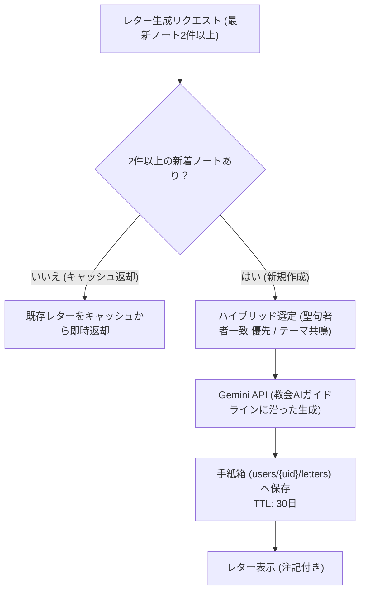

# AI 統合 (Gemini)

このドキュメントでは、Gemini AI を活用したノートの動的翻訳、質問生成、および振り返りレター機能の仕組みと最適化について解説します。

---

## 1. AI の役割とペルソナ設計

AI は、異なる言語を使うメンバー同士の橋渡しや、個人の学習を温かく励ますファシリテーターとして機能します：
- **トーン**: 温かく、励ましに満ち、簡潔で分かりやすい言葉。
- **方針**: 難解な専門用語を避け、日常生活への実践や気づきに焦点を当てます。

---

## 2. 利用モデルと設定

- **モデル**: **Gemini 3.1 Flash-Lite**
- **最適化**: 翻訳や質問生成の応答速度を最優先にするため、Thinking（推論）設定を最小限（`minimal`）に指定して呼び出します。

---

## 3. 翻訳のキャッシュとバッチ処理

API コストを削減し、表示速度を向上させるため、2つの工夫を行っています：

### ① MD5 ハッシュによる永続キャッシュ
リクエスト内容（`OriginalText + TargetLanguage`）から MD5 ハッシュキーを生成し、`translation_cache` に保存します。同一の翻訳は 50ms 未満でキャッシュから即座に返却されます。

### ② 一括翻訳（バッチ処理） (`/api/ai/translate-batch`)
チャット画面を開いた際、複数の未翻訳メッセージがある場合は以下のように処理します：
1. **並行キャッシュ検索**: まず全件のキャッシュを `Promise.all()` で確認。
2. **1回のAPI呼び出し**: キャッシュになかったメッセージのみを 1 つの JSON リクエストにまとめて Gemini へ送信（API 呼び出し回数と待ち時間を大幅削減）。
3. **バッチ書き込み**: 取得した翻訳結果をメッセージドキュメント内に直接保存。

---

## 4. 振り返り手紙（LetterBox）と聖典ペルソナ設計

最新の学習ノートを分析し、**四標準聖典（旧約・新約・モルモン書・教義と聖約・高価な真珠）の登場人物に思いを馳せながらAIが語りかける**パーソナライズされた振り返り手紙を生成します：

### ① 四標準聖典の人物プール（※生ける指導者・キリストは除外）
- **旧約聖書**: アダム、エノク、ノア、アブラハム、モーセ、エリヤ、イザヤ、ダニエル等
- **新約聖書**: バプテスマのヨハネ、ペテロ、ヤコブ、ヨハネ、パウロ、マタイ、ステパノ等（※イエス・キリストは除外）
- **モルモン書**: リーハイ、ニーファイ、アルマ、ベンジャミン王、モルモン、モロナイ、エノス等
- **教義と聖約・回復初期 (19世紀)**: ジョセフ・スミス、ハイラム・スミス、エマ・スミス、オリバー・カウドリ、イライザ・R・スノー、ブリガム・ヤング等
- **高価な真珠**: モーセ、アブラハム、エノク

### ② ハイブリッド選定ロジック
1. **優先度1（聖句の一致）**: ノートで読んだ聖典の書名・章（例: 1ニーファイ→ニーファイ、教義と聖約25章→エマ・スミス）に直結する人物を最優先で選定。
2. **優先度2（霊的テーマの一致）**: 聖句に直接の人物がいない場合、ノートの感情や悩み（試練、祈り、悔い改め、奉仕など）に最も寄り添える人物を自律選定。

### ③ ユーザーの感情・トーンに応じた4つの日常レンズ（Everyday Lenses）適応
ノートの感情や悩みをAIが分析し、その時最も心に届くレンズを自律選択します：
- **レンズ1: 人間味・あるある共感** *(日常の慌ただしさ・空回り・葛藤)*: 登場人物も同じように悩み、焦り、つまずいていたリアルな人間味で寄り添う。
- **レンズ2: 肩の荷を下ろす安心・恵み** *(疲労・自己嫌悪・完璧主義)*: 完璧主義を解きほぐし、神は粗探しではなく赦し助ける機会を待っているという安心感を届ける。
- **レンズ3: 聖句の生々しさ・率直な発見** *(知的好奇心・聖典の疑問)*: 綺麗事にまとめない、聖典の生々しい人間ドラマや意外な本音に着目する。
- **レンズ4: 飾らない本音・静かな感動** *(試練・深い悲しみ・誠実な祈り)*: 飾った言葉を排し、深い悲しみに寄り添いながら、静かにキリストの恵みと愛を証する。
- **多面的なエピソードの切り分け**: 人物をステレオタイプ化せず、レンズに合わせて生涯の特定の局面（強さ・弱さ・葛藤）にフォーカス（例: ニーファイの弓折れパニック vs 2ニーファイ4章の嘆きと賛美 vs 造船技術 vs 暗闇の手探り）。

### ④ 手紙の構成と2段構成（ジョークと霊的感動のパート分け）
- **冒頭**: `「${userName}さんへ、わたし、AIは[人物名]になりきってあなたのノートを読ませていただきました。」`（AIの明示）
- **前半（アイスブレイク・人間味）**: 選択されたレンズの個性に合わせた導入で親しみやすさを演出。
- **後半（真摯な霊的洞察・キリスト中心）**: 冗談を交えず、ノートの疑問や信仰に深く寄り添い、キリストの恵みと愛を真摯に語る。
- **詩 ＆ 追伸（P.S.）**: 記号（`*` や `---`）を使わない自然な改行による3〜4行の詩と、微笑みを残すP.S.。
- **署名**: `「— [人物名]になりきったAIより」`
- **注記**: `[注記] AIからの手紙は、聖典の人物の信仰に思いを馳せ、日々の学習を励ますためのものです。聖霊による個人の啓示や教会の公式な指導に代わるものではありません。また、AIは誤りを生成する可能性もあるため、教義の確認にはご自身の祈りと判断、教会の公式リソースをご活用ください。`
- **構造ラベルの排除**: `【前半】` や `【アイスブレイク】` などの見出しは出力せず、自然な手紙として流れるように構成。

---

## 5. デイリー聖句コメント生成（`scripts/generate-ai-daily-comments.ts`）

「わたしに従ってきなさい」の各日の聖句に対し、**4つの日常レンズ（Everyday Lenses）**と生活者のリアルな肉声により、**全11言語**でデイリーコメントを一括事前生成します：

### ① 4つの日常レンズによるマンネリ防止
単一のトーンを避け、聖句の性格に合わせて以下の4視点を動的に切り替えます：
- **レンズ1: 人間味・あるある共感**: 古代の人々も現代の私たちと同じことで悩み、焦っていたという普遍的な人間味（「何千年前も人間やってること一緒だな」）。
- **レンズ2: 肩の荷を下ろす安心・恵み**: 完璧主義を解きほぐし、神様は粗探しではなく助け赦す瞬間を待っておられるという安心感。
- **レンズ3: 聖句の生々しさ・率直な発見**: 綺麗事にまとめない、聖典の物語の飾り気のないリアルな面白さや人間臭さ。
- **レンズ4: 飾らない本音・静かな感動**: 難しい宗教用語を使わず、日々の深いため息や素直な気持ちそのままの祈り。

### ② プロンプト設計と制約ルール
- **100% 英語指示 ＋ 日英Few-Shot**: モデルの推論精度を最大化するため指示文・制約はすべて英語で統一し、Few-Shotに自然な口語の日英模範例を置くことでAI特有のポエム調・解説調を完全排除。
- **厳格な制約**: 改行なしの1文完結、絵文字は一切使用禁止、説教調・解説調（「〜しましょう」「〜の象徴です」「〜心に沁みます」）の禁止、過剰にエモい逆説・歌詞風フレーズ（「救いようがないくらい愛されてる」等）の禁止、直接的な専門用語（スマホ、通知、タイムカプセル等）を避けた普遍的共感、知恵の言葉の遵守（コーヒー・お茶・お酒等の比喩禁止）。
- **11言語ネイティブローカライズ**: `ja`, `en`, `ko`, `zho`, `es`, `pt`, `vi`, `tl`, `th`, `sw`, `it` 各言語の文化と親しい友人の日常会話リズムに最適化。

---

## 6. 教会公式AIガイドライン（総合手引き 38.8.47）に沿った配慮

教会の『総合手引き』第38.8.47項（「人工知能の適切な使用」）および基本原則に基づき、プロンプトには以下の安全ルールとガイドラインを設定しています：

1. **聖霊と個人の啓示への配慮**: AIの手紙が聖霊による個人の啓示や教会の公式指導を代替するものではないことを、規約と手紙の両方に明記。
2. **透明性の確保**: 冒頭と署名で「AIが聖典の人物になりきっている」ことを明示し、誤解を防止。
3. **神権の権能の境界**: 未啓示の奥義の推測、罪の赦しの宣言、ふさわしさの判定、召しの指示など、正規の神権指導者（ビショップ等）に属する事柄には立ち入らない。
4. **専門的助言の回避（手引き38.8.47）**: 医療、精神疾患の診断、法律、金銭に関するアドバイスを行わない。
5. **神聖なものへの敬意**: イエス・キリストや現職の指導者のなりすましを行わない。神殿の具体的な儀式文言や誓約の内容には触れない。
6. **自律と選択の自由の尊重**: 細かな生活ルールを決めつけず、原則を示して個人の祈りと自律的な判断を促す。
7. **他宗派・求道者への敬意（信仰箇条第11条）**: あらゆる信仰背景の人に敬意を払い、教義的な論争や他宗派批判を行わない。
8. **希望と平安の強調**: 黙示録や戦争の章であっても不安を煽らず、キリストの再臨の希望や心の平安に焦点を当てる。
9. **青少年への分かりやすさ**: 難解な表現を避け、幅広い年代に自然に伝わる言葉遣いを用いる。
10. **生身の人間関係・祈りへの接続**: AIへの過度な依存を防ぎ、個人の祈りや家族・教会コミュニティとのつながりを大切にするよう促す。
11. **知恵の言葉（教義と聖約89章）の遵守**: コーヒー・お茶・アルコール・タバコなどの言及・示唆を厳禁とし、日常の比喩には水や食事、散歩等の健全な習慣を用いる。

---

## 7. 関連ドキュメント

- [AI振り返りレターの心理学的効用とリテンション](./ux-ai-reflection-letters.md)
- [多言語対応 (i18n)](./logic-i18n.md)
- [ノート作成（NewNote）設計・実装ガイド](./newnote-construction-guide.md)
