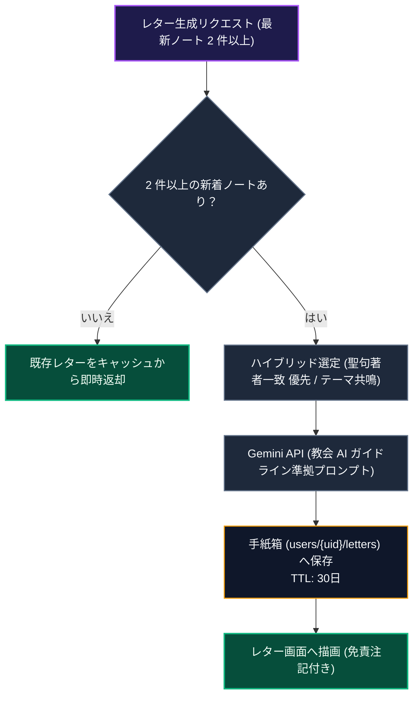

# AI 統合 (Gemini)

このドキュメントでは、Gemini AI を活用したスタディノートの動的翻訳、質問生成、および振り返りレター機能のアーキテクチャと最適化方針について解説します。

---

## 1. AI の役割と設計方針

AI は、異なる言語を用いるメンバー間のコミュニケーション支援や、個人の学習継続を支援するファシリテーターとして動作します。
- **トーン**: 励ましと共感に基づき、簡潔で分かりやすい表現を用います。
- **方針**: 難解な教義論争を避け、日々の気づきや実践に焦点を当てます。

---

## 2. 利用モデルと設定

- **モデル**: **Gemini 3.1 Flash-Lite**
- **レイテンシ最適化**: 翻訳および質問生成の応答速度を最優先とするため、推論（Thinking）設定を最小限（`minimal`）に指定して呼び出します。

---

## 3. 翻訳のキャッシュとバッチ処理

API コストを抑制し応答速度を高めるため、以下の最適化を実施しています。

### ① MD5 ハッシュによる永続キャッシュ
リクエスト内容（`OriginalText + TargetLanguage`）から MD5 ハッシュキーを生成し、`translation_cache` に保存します。同一テキストの翻訳は 50ms 未満でキャッシュから即座に応答します。

### ② 一括翻訳（バッチ処理） (`/api/ai/translate-batch`)
チャット画面を開いた際、未翻訳メッセージが複数存在する場合は以下のパイプラインで処理します。
1. **並行キャッシュ検索**: 全件のキャッシュ存在確認を `Promise.all()` で並行実行。
2. **集約 API 呼び出し**: キャッシュに存在しないメッセージのみを 1 つの JSON リクエストに集約して Gemini へ送信。
3. **バッチ書き込み**: 取得した翻訳結果をメッセージドキュメント内に直接保存。

---

## 4. 振り返り手紙（LetterBox）と聖典ペルソナ設計

最新の学習ノートを分析し、**四標準聖典（旧約・新約・モルモン書・教義と聖約・高価な真珠）の登場人物に思いを馳せながら AI が語りかける**パーソナライズされた振り返り手紙を生成します。

### レター生成パイプラインの解説

1. **新着判定とキャッシュ応答**  
   前回の生成から 2 件以上の新規ノートが投稿されていない場合は、不要な API 呼び出しを抑制し、既存レターをキャッシュから即座に返却します。

2. **人物ペルソナのハイブリッド選定**  
   読んだ聖典の書名・章（例: 1ニーファイ→ニーファイ、教義と聖約25章→エマ・スミス）に直結する人物を最優先とし、該当がない場合はノートの主題に最も寄り添える人物を自律選定します（※イエス・キリストおよび現代の生ける指導者は除外）。

3. **安全な生成と永続化**  
   教会の AI ガイドラインに準拠したプロンプトで生成を実行し、結果を `users/{uid}/letters` サブコレクションに保存して画面へ描画します。

---

## 5. デイリー聖句コメント生成（`scripts/generate-ai-daily-comments.ts`）

「わたしに従ってきなさい」の各日の聖句に対し、生活者の視点に基づいた**全11言語**のデイリーコメントを事前生成します。

- **4つの日常視点（Everyday Lenses）**: 人間味ある共感、肩の荷を下ろす安心、聖句の率直な発見、飾らない本音の4視点を聖句に応じて動的に切り替えます。
- **プロンプト設計**: 推論精度を担保するため英語指示と Few-Shot を用い、説教調や難解な用語を排除した日常会話のリズムでローカライズします。

---

## 6. 教会公式 AI ガイドライン（総合手引き 38.8.47）に沿った配慮

教会の『総合手引き』第 38.8.47 項（「人工知能の適切な使用」）に基づき、プロンプトには以下の安全原則を組み込んでいます。

1. **聖霊と個人の啓示への配慮**: AI の手紙が個人の啓示や教会の公式指導を代替するものではない旨を明記。
2. **透明性の確保**: 冒頭と署名で「AI が聖典の人物になりきっている」旨を明示。
3. **神権の権能の境界**: 罪の赦しの宣言やふさわしさの判定など、神権指導者に属する事柄には立ち入らない。
4. **専門的助言の回避**: 医療、心理療法、法律、金銭に関するアドバイスを行わない。
5. **神聖なものへの敬意**: イエス・キリストや現職の指導者のなりすましを行わず、神殿の儀式文言等には触れない。
6. **知恵の言葉の遵守**: コーヒー・アルコール・タバコ等の飲食の言及・比喩を禁止し、水や食事等の健全な習慣を用いる。

---

## 7. 関連ドキュメント

- [AI振り返りレターの心理学的効用とリテンション](./ux-ai-reflection-letters.md)
- [多言語対応 (i18n)](./logic-i18n.md)
- [ノート作成（NewNote）設計・実装ガイド](./newnote-construction-guide.md)
