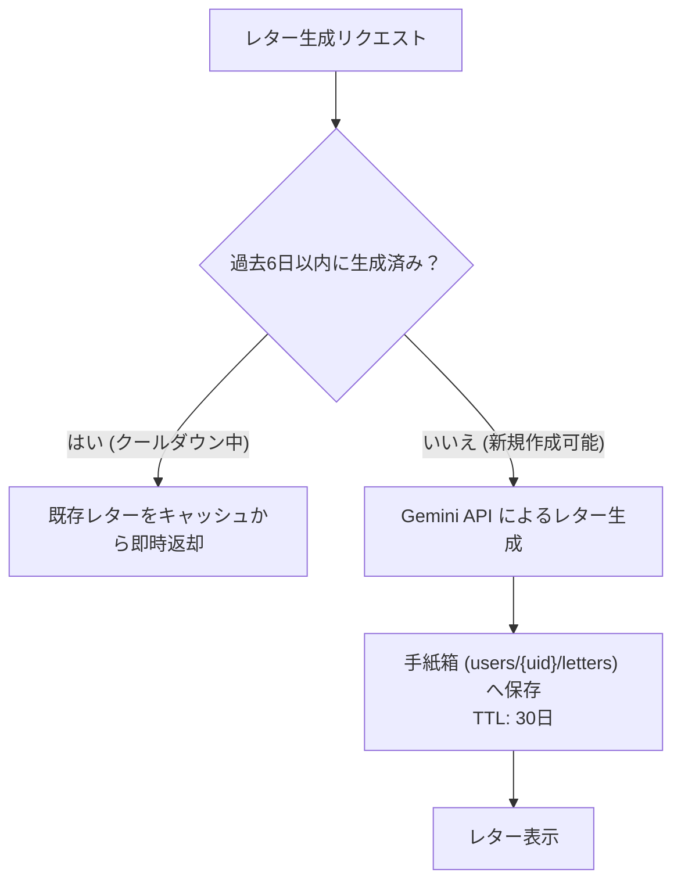

# AI 統合 (Gemini)

このドキュメントでは、Gemini AI を活用したノートの動的翻訳、質問生成、および振り返りレター機能の仕組みと最適化について解説します。

---

## 1. AI の役割とペルソナ設計

AI は、異なる言語を使うメンバー同士の橋渡しや、個人の学習を温かく励ますファシリテーターとして機能します：
- **トーン**: 温かく、励ましに満ち、簡潔で分かりやすい言葉。
- **方針**: 難解な専門用語を避け、日常生活への実践や気づきに焦点を当てます。

---

## 2. 利用モデルと設定

- **モデル**: **Gemini 3.1 Flash-Lite**
- **最適化**: 翻訳や質問生成の応答速度を最優先にするため、Thinking（推論）設定を最小限（`minimal`）に指定して呼び出します。

---

## 3. 翻訳のキャッシュとバッチ処理

API コストを削減し、表示速度を向上させるため、2つの工夫を行っています：

### ① MD5 ハッシュによる永続キャッシュ
リクエスト内容（`OriginalText + TargetLanguage`）から MD5 ハッシュキーを生成し、`translation_cache` に保存します。同一の翻訳は 50ms 未満でキャッシュから即座に返却されます。

### ② 一括翻訳（バッチ処理） (`/api/ai/translate-batch`)
チャット画面を開いた際、複数の未翻訳メッセージがある場合は以下のように処理します：
1. **並行キャッシュ検索**: まず全件のキャッシュを `Promise.all()` で確認。
2. **1回のAPI呼び出し**: キャッシュになかったメッセージのみを 1 つの JSON リクエストにまとめて Gemini へ送信（API 呼び出し回数と待ち時間を大幅削減）。
3. **バッチ書き込み**: 取得した翻訳結果をメッセージドキュメント内に直接保存。

---

## 4. 週次振り返りレター（LetterBox）の仕組み

1週間の学習ノートを分析し、ユーザーへ届けるパーソナライズされた振り返りレターです：

1. **3段落の構成**:
   - **共感と承認**: ノートの感想や学習の努力を温かく受け止める。
   - **聖典のエピソード**: 学びに関連する聖典の人物や教えを交えて視座を広げる。
   - **励ましと祝福**: 今後の生活や学習への前向きなメッセージ。
2. **6日間のクールダウン**:
   API コストを抑えるとともに、週に1回の特別な振り返り体験として価値を高めるため、生成後 6 日間はキャッシュされたレターを表示します。
3. **Firestore TTL（30日自動削除）**:
   手紙箱内のレターには 30 日の有効期限（`expiresAt`）が設定され、Firestore の TTL 機能により自動で整理されます（※初回登録時のウェルカムレターは永久保存）。

---

## 5. セキュリティとレート制限

- **App Check 必須**: 不正なスクリプトからの呼び出しを防ぐため、App Check トークンを検証。
- **レート制限 (`aiLimiter`)**: 1ユーザーあたりの1時間あたりのリクエスト上限を設定。

---

## 6. 関連ドキュメント

- [AI振り返りレターの心理学的効用とリテンション](./ux-ai-reflection-letters.md)
- [多言語対応 (i18n)](./logic-i18n.md)
- [ノート作成（NewNote）設計・実装ガイド](./newnote-construction-guide.md)
