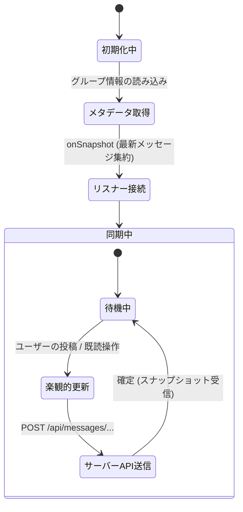

# チャットとダッシュボードの同期

::: tip インタラクティブ・アーキテクチャツアー
この機能のデータフローとステップ解説ツアーを体験できます：
- **オンライン（GitHubブラウザプレビュー）**: [インタラクティブツアーを開く (グループチャット & 多言語翻訳)](https://htmlpreview.github.io/?https://github.com/ScriptureHabit/scripture-habit/blob/main/docs/public/architecture-tour.html?tour=tour-groupchat&lang=ja)
- **VitePress / ローカル**: [グループチャット & 多言語翻訳 の解説ツアーを開く](/architecture-tour.html?tour=tour-groupchat&lang=ja)
:::

このドキュメントでは、Firestore のリアルタイムリスナー（`onSnapshot`）を活用したチャットメッセージの同期、未読・既読ステータスの管理、および画像の最適化処理について解説します。

---

## 1. リアルタイム同期アーキテクチャ

定期的なポーリングを排除し、Firestore の WebSocket 接続（`onSnapshot`）を通じてメッセージやメンバーの更新を即座にクライアントへ反映します。



### 同期ライフサイクルの解説

1. **初期化とリスナー接続**  
   グループ選択時に親ドキュメントのメタデータを取得した後、最新メッセージ集約ドキュメント（`messages_latest/latest`）への `onSnapshot` 接続を確立します。

2. **楽観的 UI 更新とサーバー送信**  
   利用者がメッセージを送信した際、サーバーの応答を待たずにローカル状態を即時更新（楽観的反映）し、並行してバックエンド API へリクエストを送信します。

3. **スナップショット受信による確定**  
   サーバー側のトランザクション書き込みが完了すると、Firestore から最新スナップショットが配信され、クライアントのローカル状態が最終確定します。

---

## 2. 既読ステータスの管理

未読・既読の判定は、サーバー上の最新状態を基準に同期されます。

1. **画面表示時の既読化**  
   チャット画面を開いた時点でローカルの未読カウントを `0` にリセットします。
2. **サーバーへの非同期通知**  
   `/api/update-read-status` を呼び出し、サーバー上の最終既読日時を更新します。
3. **データ受信時の自動修復**  
   通信障害等で一時的な不整合が生じた場合でも、次回サーバーからスナップショットを受信した際に正しい未読数へと自動修復されます。

---

## 3. 画像のアップロードと表示

- **クライアント側での画像圧縮**  
  通信帯域を節約するため、端末側で Canvas を用いてリサイズ・JPEG 圧縮を行ってから Firebase Storage へアップロードします。
- **即時プレビュー表示**  
  選択された画像は `URL.createObjectURL` により即座にプレビュー表示され、アップロード完了後に永続的な Storage URL へ切り替わります。

---

## 4. 実装時の注意点とアンチパターン対策

### ① 無限レンダリングループの防止（Stable Ref パターン）
`onSnapshot` を設定する `useEffect` の依存配列に `messages` 配列を含めると、データ受信ごとにリスナーが解除・再登録されて無限ループに陥ります。
これを防ぐため、メッセージ配列は `useRef` に保持し、リスナーのライフサイクルから分離しています。

```typescript
const currentMessagesRef = useRef<Message[]>(currentMessages);
useEffect(() => {
  currentMessagesRef.current = currentMessages;
}, [currentMessages]);
```

### ② グループ切替時の競合防止（同期リセット）
グループを切り替えた際、非同期フックで状態をリセットすると、キャッシュデータが混在したり画面のちらつきが発生します。
コンポーネントのレンダリングフェーズで `groupId` の変化を検知し、同期的にリセットを行うことで安定した画面遷移を実現しています。

---

## 5. 関連ドキュメント

- [グループチャット設計・実装ガイド](./groupchat-construction-guide.md)
- [ダッシュボード ＆ マイノート設計ガイド](./dashboard-mynotes-construction-guide.md)
- [Firestore トランザクション & カウンター設計](./firestore-transactions-counters.md)
