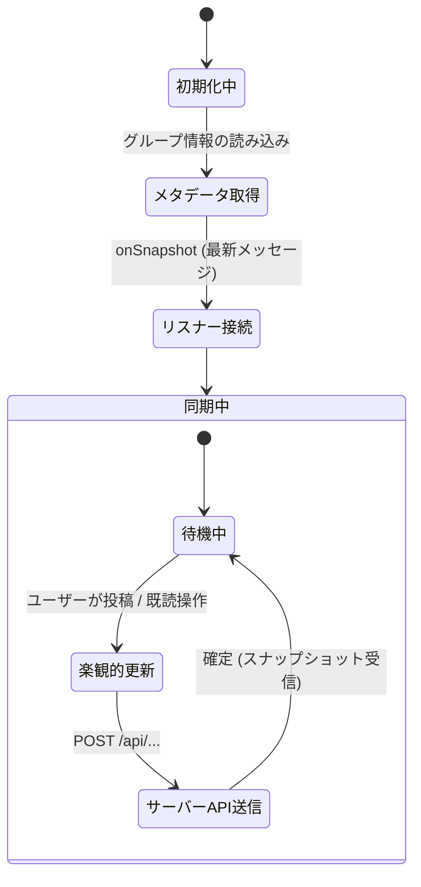

# チャットとダッシュボードの同期

このドキュメントでは、Firestore のリアルタイムリスナー（`onSnapshot`）を使ったチャットメッセージの同期、既読ステータスの管理、および画像の最適化処理について解説します。

---

## 1. リアルタイム同期アーキテクチャ

定期的なポーリングを行う代わりに、Firestore の WebSocket 接続（`onSnapshot`）を利用して、メッセージやメンバーの変更をリアルタイムに画面へ反映します。



### 同期パターンの特徴
1. **集約ドキュメントの購読 (`messages_latest/latest`)**:
   過去のメッセージを1件ずつ監視するのではなく、最新25件をまとめた単一の集約ドキュメントを購読します。これにより、初回読み込みから新規メッセージ受信まで、常に最小限の読み取り回数（1回）で画面を更新できます。
2. **差分のみの更新 (`docChanges`)**:
   メンバー一覧の同期では、変更のあったメンバー情報のみを差分で更新し、不要な再描画を抑えます。
3. **楽観的UI更新（Optimistic UI）**:
   メッセージ送信や既読ボタンを押した際、サーバーの応答を待たずに画面上ですぐに反映し、快適な操作感を提供します。

---

## 2. 既読ステータスの管理

未読・既読の判定は、サーバー上の最新状態を基準に同期されます：

1. **画面表示時の既読化**: チャット画面を開いた時点で、ローカルの未読カウントを `0` にリセット。
2. **サーバーへの通知**: `/api/update-read-status` を呼び出し、最終既読日時を更新。
3. **エラー時の自動修復**: 通信エラーが発生した場合は、次回サーバーからデータを受信した際に正しい未読数へと自動修復されます。

---

## 3. 画像のアップロードと表示

- **クライアント側での画像圧縮**: 通信量を抑えるため、端末側でリサイズ・圧縮してから Firebase Storage へアップロードします。
- **即時プレビュー**: 選択した画像は即座にプレビュー表示され、アップロード完了後に永続的なURLへ切り替わります。

---

## 4. 実装時の注意点とアンチパターン対策

### ① 無限レンダリングループの防止（Stable Ref パターン）
`onSnapshot` を設定する `useEffect` の依存配列に `messages` 配列を入れると、データを受信するたびにリスナーが解除・再登録されて無限ループが発生します。
これを防ぐため、メッセージ配列は `useRef` に保持し、リスナーの依存配列には含めないように設計されています。

```typescript
const currentMessagesRef = useRef<Message[]>(currentMessages);
useEffect(() => {
  currentMessagesRef.current = currentMessages;
}, [currentMessages]);
```

### ② グループ切替時の競合防止（同期リセット）
グループを切り替えた際、非同期で状態をリセットすると、キャッシュデータが消去されたり画面がちらついたりする原因になります。
コンポーネントのレンダリングフェーズで `groupId` の変化を検知し、同期的にリセットを行うことで安定した画面遷移を実現しています。

---

## 5. 関連ドキュメント

- [グループチャット設計・実装ガイド](./groupchat-construction-guide.md)
- [ダッシュボード ＆ マイノート設計ガイド](./dashboard-mynotes-construction-guide.md)
- [Firestore トランザクション & カウンター設計](./firestore-transactions-counters.md)
