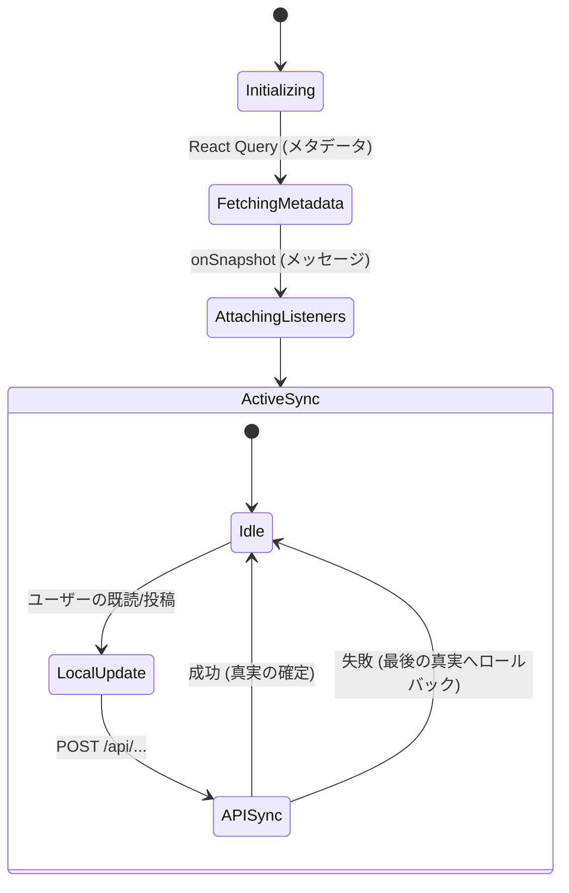

# チャットとダッシュボードの同期

**チャットダッシュボード**は、**scripture-habit**における重要なUIコンポーネントです。複数のグループにおけるリアルタイムメッセージ、画像アップロード、未読ステータスマーカーを処理します。

---

## 🛰️ リアルタイムコア: `onSnapshot` アーキテクチャ

従来のポーリングや手動フェッチパターンは避けています。代わりに、永続的なWebSocketリスナーを使用して、Firestoreデータベースの状態をUIにリアルタイムで反映させます。

### 同期エンジンとデルタ処理

同期エンジン（`src/components/groupchat/hooks/core/`内）は、読み取り効率とユーザー体験を最適化するためにハイブリッド同期パターンを採用しています。

- **マテリアライズドビューによる購読（メッセージ）**:
  メッセージ履歴全体（または `/messages` サブコレクション全体）を監視すると、各メッセージの追加や変更時に膨大な量のドキュメント読み取りコストが発生します。これを防ぐため、クライアントは最新メッセージ群を実体化した単一の集計ドキュメント `/groups/{groupId}/messages_latest/latest` を `onSnapshot` で購読します。これにより、最初のロードから新しいメッセージ受信まで、常に**1回**のドキュメント読み取りで最新のチャット状態を取得できます。
- **差分ドキュメントの処理（グループメンバー）**:
  グループメンバーリストの同期（`useGroupMembersSync`）では、`/members` サブコレクションを購読し、Firestore の `snapshot.docChanges()` を使用して、追加または変更されたメンバーの差分のみをインクリメンタルに処理（デルタ処理）します。
- **楽観的状態（Optimistic State）**:
  ユーザーがメッセージを送信した際や既読にした際、UIはローカルの状態を即座に更新（`useDashboardActions` では `groupStates/{groupId}` への直接書き込みによる遅延補償も実行）し、バックグラウンドでAPIの同期処理を行います。
- **スナップショットのマージ（Snapshot Merging）**:
  新しいメッセージがローカルリストに追加されると、`messages_latest` からの変更データとクライアント側で一時的に生成された楽観的メッセージがマージされます。メッセージの `doc.id` または `id` に基づいた安定した React の `key` プロパティを使用することで、コンポーネントツリーの再レンダリングを最小限に抑えます。

---

## 🏁 既読マーカー

未読数の同期は、**「サーバー側の真実（Server Truth）」**モデルを使用して管理されます：

1.  **ローカルの既読**: ユーザーがチャットに入ると、アプリはローカルの`unreadCount`を0としてマークします。
2.  **API同期**: `/api/update-read-status`を呼び出し、新しい「最終既読（Last Read）」タイムスタンプをサーバーに通知します。
3.  **リカバリーロジック**: API呼び出しが失敗したか、バックグラウンドタブの競合が発生した場合、サーバーからの次の`onSnapshot`トリガーによって、ローカルの状態がデータベースの値で上書きされます。

---

## 🖼️ メディアと画像の処理

チャット内の画像は、UIの応答性を保つためにマルチステージプロセスに従います：
- **最適化**: ユーザーの帯域幅を節約するため、アップロード前にクライアント側で画像のサイズ変更または圧縮が行われます。
- **ストレージ**: Firebase Storageを介してリアルタイムURLが生成されます。
- **楽観的プレビュー（Optimistic Preview）**: ユーザーが画像を選択すると、コンポーネントは即座にローカルのblob URLを表示し、アップロードが確認された後にのみ、それを恒久的なURLに置き換えます。

---

## 🚦 同期状態遷移図



---

## 🚀 開発者向けパフォーマンスのヒント

Firestoreの読み取り（Read）を高度に最適化し、予期しない課金の急増を防ぐため、以下のアーキテクチャルールを遵守しています：

- **Firestoreバンドルによる高速化（初回ロード）**:
  - `useMessageStreamSync`では、まず `/api/groups/bundle/:groupId` から事前構築されたFirestoreバンドルの取得を試みます。これにより、50回分のドキュメント読み取りを行う代わりに、正確に**1回のAPI読み取り**で最初のメッセージチャンク（最大50件）をロードし、ローカルキャッシュに保存します。
- **キャッシュヒット率向上のためのタイムスタンプ丸め**:
  - 移動時間枠（例：「過去24時間」）でフィルタリングするクエリでは、`Date.now()`のような**正確なタイムスタンプは決して使用しないでください**。これはミリ秒単位で変化するため、クエリがキャッシュされなくなります。
  - クエリのタイムスタンプは常に**最も近い30分（または1時間）単位に切り捨て/切り上げ（丸め）**してください。これにより、複数のレンダリングやページ遷移にわたってクエリのシグネチャが同一になり、Firestore SDKの`persistentLocalCache`が**サーバー読み取り0回**でデータを即座に提供できるようになります。
- **getDocs（リストビュー）と onSnapshot（詳細/アクティブビュー）の使い分け**:
  - **getDocs**: ダッシュボードのグループプレビューカードのような、時折の手動更新やページ遷移による更新で十分な上位リストに使用します。これにより、バックグラウンドで不要なWebSocket接続を開いたままにすることを避け、読み取りコストを低く抑えます。
  - **onSnapshot**: ユーザーエンゲージメントのためにリアルタイム同期が不可欠な、アクティブなチャットペインなどの詳細/アクティブビュー専用とします。
- **スナップショットの制限**: チャットクエリでは常に `limit(N)` と `orderBy('createdAt', 'desc')` を使用し、大量の過去メッセージがロードされるのを防ぎます。
- **安定した参照 (Stable References)**: 派生したチャットデータには `useMemo` を使用し、タイピングイベント時にサイドバーが再レンダリングされるのを防ぎます。
- **バックグラウンド抑制**: ブラウザのタブが非アクティブな場合、リスナーはアクティブなままですが、CPUを節約するためにUIの更新がスロットリング（制限）されます。

---

## ⚠️ リアルタイム同期の落とし穴とアンチパターン

Firestore Client SDKを使用してリアルタイム同期フックを構築する際、常に注意しなければならない2つの大きなアーキテクチャ上の落とし穴があります。これらはどちらも、歴史的には「Strategy B」のチャット最適化中に解決されたものです：

### 1. 無限購読ループ（古い/可変状態の落とし穴）
*   **危険性**: `onSnapshot` サブスクリプションをトリガーする `useEffect` の依存関係配列に、主要なメッセージ状態（`currentMessages`）を配置してしまうこと。
*   **失敗の仕組み**:
    1.  フックがFirestoreを購読（Subscribe）する。
    2.  Firestoreがデータを返し、`dispatch({ type: 'SET_MESSAGES', messages })` がトリガーされる。
    3.  親コンポーネントが、`messages` の新しい配列参照で再レンダリングされる。
    4.  `messages` が変更されたため、`useEffect` がクリーンアップされ、`unsubscribe()` が呼び出される。
    5.  エフェクトがすぐに再実行され、`onSnapshot()` を呼び出して再購読する。
    6.  これにより永続的な無限ループが発生し、CPUを占有してチャットウィンドウが完全に真っ白になる。
*   **解決策（Stable Ref パターン）**: `currentMessages` をサブスクリプションの `useEffect` 依存関係配列から完全に排除します。代わりに、毎回のレンダリングで更新される `useRef` に保存します：
    ```typescript
    const currentMessagesRef = useRef<Message[]>(currentMessages);
    useEffect(() => {
      currentMessagesRef.current = currentMessages;
    }, [currentMessages]);
    ```
    Inside the `onSnapshot` callback, read from `currentMessagesRef.current` to calculate optimistic resolution without ever re-triggering the subscription effect.

### 2. 初期化時の競合状態（非同期リセットの落とし穴）
*   **危険性**: Firestoreのオフライン永続化/キャッシュを使用しているときに、`groupId`の変更に伴い、`useEffect`を介して非同期にチャット状態をリセットしてしまうこと。
*   **失敗の仕組み**:
    1.  ユーザーがグループを切り替えるか、チャットに再入室する。
    2.  以前のメッセージをクリアするために、`dispatch({ type: 'RESET' })` を呼び出す非同期の `useEffect` がスケジュールされる。
    3.  同じレンダリングパス内で、サブスクリプションの `useEffect` が実行され、`onSnapshot` が登録される。
    4.  Firestoreの `persistentLocalCache` が有効になっているため、クライアント側SDKは即座にかつ**同期的に**そのグループのキャッシュメッセージを返し、`SET_MESSAGES` をディスパッチする。
    5.  その1ミリ秒後、スケジュールされていた非同期の `RESET` ディスパッチがようやく実行され、状態が `[]` にクリアされ、ステータスが `'loading'` に戻される。
    6.  メッセージは瞬時に消え去り、チャットウィンドウは永久に真っ白なままになる。
*   **解決策（同期レンダリングフェーズリセット）**: 非同期の `RESET` エフェクトを完全に排除します。代わりに、`groupId`の変更を検出し、**Reactのレンダリングフェーズ中に同期的に**リセットをディスパッチします：
    ```typescript
    const prevGroupIdRef = useRef<string | null>(null);
    if (groupId !== prevGroupIdRef.current) {
      prevGroupIdRef.current = groupId;
      if (groupId) {
        dispatch({ type: 'RESET', groupId });
      }
    }
    ```
    これにより、Reactは現在のレンダリングパスを即座に中断し、完全にクリアされた状態でレンダリングを再開始するため、遅れて到達したリセットイベントによって `onSnapshot` の結果が上書きされないことが保証されます。
