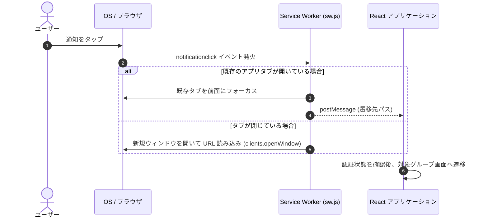

# プッシュ通知システム

このドキュメントでは、Web プッシュ通知（FCM）の配信アーキテクチャ、トークンの安全な管理、通知トレイの自動整理、および通知タップ時の画面遷移制御について解説します。

---

## 1. FCM トークンの管理とプライバシー

ユーザーのプライバシー保護とクエリパフォーマンスを両立するため、トークンは 2 段階で管理されています。

1. **プライベート保管庫 (`users/{uid}/private/tokens`)**  
   デバイストークン配列（`fcmTokens`）は、本人のみがアクセス可能なサブコレクションに隔離し、他ユーザーからの参照を防ぎます。
2. **高速判定用フラグ (`users/{uid}.hasFcmToken`)**  
   有効なトークンを保持しているかを示す真偽値フラグです。夜間リマインダー等の定期処理において、プライベートドキュメントを全件読み込まずに対象者を高速に抽出します。

---

## 2. クライアント側の通知セットアップ

通知の許可要求とトークン取得は `src/utils/notification-helper.ts` で制御されます。

1. **ブラウザ機能の確認**: Service Worker および PushManager の対応状況を検証。
2. **権限リクエスト**: `Notification.requestPermission()` によりユーザーへ許可を要求。
3. **Service Worker 登録**: `/sw.js` を登録し、バックグラウンドでの Push イベント受信を確立。
4. **トークン登録**: VAPID キーを用いて FCM トークンを発行し、Firestore のプライベート保管庫へ保存。

---

## 3. 通知トレイの自動整理

端末の通知トレイが不要なメッセージで圧迫されないよう、適切なタイミングで通知をクリーンアップします。

- **アプリ起動時**: すでに学習を開始したとみなし、残存しているストリークリマインダー通知をすべて消去します。
- **グループチャット入室時**: 該当グループに関する新着メッセージ通知のみを選択的に閉じます（他グループの通知は維持）。

---

## 4. マルチキャスト配信と無効トークンの自動パージ

- **500件ずつの分割送信**: Firebase Admin SDK の `sendEachForMulticast` を用い、最大 500 件単位で一括配信します。
- **無効トークンの自動削除**: アプリのアンインストール等で無効化したトークン（`messaging/registration-token-not-registered` 等）は、配信エラーを検知して自動的にデータベースからパージします。

---

## 5. 通知タップ時の起動と画面遷移

通知をタップした際、Service Worker とクライアントアプリが連携して適切な画面へルーティングします。

### シーケンスの解説

1. **`notificationclick` イベントの捕捉**  
   ユーザーが端末の通知をタップすると、Service Worker がイベントを捕捉し、通知ペイロードから遷移先 URL（例: `/groups/{groupId}`）を抽出します。

2. **既存タブの再利用とフォーカス**  
   すでにブラウザでアプリが開かれている場合は新規タブを開かず、既存タブを前面にフォーカスして `postMessage` で遷移先を通知します。

3. **認証確認とディープリンク遷移**  
   React Router が URL を解決し、認証状態を確認した上で該当のチャット画面やノート画面へシームレスに遷移します。

---

## 6. 関連ドキュメント

- [タイムゾーン対応のリマインダー通知](./timezone-streak-reminders.md)
- [定期メンテナンスジョブ (Cron)](./maintenance-cron.md)
- [チャットとダッシュボードの同期](./feature-chat-dashboard.md)
