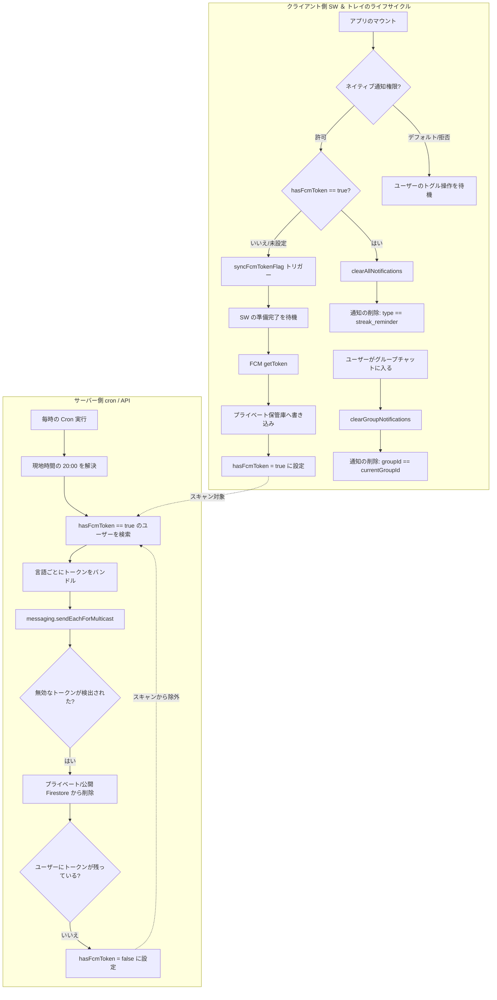

# 通知システム

**通知通知サブシステム**は、メンバーがノートを投稿したりマイルストーンを達成したりしたときにアラートを配信し、毎日の学習リマインダーを送信することで、ユーザーのエンゲージメント（継続的な利用）維持をサポートします。

---

## 🔑 FCMトークンの保存とプライバシー

ユーザーのプライバシー保護とパフォーマンス向上のため、FCM登録トークンは2つの主要なフィールドを使用して保存されます：

1. **プライベートトークン保管庫 (`users/{uid}/private/tokens/fcmTokens`)**:
   - FCM登録トークンは、ユーザーのプライベートな `tokens` ドキュメントの内部に厳格に保存されます。
   - **アクセスルール**: Firestoreのセキュリティルールにより、認証された所有者（`request.auth.uid == uid`）のみに読み取りおよび書き込みのアクセスが制限されます。これにより、他のグループメンバーがデバイストークンを読み取ることを防ぎます。
2. **公開ステータスフラグ (`users/{uid}/hasFcmToken`)**:
   - 公開されたブーリアン（真偽値）プロパティ `hasFcmToken: boolean` がユーザーのプロフィールドキュメントに保存されます。
   - **パフォーマンス**: 毎日のリマインダー処理において、プライベートトークンやサブコレクションを読み込むことなく、インデックスによる読み取りを使用して通知対象のユーザーをすばやく検索できます。

### 互換性とマージ
通知の配信中、バックエンドのヘルパーは、古い公開 `fcmTokens` 配列と新しいプライベートサブコレクションの両方から安全にトークンを回収します。新しく登録されたデバイスは、プライベートサブコレクションを使用します。

---

## ⚡ クライアント側サービスワーカーのセットアップ

プッシュ通知の許可、サービスワーカーのセットアップ、およびバックグラウンドトークンの同期は、クライアントデバイスの `src/utils/notification-helper.ts` 内で処理されます。

### 1. 権限とセットアップ
ユーザーが「通知を有効にする」をクリックすると、クライアントは以下の手順を調整して実行します：
1. **サポートの確認**: ブラウザで `serviceWorker`、`Notification`、および `PushManager` がサポートされているか確認します。ブラウザが互換性を持たない場合は、メッセージを表示します。
2. **アプリ内ブラウザの警告**: アプリ内 WebView（LINE、Instagram、Facebookなど）では、プラットフォームのサンドボックス制限によりプッシュ通知が失敗することが多いため、警告を表示します。
3. **権限プロンプトの表示**: `Notification.requestPermission()` を呼び出します。
4. **サービスワーカーの登録**:
   - 既存のアクティブな登録を検索します。
   - アクティブな登録が見つかった場合はそれを更新して再利用し、見つからない場合は `/sw.js` をスコープ `'/'` で登録します。
   - バックグラウンドプッシュリスナーが実行されていることを保証するため、`await navigator.serviceWorker.ready` を使用して実行をブロックします。
5. **トークンの保存**: VAPID キーを使用して、一意の FCM トークンを取得します。Firestore の `arrayUnion` 演算子を使用して、ユーザーのプライベートな `tokens` サブコレクションにトークンを書き込み、公開ユーザーオブジェクト上で `hasFcmToken = true` を設定します。

### 2. 自己修復フラグ同期 (`syncFcmTokenFlag`)
データベースのフラグが正しいことを保証するため（例：データベースのリセット後など）：
- アプリケーションのマウント時に、ブラウザの `Notification.permission` が `'granted'`（許可）であるにもかかわらず、ユーザープロフィールが `hasFcmToken` は false または未設定であると示している場合、ヘルパーはバックグラウンドでこれを更新します。
- アクティブなサービスワーカー登録から FCM トークンを取得し、ステータスを Firestore に書き戻して `hasFcmToken` フラグを更新します。

---

## 🧹 通知トレイの制御

OS の通知トレイをクリーンに保つため、アクティブなアラートはプログラムで管理されます：

### 1. アプリ起動時にストリークリマインダーをクリア
ユーザーが毎日の学習を完了するためにアプリケーションを開いた後は、ストリークの警告は不要になります：
- アプリケーション起動時に、`clearAllNotifications` はアクティブなサービスワーカー登録を取得します。
- `registration.getNotifications()` を使用して、OS の通知ドロワーに表示されている通知を取得します。
- `notification.data.type === 'streak_reminder'` である通知に対して `notification.close()` を呼び出します。これにより、アプリ起動時にストリークリマインダーが即座にクリアされます。

### 2. グループメッセージ通知のクリア
関連のない他の更新通知を閉じてしまわないように：
- ユーザーがグループチャット画面に入ると、クライアントは `clearGroupNotifications(groupId)` を呼び出します。
- `notification.data.groupId === groupId` に一致する通知**のみ**を閉じます。
- その他の通知（ストリークのアラートや、他のグループからのアラートなど）は OS の通知トレイに残ります。

---

## ⚡ マルチキャスト送信とチャンク分割

Firestore メッセージングは大量送信をサポートしていますが、1回のリクエストあたり500トークンという制限があります。当社の `sendPushNotification` ユーティリティはリクエストを分割します：

- **チャンクサイズ**: 500トークン。
- **マルチキャストループ**: グループに2,000個のアクティブなトークンがある場合、システムは4つの並行リクエストを実行します。
- **`sendEachForMulticast`**: 最新の Firebase Admin SDK メソッドを使用しており、チャンク内の*個々のトークンごと*にステータスレポートが提供されます。

---

## 🛠️ 自己修復トークンライフサイクル

モバイルアプリのアンインストールやデバイストークンの有効期限切れにより、データベースに無効なトークンが残ることがあります。`/api/streak-warning` および `cleanupTokens` サービスは、自己修復フィードバックループを使用しています：

1. **検出**: Admin SDK が `messaging/invalid-registration-token` を報告します。
2. **キャプチャ**: 失敗したトークンがマルチキャストのレスポンスから抽出されます。
3. **トラッキング**: `tokenToUserMap` が、失敗したトークンを所有しているユーザーIDを識別します。
4. **整理（プルニング）**: `cleanupTokens` が、Firestore の公開およびプライベート両方の場所から失敗したトークンを削除します。
5. **安全フラグ**: ユーザーにFCMトークンが1つも残っていない場合、将来の冗長な検索を防ぐため、システムはユーザーのプロフィールドキュメントで `hasFcmToken = false` を設定します。

---

## 📦 ペイロード構造

送信するすべてのプッシュ通知は、Android と iOS の両方で互換性を確保するため、ハイブリッドペイロードを使用しています。

| キー | 目的 | ロジック |
| :--- | :--- | :--- |
| **`notification`** | **ビジュアル表示** | OS によって処理されます。アプリが閉じている場合でも、タイトルと本文が表示されます。 |
| **`data`** | **プログラム処理** | Capacitor によって処理されます。ディープリンク用の `groupId` や `type` が含まれます。 |

### フォアグラウンドでの抑制
アプリが開いている（フォアグラウンド）状態では、**リアルタイムの `onSnapshot` リスナー**がチャット内のコンテンツをすでに表示しているため、ビジュアル表示の通知バナーを抑制します。これにより、重複するアラートを防ぎます。

---

## 🚦 通信およびライフサイクルフロー

