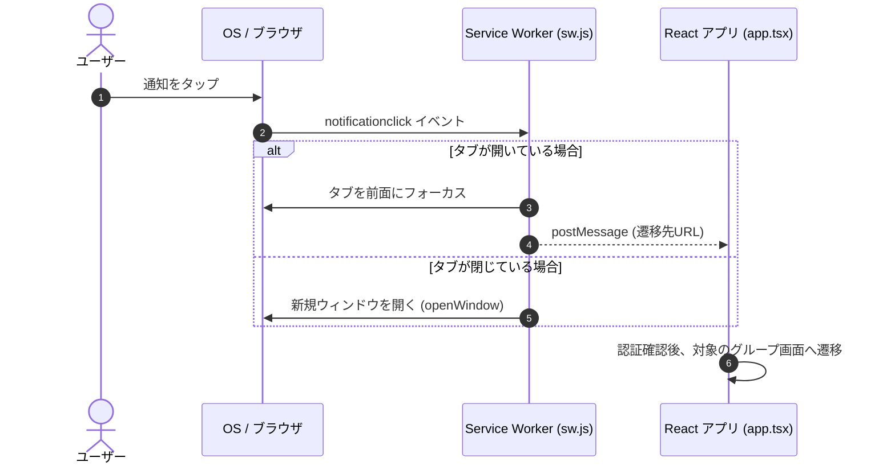

# プッシュ通知システム

このドキュメントでは、Webプッシュ通知（FCM）の配信、トークンの安全な管理、通知トレイの整理、および通知タップ時のアプリ起動・画面遷移について解説します。

---

## 1. FCMトークンの管理とプライバシー

ユーザーのプライバシー保護と検索パフォーマンスを両立するため、トークンは以下のように管理されています：

1. **プライベート保管庫 (`users/{uid}/private/tokens`)**:
   デバイストークン（`fcmTokens` 配列）は、本人しかアクセスできないプライベートなドキュメントに保存されます（他のグループメンバーから参照されるのを防止）。
2. **公開フラグ (`users/{uid}.hasFcmToken`)**:
   ユーザーが有効なトークンを保持しているかどうかを示すブーリアンフラグ。毎時のリマインダー処理で、プライベートドキュメントを1件ずつ読み込まずに通知対象者を素早く検索するために使用します。

---

## 2. クライアント側の通知セットアップ

通知の許可・トークン取得は `src/utils/notification-helper.ts` で行われます：

1. **ブラウザ互換性の確認**: Service Worker および PushManager が利用可能かチェック。
2. **権限リクエスト**: `Notification.requestPermission()` でユーザーに許可を求めます。
3. **Service Worker 登録**: `/sw.js` を登録し、バックグラウンドでの通知受信を有効化。
4. **トークン登録**: VAPID キーを用いて FCM トークンを発行し、Firestore に保存。

---

## 3. 通知トレイの自動整理

端末の通知欄が不要な通知で埋まらないよう、適切なタイミングで通知を自動削除します：

- **アプリ起動時**: すでにアプリを開いて学習を始めたため、残っているストリークリマインダー通知をすべて閉じます。
- **グループチャット入室時**: 該当グループのメッセージ通知のみを閉じます（他のグループやストリークの通知は維持）。

---

## 4. マルチキャスト配信と無効トークンの自動削除

- **500件ずつの分割送信**: Firebase Admin SDK の `sendEachForMulticast` を使用し、最大500件ずつ一括配信します。
- **無効トークンの自動パージ**: アプリのアンインストールなどで無効になったトークン（`messaging/invalid-registration-token` 等）は、配信エラーを検知して自動的にデータベースから削除されます。

---

## 5. 通知タップ時の起動と画面遷移

通知をタップした際、該当するグループチャットやマイノート画面へスムーズに誘導します：

---

## 6. 関連ドキュメント

- [タイムゾーン対応のリマインダー通知](./timezone-streak-reminders.md)
- [定期メンテナンスジョブ (Cron)](./maintenance-cron.md)
- [チャットとダッシュボードの同期](./feature-chat-dashboard.md)
