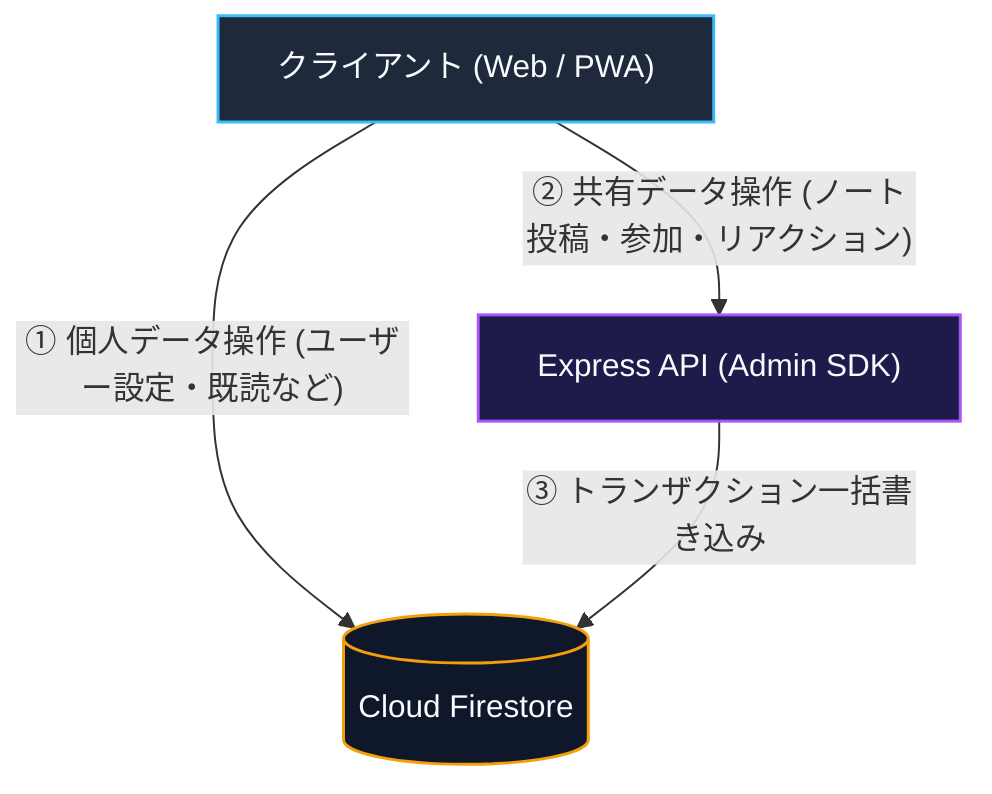

# Firebase セキュリティルールと書き込み分離

> [!TIP]
> **インタラクティブ・アーキテクチャツアー**: [ブラウザでツアーを開く (ユーザー認証・ログイン)](https://htmlpreview.github.io/?https://github.com/ScriptureHabit/scripture-habit/blob/main/docs/public/architecture-tour.html?tour=tour-login&lang=ja)

このドキュメントでは、Firestore セキュリティルール（`firestore.rules`）による認証検証、グループ参加制限の強制、および共有データへのクライアント直接書き込みを禁止する設計について解説します。

---

## 1. 2層の防御モデル

セキュリティは、API ゲートウェイ（Express ミドルウェア）とデータベースルール（`firestore.rules`）の 2 段階で検証されます。

```
リクエスト ──► [ 第1層: API ゲートウェイ ] ──► [ 第2層: データベース層 ] ──► データ保存
                 - Express ミドルウェア           - firestore.rules
                 - verifyAppCheck (App Check)     - isAuthenticated()
                 - レート制限                     - allow write: if false; (共有データ)
```

クライアントが API を介さずに Firestore へ直接書き込みを試行した場合でも、データベースルールにより不正なミューテーションを確実に遮断します。

---

## 2. セキュリティルールの基本関数

### ① 認証とメール確認 (`isAuthenticated()`)
サインイン済みであり、メールアドレスの確認が完了しているユーザーのみにアクセスを許可します。

```javascript
function isAuthenticated() {
  return request.auth != null && (
    request.auth.token.email_verified == true || 
    request.auth.token.get('email_verified', false) == true ||
    request.auth.token.get('email', '').matches('.*@example[.]com$')
  );
}
```

### ② App Check 検証 (`isAppCheckVerified()`)
自動化されたボットからのアクセスを防ぐため、新規ユーザー登録などの重要操作時に正規アプリからのトークンを検証します。

---

## 3. データベース層でのグループ制限の強制

ユーザーが不正に多数のグループを作成できないよう、ルール内で所属グループ数（最大4グループ）を動的に検証します。

```javascript
allow create: if isAuthenticated() && 
  request.resource.data.ownerUserId == request.auth.uid &&
  get(/databases/$(database)/documents/users/$(request.auth.uid)).data.get('groupIds', []).size() < 4;
```

---

## 4. 共有データの書き込み分離（バックエンド限定書き込み）

データの改ざん防止とトランザクション整合性を保つため、**共有リソースへのクライアント直接書き込みを禁止（`allow write: if false;`）** しています。



### 書き込み分離の解説

1. **個人スコープのデータ (`users/{uid}`, `groupStates`)**  
   本人のみが読み書き可能（`request.auth.uid == userId`）であり、オフライン操作性とレスポンス向上のためクライアント SDK からの直接更新を許可しています。

2. **共有スコープのデータ (`messages`, `members`, `cheers`)**  
   クライアント SDK からの直接書き込みをルールで一律禁止（`allow write: if false;`）しています。

3. **バックエンド経由の整合性保証**  
   共有データの更新は必ずバックエンド API を経由させ、Firebase Admin SDK によるトランザクション内で学習日数やレベル、チャットログをアトミックに書き込みます。

---

## 5. 関連ドキュメント

- [データベースとセキュリティ](./database-security.md)
- [App Check & API 保護](./security-architecture.md)
- [Firestore トランザクション & カウンター設計](./firestore-transactions-counters.md)
