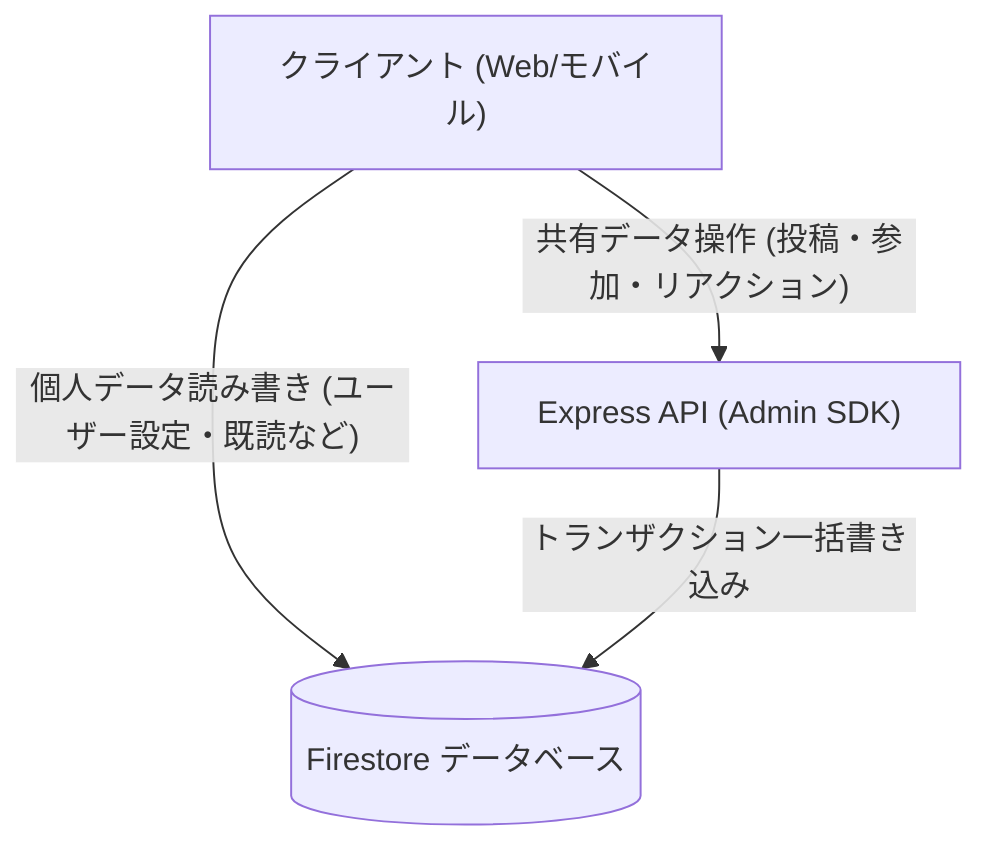

# Firebase セキュリティルールと書き込み分離

このドキュメントでは、Firestore セキュリティルール（`firestore.rules`）による認証検証、グループ制限の強制、およびクライアント直接書き込みの禁止設計について解説します。

---

## 1. 2層の防御モデル

セキュリティは、API ゲートウェイ（Express ミドルウェア）とデータベースルール（`firestore.rules`）の2段階で検証されます：

```
リクエスト ──► [ 第1層: API ゲートウェイ ] ──► [ 第2層: データベースルール ] ──► データ保存
                 - Express ミドルウェア           - firestore.rules
                 - verifyAppCheck (App Check)     - isAuthenticated()
                 - レート制限                     - allow write: if false; (共有データ)
```

クライアントが API を介さずに Firestore に直接アクセスしようとした場合でも、データベースルールが不正な書き込みを確実にブロックします。

---

## 2. セキュリティルールの基本関数

### ① 認証とメール確認 (`isAuthenticated()`)
ログイン済みかつメールアドレスの確認が完了しているユーザーのみにアクセスを許可します：

```javascript
function isAuthenticated() {
  return request.auth != null && (
    request.auth.token.email_verified == true || 
    request.auth.token.get('email_verified', false) == true ||
    request.auth.token.get('email', '').matches('.*@example[.]com$')
  );
}
```

### ② App Check 検証 (`isAppCheckVerified()`)
自動化されたボットからのアクセスを防ぐため、新規ユーザー登録時などに正規アプリのトークンを検証します。

---

## 3. データベース層でのグループ制限の強制

ユーザーが不正に多くのグループを作成できないよう、ルール内で所属グループ数（最大4個）を動的に確認します：

```javascript
allow create: if isAuthenticated() && 
  request.resource.data.ownerUserId == request.auth.uid &&
  get(/databases/$(database)/documents/users/$(request.auth.uid)).data.get('groupIds', []).size() < 4;
```

---

## 4. 共有データの書き込み分離（バックエンド限定書き込み）

データの改ざん防止とトランザクション整合性を保つため、**共有データへのクライアント直接書き込みを完全に禁止（`allow write: if false;`）** しています：



- **共有データ (`messages`, `members`, `cheers`)**:
  クライアントからの書き込みを禁止（`allow write: if false;`）。必ずバックエンド API（Admin SDK）を経由してトランザクション書き込みを行います。
- **個人データ (`users/{uid}`, `private/tokens`, `groupStates`)**:
  本人（`request.auth.uid == userId`）に限り、オフライン時の操作性向上のため直接書き込みを許可。

---

## 5. 関連ドキュメント

- [データベース & セキュリティ](./database-security.md)
- [App Check & API 保護](./security-architecture.md)
- [Firestore トランザクション & カウンター設計](./firestore-transactions-counters.md)
