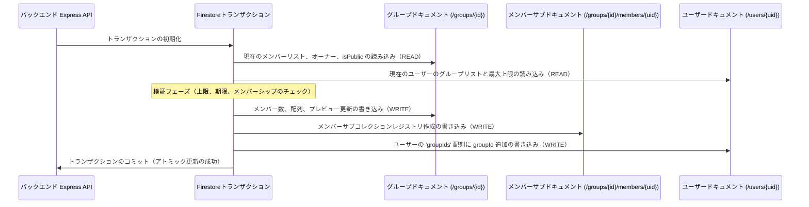

# Firestoreトランザクション＆カウンターサービス設計

このドキュメントでは、バックエンドがトランザクションを処理し、複数のドキュメントをアトミックに更新し、書き込みパフォーマンスのボトルネックを防ぐために分散カウンターを使用する方法について詳しく説明します。

---

## 1. 「書き込み前の読み込み（READ-before-WRITE）」ルール

Google Cloud Firestoreのトランザクションでは、**すべての読み込み操作（クエリ、取得）は、書き込み操作（セット、更新、削除）の前に実行される必要があります**。

`transaction.update()` を呼び出した後に `transaction.get()` を呼び出すと、Firestoreはエラーをスローします。これは、Firestoreトランザクションが楽観的並行性制御を使用しており、変更を適用する前に読み込みデータをロックする必要があるためです。

### コード例 (`groups.ts`)
ユーザーがグループに参加すると、バックエンドは以下のようにデータベース操作をシーケンス（順序付け）します。

```typescript
const result = await db.runTransaction(async (transaction) => {
    // -------------------------------------------------------------
    // ステップ 1: 読み込みフェーズ（すべてのデータベース取得はここで実行する必要があります）
    // -------------------------------------------------------------
    const groupDoc = await transaction.get(groupRef);
    const userDoc = await transaction.get(userRef);
    // トランザクション内でのシャード化されたカウンターの読み込みをバイパスして、10回分の読み込みを節約！
    // 取得済みの groupDoc メインスナップショットから直接読み込みます。
    const totalMessages = groupDoc.data()?.messageCount || 0;

    // -------------------------------------------------------------
    // ステップ 2: 検証フェーズ（ローカルのビジネスロジックチェック）
    // -------------------------------------------------------------
    if (!groupDoc.exists) throw new Error('Group not found.');
    // メンバーシップ制限、重複チェック、招待期限などのチェック...

    // -------------------------------------------------------------
    // ステップ 3: 書き込みフェーズ（更新および変更の適用）
    // -------------------------------------------------------------
    transaction.update(groupRef, { ...Updated group array fields ... });
    transaction.set(membersSubCollectionRef, { ...New member sub-doc ... });
    transaction.update(userRef, { ...Add group ID to user registry ... });
});
```

### 1.1 コンパイルセーフな読み込み/書き込みフェーズの分離（IIFEパターン）

構築段階で「書き込み前の読み込み」の制約を厳密に強制するため、高度に複雑なトランザクション（`MessageService` の `postMessage` や `NoteService` の `postNote` など）では、読み込みシーケンス全体（条件付きブートストラップ/スナップショットや依存する純粋な計算を含む）を、**フェーズ1: 読み込みフェーズ** を表す非同期の即時実行関数式（IIFE）ブロックにカプセル化します。

このブロック内では、書き込みの変更（ミューテーション）は一切許可されません。返された解決済み状態と計算変数はすべて外部スコープで受け取られ、その後、**フェーズ2: 書き込みフェーズ**（`transaction.set` および `transaction.update` の変更のみを含む）で実行されます。

この物理的なフェーズの分離により、開発者が将来の更新時に書き込み変更の後に誤って読み込みクエリを挿入してしまうことが絶対にないよう保証されます。

#### コード例 (`MessageService.postMessage` / `NoteService.postNote`)
```typescript
const result = await db.runTransaction(async (transaction) => {
    // -------------------------------------------------------------
    // フェーズ 1: 読み込み＆計算フェーズ（厳格な「書き込み前の読み込み」）
    // -------------------------------------------------------------
    const { userData, currentMessages, allLatestGids, ... } = await (async () => {
        const [userSnap, latestSnap] = await Promise.all([
            transaction.get(userRef),
            transaction.get(latestRef)
        ]);

        // ... 純粋な計算、検証、および履歴ブートストラップクエリ ...

        return {
            userData: userSnap.data(),
            currentMessages: latestSnap.data()?.messages || [],
            allLatestGids
        };
    })();

    // -------------------------------------------------------------
    // フェーズ 2: 書き込みフェーズ（厳密に変更操作のみ）
    // -------------------------------------------------------------
    transaction.set(msgRef, msgData);
    transaction.set(latestRef, { messages: updatedMessages }, { merge: true });
    transaction.update(userRef, userUpdate);
});
```

---

## 2. 複数ドキュメントの更新

読み込みを高速化するため、関連するデータは複数のコレクションに分散して保存されます。あるイベントが発生したとき（グループへの参加など）、バックエンドは不完全または破損したデータ状態を防ぐために、単一のトランザクション内で複数のドキュメントを**アトミック（不可分）**に更新する必要があります。



### グループに参加するときに更新されるドキュメント：
1. **親グループドキュメント**: `members` UID配列、`memberPreviews` ニックネームリスト、および `membersCount` を更新します。
2. **メンバーサブコレクションドキュメント**: カスタム設定（`joinedAt` や `kickThreshold` など）を保存するための `/groups/{groupId}/members/{uid}` ドキュメントを作成します。
3. **ユーザーレジストリドキュメント**: `/users/{uid}.groupIds` にグループIDを追加します。これは、メンバーシップの数を制限するために Firestore Security Rules によってチェックされます。

---

## 3. 分散カウンターとホットスポット化の防止

Firestoreは、本番環境において単一ドキュメントの更新頻度を **1秒あたり約1回** に制限しています。

もしグループ内の多くのユーザーが同時にスタディノートを投稿したり、チャットメッセージを送信したりすると、中央のグループドキュメント上の単一のカウンターフィールドを更新しようとする処理は、競合（ホットスポット化）のために失敗します。

### 解決策: `CounterService`
高トラフィックの下でカウンターをスケールさせるため、アプリはクライアント側キャッシュを備えた**分散カウンター（Distributed Counter）**パターンを使用します。

```
                   [ 高い並行書き込み ]
                   │      │      │      │      │
                   ▼      ▼      ▼      ▼      ▼
             [ 0〜N 個のカウンターサブドキュメントにランダムにシャード化 ]
             （例: /groups/{id}/messageCount_shards/{shardId}）
                                 │
                                 ▼
           [ 定期的なバックエンドバッチ集計 / 読み込み ]
            すべてのシャードドキュメントをロードして合計値を算出
```

### 仕組み:
1. **動的シャード化**: `group.messageCount` を直接インクリメントする代わりに、書き込みをシャードドキュメントのサブコレクション（`/shards/{id}`）にランダムに分散させます。
2. **読み込みの統合**: 正確なカウントが必要な場合、`CounterService` はすべてのシャードドキュメントを読み込み、それらの値を合計して合計値を返します。
3. **書き込みのスケール**: 更新が複数のシャードに分散されるため、データベースは処理速度を低下させることなく、1秒あたり多くの並行カウント更新を処理できます。

---

## 4. メッセージ集計（ストラテジーB）＆低読み込み高頻度トランザクション

チャットメッセージ送信（`postMessage`）やリアクショントグル（`toggleReaction`）などの高頻度な操作をスケールさせるため、scripture-habitは**メッセージ集計パターン（ストラテジーB）**を実装しています。これにより、アクティブなチャット同期において、アクティブなストリームごとに**正確に1回のFirestore読み込み**にまで削減されます。

### 4.1 マテリアライズドチャット集計 (`messages_latest/latest`)
`/messages` サブコレクション全体を購読する（ロード時やローカル変更時にN回の読み込みが発生する）代わりに、クライアントは単一のマテリアライズドビュー（実体化ビュー）ドキュメント `/groups/{groupId}/messages_latest/latest` を `onSnapshot` で購読します。

投稿、編集、リアクション、または削除操作中に、バックエンドは以下のトランザクションを実行します。
1. 単一の `latest` ドキュメントと（キャッシュに存在しない場合は）ユーザープロファイルの状態を**読み込み**ます。
2. ローカルでメッセージ配列を**変更（ミューテーション）**します（追加、編集、25アイテムへのスライス、または削除時の縮小）。
3. 更新された配列を `/messages_latest/latest` に**書き戻し**、単一のメッセージログを `/messages` サブコレクションに書き込みます。

このアーキテクチャにより、アクティブにリッスンしているすべてのクライアントは、**0回のデータベース読み込み**で即座にリアルタイムの更新を受信できます（投稿者によって実行される単一の書き込みに対してのみ費用が発生します）。

> [!TIP]
> **新規グループ作成時の最適化 (Cold Start 回避)**
> グループが新しく作成された際、バックエンド（`groups.ts`）は初期ウェルカムメッセージを含む `messages_latest/latest` ドキュメントを事前に作成（シード）します。これにより、クライアントが新しいグループに初めてアクセスした際にも `messages_latest/latest` が必ず存在するため、物理的な `/messages` サブコレクション全体に対する直接フォールバッククエリ（コールドスタート）の発生を防ぎ、読み取り効率を100%に維持します。

### 4.2 ゼロジッターUIソート (`clientTimestamp`)
Firestoreのサーバータイムスタンプの解決中、ローカルで（楽観的更新の際に）`createdAt` が一時的に `null` として解決される短い期間があります。クライアントの時計が同期していない場合、サーバーのスナップショットが返ってきたときに「UIのジャンプ（ちらつき）」が発生します。

ゼロジッター（ちらつきなし）のソートを保証するために：
* クライアントは、メッセージやスタディノートを投稿する際、クライアント側で生成されたUnixエポックミリ秒のタイムスタンプ（`clientTimestamp = Date.now()`）をリクエストボディに付加します。
* バックエンドは `clientTimestamp` を個々のメッセージドキュメントと `latest` 集計配列の両方に永続化します。
* フロントエンドは `clientTimestamp || parseTimestampToMillis(createdAt)` を絶対的なソートキーとして使用します。ソートキーはサーバー同期の前後で安定しているため、UIのジャンプは完全に防止されます。

### 4.3 自己修復データ照合 (`reconcileLatestMessages`)
集計配列はマテリアライズドビューを表しているため、手動によるデータベース変更や競合状態により、`/messages` サブコレクション内の実際の履歴から乖離（ドリフト）する可能性があります。

最終的なデータ整合性と絶対的な自己修復を保証するために：
* **`reconcileLatestMessages(groupId)`**: トランザクションセーフなメソッドで、`/messages_latest/latest` 配列と、`/messages` サブコレクション内の実際の物理的な最新25メッセージを比較します。不整合（IDの一致不良、長さ、または順序の不一致）が検出された場合、集計ドキュメントは自動的に上書きされ、自己修復されます。
* **クロン同期ループ**: この自己修復機能は、アクティブな優先グループと非アクティブなメンテナンスグループの再計算の両方について、毎時のクロン同期 `/aggregate-message-counts` に統合されており、ユーザーの介入なしにバックグラウンドでデータが自動修復されることを保証します。

### 4.4 グループチャットの読み取り操作コスト監査

ユーザーがグループチャットを開いて操作する際の読み取りコストを監査および最適化するため、システムは**静的バンドル**と**実体化リスナー**のハイブリッドモデルを使用しています。

#### シナリオ A: チャットルームへの最初の入室（履歴の読み込み）
ユーザーがグループチャットを開いたとき、個々のメッセージに対して複数回のドキュメント読み取りを行う代わりに、アプリケーションは `/api/groups/bundle/:groupId` から最適化された Firestore バンドルをリクエストします。

*   **CDN/サーバーキャッシュヒット（別のメンバーがチャットを開いてから30〜60秒以内）**:
    *   **Firestore 読み取り: 0 回**（エッジ CDN キャッシュまたはインメモリのサーバーキャッシュから完全に提供されます。100% 無料）。
*   **キャッシュミス（期限切れ後に初めてロードされた場合）**:
    *   **Firestore 読み取り: 約26回**
        *   1回: `/groups/{groupId}`（ユーザーのメンバーシップを確認するため）。
        *   25回: `/groups/{groupId}/messages`（`createdAt` 降順、25件制限）。
        *   *（注: 一度取得されると、このバンドルはグローバルにキャッシュされ、チャットに入る他のすべてのユーザー의 読み取りコストを節約します）。*

#### シナリオ B: アクティブチャット同期（リアルタイムリスニング）
最初の履歴がロードされた後、クライアントは単一の実体化された集計ドキュメント `/groups/{groupId}/messages_latest/latest` に `onSnapshot` リスナーをアタッチします。

*   **最初のリスニング接続時**:
    *   **Firestore 読み取り: 1 回**（集計メッセージ配列を取得するため）。
*   **グループ内の誰かが新しいメッセージ/ノートを投稿または編集したとき**:
    *   **Firestore 読み取り: 1 更新あたり 1 回**（変更された `latest` スナップショットによってトリガーされます）。
    *   *（注: チャットストリームのリスニング操作コストは O(1) です。50名のアクティブメンバーが同時にノートを投稿しているグループであっても、クライアントは更新ごとに1回の読み取りしか支払わず、コストのかかるメッセージコレクション全体のクエリを回避します）。*

---

## 5. Firestore読み込みの最適化＆テレメトリー監査システム

scripture-habitがスケールする中で、データベースコストを低く抑え、APIレスポンス時間を高速に維持するために、このアーキテクチャではFirestoreドキュメントの読み込み操作を最小限に抑えるための厳密なガイドラインを規定しています。

### 5.1 最適化の原則

1. **クエリスナップショットの再利用**
   クエリを介してドキュメントを検索する場合（例: `inviteCode` でグループを検索するなど）、結果の `QueryDocumentSnapshot` にはすでにドキュメントデータ全体が含まれています。スナップショットを直接再利用することで、二重に `transaction.get(docRef)` を呼び出す無駄な処理をバイパスします：
   ```typescript
   // 効率的な招待リンクでの参加処理
   const querySnap = await transaction.get(inviteCodeQuery);
   const groupDoc = querySnap.docs[0]; // これを直接再利用します！（groupRef.get() をバイパス）
   ```

2. **並行チャンク取得 (`db.getAll`)**
   ループ内での逐次的な取得（N+1クエリ）は、複数回のネットワーク往復を引き起こすため避けてください。すべての参照を収集し、500件ずつのバッチでチャンク化された `db.getAll(...)` を使用して並行して取得します：
   ```typescript
   // 効率的なバッチ同期
   const allMemberRefs = groupIds.map(gid => db.collection('groups').doc(gid).collection('members').doc(userId));
   const snaps = await db.getAll(...allMemberRefs); // ループ内での取得をバイパス！
   ```

3. **バックグラウンドコンテキストの伝播**
   非同期バックグラウンドワーカーに処理をオフロードする場合（例：`postNote` でのプッシュ通知）、データを再取得するのではなく、事前にロードされたスナップショットをワーカーのコンテキストに伝播します。

4. **楽観的読み込みの排除**
   トランザクションの検証に特定のフィールドやアクションが必要ない場合、楽観的な取得処理（`postNote` や `deleteNote` での学習ノートの取得など）をバイパスします。

---

## 6. 自動テレメトリー＆グローバル読み込みバジェット

開発者が将来の更新時に誤ってN+1クエリや冗長な取得処理を再導入してしまわないよう、エミュレートされた統合テスト環境では透明性の高い**グローバル読み込み監査（Global Read Audit）**が実行されます。

### 6.1 透明なプロトタイプラッピング
テスト中、[TestSetup](../../scripture-habit/api_internal/test-setup.ts) ハーネスは以下のすべての実行をインターセプトしてカウントします。
- `admin.firestore.Transaction.prototype.get`
- `admin.firestore.Transaction.prototype.getAll`
- `admin.firestore.DocumentReference.prototype.get`

この追跡は、標準的なモックの復元（`vi.restoreAllMocks()`）の影響を完全に受けません。

### 6.2 テスト出力レポートと警告バジェット
エミュレートされた各テストファイルの最後に、`TestSetup` はデータベース読み込みの詳細なコレクションレベルの内訳をログに出力します。

```text
📊 [Firestore Read Audit] -----------------------------
   Transaction GETs:    18
   Transaction GETALLs: 1
   Document GETs:       10
   👉 Total Reads:      29
   Collection Breakdown:
     - users: 11 reads
     - groups: 16 reads
-------------------------------------------------------
```

テストファイルが余裕を持って設定された **300回のFirestore読み込み** のバジェットを超えると、`TestSetup` は開発者にN+1クエリの非同期チェーンを見直すよう促す、目立つコンパイラ警告を出力します。
