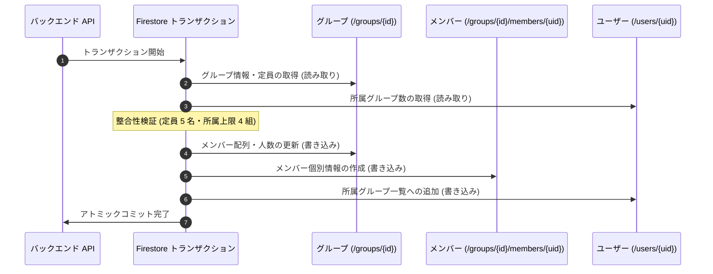

# Firestore トランザクション ＆ パフォーマンス最適化

このドキュメントでは、データの整合性を担保するトランザクション処理ルール、読み取り回数を削減するメッセージ集約構造、およびパフォーマンス最適化について解説します。

---

## 1. 「読み取り先行（Read-before-Write）」の原則

Firestore トランザクション（`db.runTransaction()`）では、**すべての読み取り操作（`get()`）を書き込み操作（`set()`, `update()`, `delete()`）の前に完了させる必要があります**。

一度でも書き込みを実行した後に読み取りを呼び出すと、実行時例外が発生します。

```typescript
const result = await db.runTransaction(async (transaction) => {
    // 1. 読み取りフェーズ（必要データを先行取得）
    const groupDoc = await transaction.get(groupRef);
    const userDoc = await transaction.get(userRef);

    // 2. 検証フェーズ（定員・権限の検証）
    if (!groupDoc.exists) throw new Error('Group not found.');
    if (groupDoc.data().members.length >= 5) throw new Error('Group full.');

    // 3. 書き込みフェーズ（一括アトミック更新）
    transaction.update(groupRef, { members: updatedMembers });
    transaction.set(memberSubDocRef, { joinedAt: new Date() });
    transaction.update(userRef, { groupIds: updatedGroupIds });
});
```

### 読み書き分離（IIFE パターン）
複雑なミューテーション（ノート投稿やメッセージ送信）では、読み取りと計算処理を即時実行関数（IIFE）に隔離し、書き込みフェーズと明確に分けることで、将来のリファクタリング時における順序崩壊を防いでいます。

---

## 2. 複数ドキュメントのアトミック更新

グループ参加などの操作では、関連する複数ドキュメントをトランザクション内で不可分にコミットし、データの不整合を排除します。



### トランザクションシーケンスの解説

1. **先行読み取りと排他制御**  
   グループ親ドキュメントとユーザープロフィールの最新スナップショットを同時に読み取ります。
2. **境界条件の厳格な検証**  
   定員（5名）および所属グループ上限（4組）を満たしているか、競合なく判定します。
3. **不可分な一括書き込み**  
   親ドキュメント、サブコレクション、ユーザーデータの 3 箇所を同一トランザクション内でアトミックに確定させます。

---

## 3. チャット読み取り回数の最適化 (`messages_latest/latest`)

チャット画面表示ごとに個別メッセージを多数読み込むコストを抑制するため、集約ドキュメント方式を採用しています。

### ① 集約ドキュメントの購読
`/groups/{groupId}/messages_latest/latest` に最新 25 件のメッセージ配列を集約して保持します。
- **読み取りコストの削減**: チャット画面の初期表示に必要な読み取り回数を**わずか 1 回**に圧縮。
- **即時更新**: メッセージ投稿時に集約ドキュメントが更新され、`onSnapshot` リスナーを通じて全員に即座にブロードキャストされます。

### ② 表示順序の安定化 (`clientTimestamp`)
サーバータイムスタンプ確定までの表示順序の逆転を防ぐため、投稿時に端末時刻（`clientTimestamp`）を付与し、クライアント側で安定ソートを実行します。

---

## 4. クエリ最適化の原則

1. **スナップショットの再利用**: `transaction.get(query)` で取得した結果を保持し、同一ドキュメントの再読み取りを行わない。
2. **一括取得（`db.getAll`）の活用**: ループ内の個別 `get()` を廃止し、`db.getAll(...refs)` により並行一括読み取りを実行。
3. **取得範囲の局所化**: 判定に不要なフィールドやドキュメントをトランザクションスコープから除外。

---

## 5. 関連ドキュメント

- [ノート投稿 & ストリーク計算](./logic-note-posting.md)
- [グループチャット設計・実装ガイド](./groupchat-construction-guide.md)
- [Firestore のオフライン永続化](./firestore-offline-persistence.md)
