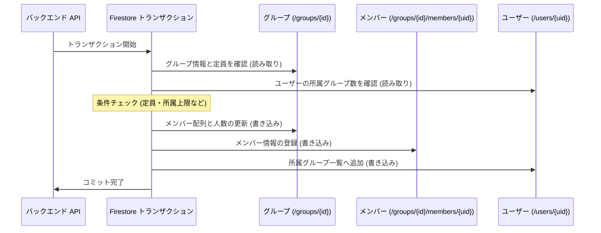

# Firestore トランザクション ＆ パフォーマンス最適化

このドキュメントでは、データの整合性を保つためのトランザクション処理ルール、読み取り回数を削減するメッセージ集約構造、およびパフォーマンス最適化について解説します。

---

## 1. 「読み取りを先に行う（Read-before-Write）」ルール

Firestore のトランザクション（`db.runTransaction()`）では、**すべての読み取り処理（`get()`）を、書き込み処理（`set()`、`update()`、`delete()`）の前に完了させる必要があります**。

一度書き込みを行った後に読み取りを呼び出すと、Firestore はエラーを返します。

```typescript
const result = await db.runTransaction(async (transaction) => {
    // 1. 読み取りフェーズ（必要なデータはすべて先に取得）
    const groupDoc = await transaction.get(groupRef);
    const userDoc = await transaction.get(userRef);

    // 2. バリデーションフェーズ（定員・権限などの条件チェック）
    if (!groupDoc.exists) throw new Error('Group not found.');
    if (groupDoc.data().members.length >= 5) throw new Error('Group full.');

    // 3. 書き込みフェーズ（データの一括更新）
    transaction.update(groupRef, { members: updatedMembers });
    transaction.set(memberSubDocRef, { joinedAt: new Date() });
    transaction.update(userRef, { groupIds: updatedGroupIds });
});
```

### 読み取り・書き込みの分離（IIFE パターン）
複雑な処理（ノート投稿やメッセージ送信など）では、読み取りと計算処理を即時実行関数（IIFE）で囲み、書き込みフェーズと明確に分けることで、将来のコード修正時に誤って読み取り順序を崩してしまうミスを防いでいます。

---

## 2. 複数ドキュメントのアトミックな更新

ユーザーがグループに参加する際などは、関連する複数のドキュメントをトランザクション内で同時に更新し、データの不整合を防ぎます：



---

## 3. チャット読み取り回数の最適化 (`messages_latest/latest`)

チャット画面を開くたびに過去のメッセージを1件ずつ読み込むと、Firestore の読み取りコストが急増します。Scripture Habit では以下の工夫を行っています：

### ① 最新メッセージの集約ドキュメント
`/groups/{groupId}/messages_latest/latest` という1つのドキュメントに、最新25件のメッセージ配列をまとめて保存しています。
- **効果**: チャットを開いたときの初期読み取りが**わずか1回**で済みます。
- **リアルタイム更新**: 新しいメッセージが投稿されると、この集約ドキュメントが更新され、リスナー（`onSnapshot`）を通じて参加者全員に即座に配信されます。

### ② 画面描画のちらつき防止 (`clientTimestamp`)
サーバーのタイムスタンプが確定するまでのわずかな間にメッセージの表示順が前後するのを防ぐため、投稿時に端末時間（`clientTimestamp`）を付与し、常に安定した順序で並び替えます。

---

## 4. 読み取りコストを削減するための原則

1. **クエリ結果の再利用**: `transaction.get(query)` で取得したスナップショットがある場合、同じドキュメントを `docRef.get()` で再取得しない。
2. **一括取得（`db.getAll`）の活用**: ループの中で1件ずつ取得するのではなく、`db.getAll(...refs)` を使って並行して一括取得する。
3. **不要な事前取得の排除**: バリデーションに不要なデータはトランザクション内で取得せず、必要最小限の読み取りに留める。

---

## 5. 関連ドキュメント

- [ノート投稿 & ストリーク計算](./logic-note-posting.md)
- [グループチャット設計・実装ガイド](./groupchat-construction-guide.md)
- [Firestore のオフライン永続化](./firestore-offline-persistence.md)
