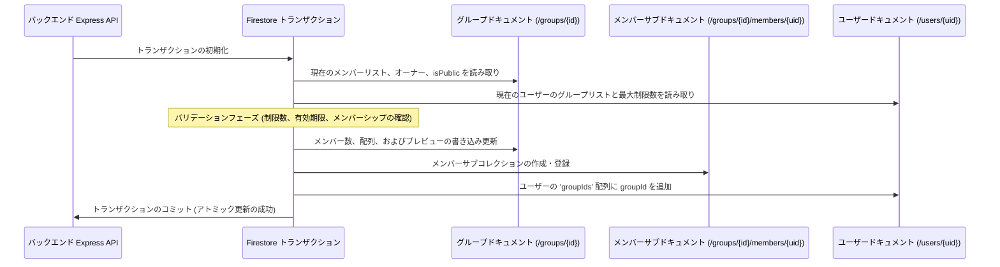

# Firestore トランザクションとパフォーマンス最適化

このドキュメントでは、バックエンドがトランザクションをどのように処理し、複数のドキュメントをアトミックに更新し、データベースの読み取りと書き込みを最適化してホットスポットを防ぎ、コストを削減するかについて詳しく説明します。

---

## 1. 「READ-before-WRITE（書き込み前の読み込み）」ルール

Google Cloud Firestore のトランザクションでは、**すべての読み取り操作（クエリ、get）は、書き込み操作（set、update、delete）の前に実行される必要があります**。

`transaction.update()` を呼び出した後に `transaction.get()` を呼び出すと、Firestore はエラーをスローします。これは、Firestore トランザクションが楽観的並行性制御を使用するためであり、変更を適用する前に読み取りデータをロックする必要があるためです。

### コード例 (`groups.ts`)
ユーザーがグループに参加する場合、バックエンドはデータベース操作の順序を以下のように制御します：

```typescript
const result = await db.runTransaction(async (transaction) => {
    // -------------------------------------------------------------
    // ステップ 1: 読み取りフェーズ（すべてのデータベース get はここで実行する）
    // -------------------------------------------------------------
    const groupDoc = await transaction.get(groupRef);
    const userDoc = await transaction.get(userRef);

    // -------------------------------------------------------------
    // ステップ 2: バリデーションフェーズ（ローカルでのビジネスロジックチェック）
    // -------------------------------------------------------------
    if (!groupDoc.exists) throw new Error('Group not found.');
    // メンバーシップ制限、重複チェック、招待コードの期限切れチェックなど...

    // -------------------------------------------------------------
    // ステップ 3: 書き込みフェーズ（更新と変更の適用）
    // -------------------------------------------------------------
    transaction.update(groupRef, { ...グループ配列フィールドの更新... });
    transaction.set(membersSubCollectionRef, { ...新しいメンバーのサブドキュメント... });
    transaction.update(userRef, { ...ユーザーのグループ登録一覧への追加... });
});
```

### 1.1 コンパイル時に安全な Read/Write フェーズの分離（IIFE パターン）

この制約を構築段階で厳密に適用するために、非常に複雑なトランザクション（`MessageService` の `postMessage` や `NoteService` の `postNote` など）は、読み取りシーケンス全体（条件付きのブートストラップや関連する純粋な計算）を、**フェーズ1: 読み取りフェーズ** を表す非同期即時実行関数式 (IIFE) ブロック内にカプセル化します。

このブロック内では、書き込み操作は一切許可されません。解決された状態や計算された変数はすべて外部のスコープで受け取られ、**フェーズ2: 書き込みフェーズ**（`transaction.set` と `transaction.update` のみを含む）で実行されます。

この物理的なフェーズ分離により、開発者が将来の更新時に書き込み処理の後に誤って読み取りクエリを挿入することが不可能になります。

#### コード例 (`MessageService.postMessage` / `NoteService.postNote`)
```typescript
const result = await db.runTransaction(async (transaction) => {
    // -------------------------------------------------------------
    // フェーズ 1: 読み取りおよび計算フェーズ (厳密な Read-before-Write)
    // -------------------------------------------------------------
    const { userData, currentMessages, ... } = await (async () => {
        const [userSnap, latestSnap] = await Promise.all([
            transaction.get(userRef),
            transaction.get(latestRef)
        ]);

        // ... 純粋な計算、バリデーション、および履歴ブートストラップクエリ ...

        return {
            userData: userSnap.data(),
            currentMessages: latestSnap.data()?.messages || []
        };
    })();

    // -------------------------------------------------------------
    // フェーズ 2: 書き込みフェーズ (ミューテーションのみ)
    // -------------------------------------------------------------
    transaction.set(msgRef, msgData);
    transaction.set(latestRef, { messages: updatedMessages }, { merge: true });
    transaction.update(userRef, userUpdate);
});
```

---

## 2. 複数ドキュメントの更新

読み取りを高速化するために、関連データは複数のコレクションにまたがって保存されます。イベント（グループへの参加など）が発生したとき、バックエンドはデータの整合性を保つため、単一のトランザクション内で複数のドキュメントを**アトミックに**更新する必要があります。



### グループ参加時に更新されるドキュメント：
1. **親グループドキュメント**: `members` UID 配列、`memberPreviews` ニックネームリスト、および `membersCount` を更新します。
2. **メンバーサブコレクションドキュメント**: 加入タイムスタンプやユーザー設定を保存するため、`/groups/{groupId}/members/{uid}` ドキュメントを作成します。
3. **ユーザー登録ドキュメント**: 加入制限を確認するため、`/users/{uid}.groupIds` にグループ ID を追加します（Firestore セキュリティルールで確認されます）。

---

## 3. メッセージの集約と低リード高頻度トランザクション

チャットメッセージの送信（`postMessage`）やリアクションの切り替え（`toggleReaction`）などの高頻度の操作をスケールさせるために、scripture-habit は、アクティブなチャット同期をアクティブなストリームあたり**正確に1回の Firestore 読み取り**に抑える**メッセージ集約パターン**を実装しています。

### 3.1 実体化されたチャット集約ドキュメント (`messages_latest/latest`)
`/messages` サブコレクション全体を購読する（ロード時およびローカルの変更時に N 回の読み取りが発生する）代わりに、クライアントは `onSnapshot` を使用して、単一の実体化されたビュードキュメントである `/groups/{groupId}/messages_latest/latest` を購読します。

投稿、編集、リアクション、または削除操作中に、バックエンドは以下のトランザクションを実行します：
1. 単一の `latest` ドキュメントと（キャッシュにない場合は）ユーザープロファイルの状態を**読み取ります**。
2. ローカルでメッセージ配列を**変更します**（追加、編集、25アイテムへのスライス、または削除時の縮小）。
3. 更新された配列を `/messages_latest/latest` に**書き戻し**、個々のメッセージログを `/messages` サブコレクションに書き込みます。

このアーキテクチャにより、アクティブにリッスンしているすべてのクライアントは、**データベースの読み取りを行わずに**（投稿者が行う単一の書き込みに対してのみ支払うことで）リアルタイムの更新を即座に受信できます。

> [!TIP]
> **新規グループ作成の最適化 (コールドスタートの回避)**
> グループが新しく作成されると、バックエンド (`groups.ts`) は、初期のウェルカムシステムメッセージを含む `messages_latest/latest` ドキュメントを事前に作成（シード）します。これにより、クライアントが最初に新しいグループにアクセスしたときに `messages_latest/latest` が必ず存在することが保証され、過去の `/messages` サブコレクションのフォールバッククエリ（コールドスタート）が完全に排除され、読み取り効率が 100% に維持されます。

### 3.2 ジッターゼロの UI ソート (`clientTimestamp`)
Firestore のサーバータイムスタンプ解決中、楽観的アップデートによりローカルで `createdAt` が一時的に `null` として解決される期間があります。クライアントの時計が同期していない場合、サーバーの返却時に「UIのジャンプ」が発生する原因になります。

ジッターフリーな並び替えを保証するため：
* クライアントは、メッセージや学習ノートを投稿する際、リクエストボディにクライアントが生成した Unix エポックミリ秒タイムスタンプ (`clientTimestamp = Date.now()`) を付加します。
* バックエンドは、`clientTimestamp` を個別のメッセージドキュメントと `latest` 集約配列の両方に保存します。
* フロントエンドは、絶対的なソートキーとして `clientTimestamp || parseTimestampToMillis(createdAt)` を使用します。ソートキーがサーバー同期の前後で安定しているため、UI のジャンプは完全に防止されます。

### 3.3 自己修復データ整合性チェック (`reconcileLatestMessages`)
集約配列は実体化されたビューであるため、手動のデータベース変更やレースコンディションによって、`/messages` サブコレクションの実際の履歴と乖離（データドリフト）が発生する可能性があります。

最終的なデータ整合性と絶対的な自己修復を保証するため：
* **`reconcileLatestMessages(groupId)`**: トランザクションで安全なメソッドであり、`/messages_latest/latest` 配列と、`/messages` サブコレクション内の実際の物理的な最新 25 件のメッセージを比較します。不整合（ID の不一致、長さ、または順序）が検出された場合、集約ドキュメントは自動的に上書きされ、自己修復されます。
* **Cron 同期ループ**: この自己修復機能は、アクティブな優先グループとス stale（古い）なグループの再計算の両方に対して、毎時の cron 同期に統合されており、ユーザーの介入なしにバックグラウンドでデータが自動修復されます。

### 3.4 グループチャットの読み取りカウント操作コストの監査

ユーザーがグループチャットを開いて操作する際の読み取りコストを監査および最適化するために、システムは**静的バンドル**と**実体化されたリスナー**のハイブリッドモデルを使用しています。

#### シナリオ A: 初期チャットルームへの入室（履歴の読み込み）
ユーザーがグループチャットを開くと、個々のメッセージに対して複数のドキュメントを読み取る代わりに、アプリケーションは `/api/groups/bundle/:groupId` を介して最適化された Firestore バンドルをリクエストします。

*   **CDN/サーバーキャッシュヒット（別のメンバーがチャットを開いてから 30〜60 秒以内）**:
    *   **Firestore 読み取り：0 回** (Edge CDN キャッシュまたはインメモリのサーバーキャッシュから完全に提供されます。100% 無料)。
*   **キャッシュミス（期限切れ後に初めて読み込まれる場合）**:
    *   **Firestore 読み取り：約 26 回**
        *   1 回: `/groups/{groupId}` (ユーザーのメンバーシップを確認するため)。
        *   25 回: `/groups/{groupId}/messages` (`createdAt` の降順でソートされ、25 件に制限されます)。
        *   *(注: 一度フェッチされると、このバンドルはグローバルにキャッシュされ、チャットに入る他のすべてのユーザーの読み取りが節約されます)。*

#### シナリオ B: アクティブチャット同期（リアルタイムリスニング）
初期履歴が読み込まれると、クライアントは単一の実体化された集約ドキュメント `/groups/{groupId}/messages_latest/latest` に `onSnapshot` リスナーをアタッチします。

*   **初期リスニング開始時**:
    *   **Firestore 読み取り：1 回** (集約メッセージ配列をフェッチするため)。
*   **グループ内の誰かが新しいメッセージやノートを投稿または編集したとき**:
    *   **Firestore 読み取り：更新ごとに 1 回** (変更された `latest` スナップショットによってトリガーされます)。

---

## 4. Firestore 読み取りの最適化とテレメトリ監査システム

scripture-habit のスケールに伴い、データベースコストを低く抑え、API レスポンス時間を高速に維持するため、アーキテクチャは Firestore ドキュメントの読み取り操作を最小限に抑える厳格なガイドラインを適用しています。

### 4.1 最適化の原則

1. **クエリスナップショットの再利用**
   クエリを使用してドキュメントを検索する場合（例: `inviteCode` でグループを検索する場合）、返される `QueryDocumentSnapshot` にはすでにドキュメントデータがすべて含まれています。スナップショットを直接再利用することで、セカンダリの `transaction.get(docRef)` 呼び出しを回避します：
   ```typescript
   // 効率的な招待コードによる参加
   const querySnap = await transaction.get(inviteCodeQuery);
   const groupDoc = querySnap.docs[0]; // これを直接再利用する! (groupRef.get() を回避)
   ```

2. **並行チャンクフェッチ (`db.getAll`)**
   ループ内での連続した get（N+1 クエリ）は、複数のネットワークラウンドトリップを引き起こすため避けてください。すべての参照を収集し、500 件ずつのチャンクで `db.getAll(...)` を使用して並行してフェッチします：
   ```typescript
   // 効率的なバッチ同期
   const allMemberRefs = groupIds.map(gid => db.collection('groups').doc(gid).collection('members').doc(userId));
   const snaps = await db.getAll(...allMemberRefs); // ループ内 get を回避!
   ```

3. **バックグラウンドコンテキストの伝播**
   非同期バックグラウンドワーカー（例: `postNote` でのプッシュ通知）に操作を委任する場合、事前にロードされたスナップショットをワーカーコンテキストに伝播させ、再フェッチを防ぎます。

4. **楽観的読み取りの排除**
   トランザクションのバリデーションに不要な場合、楽観的フェッチ（`postNote` や `deleteNote` での学習ノートのフェッチなど）をスキップします。

---

## 5. 自動テレメトリとグローバルリードバジェット

開発者が将来の更新時に誤って N+1 クエリや冗長なフェッチを再導入しないように、エミュレートされた統合テスト環境は透過的な **グローバルリード監査** を実行します。

### 5.1 透過的なプロトタイプのラッピング
テスト中、[TestSetup](../scripture-habit/api_internal/test-setup.ts) ハーネスは以下をインターセプトしてカウントします：
- `admin.firestore.Transaction.prototype.get`
- `admin.firestore.Transaction.prototype.getAll`
- `admin.firestore.DocumentReference.prototype.get`

この追跡は、標準のモック復元（`vi.restoreAllMocks()`）の影響を完全に受けません。

### 5.2 テスト出力レポートと警告バジェット
エミュレートされた各テストファイルの最後に、`TestSetup` はデータベース読み取りの詳細なコレクションレベルのブレイクダウンを記録します：

```text
📊 [Firestore Read Audit] -----------------------------
   Transaction GETs:    18
   Transaction GETALLs: 1
   Document GETs:       10
   👉 Total Reads:      29
   Collection Breakdown:
     - users: 11 reads
     - groups: 16 reads
-------------------------------------------------------
```

テストファイルが **300 回の Firestore 読み取り** のゆとりのあるバジェットを超えると、`TestSetup` は非同期チェーンの N+1 クエリを確認するように促す目立つ警告を出力します。
