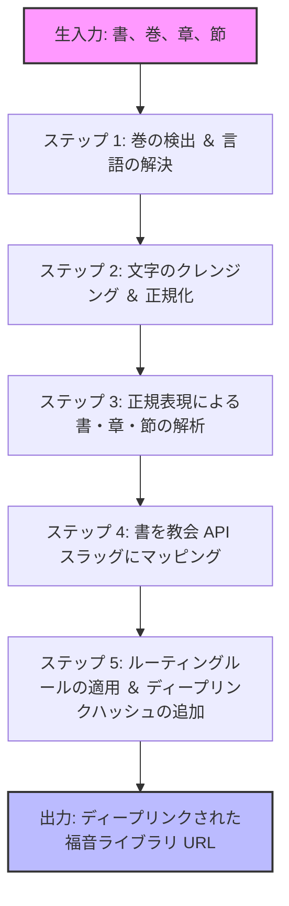

# 福音ライブラリ URL マッパー

`Gospel Library Mapper` (`src/utils/gospel-library-mapper.ts`) は、ユーザー入力、聖句の引用、書（巻）、およびトピックを、末日聖徒イエス・キリスト教会の公式サイト上の公式学習 URL に変換します。

文字列のクレンジングと解析、節選択の解決を行い、複数言語向けにハイライトパラメータ付きのディープリンクを作成します。

---

## 技術的パイプラインとデータフロー

マッパーは、ディープリンクされた URL を作成するために、5つのステップからなるパイプラインを通じて入力を処理します：



---

## コア機能

このモジュールは、3つの主要な関数をエクスポートします：

### 1. `getGospelLibraryUrl(...)`
メインの関数です。書（巻）、章/聖句テキスト、および言語が指定されると、正しい URL を構築します。
```typescript
getGospelLibraryUrl(
  volume: string | null | undefined,
  chapterInput: string | null | undefined,
  language: string = 'en'
): string | null
```

### 2. `getCategoryFromScripture(...)`
生の文字列から聖句のカテゴリ（例：「モルモン書」、「総大会」など）を特定します。
```typescript
getCategoryFromScripture(scriptureText: string | null | undefined): string
```

### 3. `getScriptureInfoFromText(...)`
マークダウン風のスタディノートから構造化された行（`**Chapter:**` または `**Scripture:**`、日本語では `**章:**` や `**聖句:**` など）を読み取り、正しい学習 URL を作成します。
```typescript
getScriptureInfoFromText(text: string | null | undefined): string | null
```

---

## ステップごとの実装詳細

### ステップ 1: 巻（聖典）の検出と言語マッピング
- **多言語マッチング**: 英語、日本語、ポルトガル語、中国語、スペイン語、ベトナム語、タイ語、韓国語、タガログ語、スワヒリ語のユーザー入力（「Old Testament」、「モルモン書」、「Velho Testamento」など）から、書（巻）を検出します。
- **言語コード変換**: アプリケーションの言語コードを、教会の公式な3文字のクエリパラメータに変換します：
  - `'en'` $\rightarrow$ `?lang=eng`
  - `'ja'` $\rightarrow$ `?lang=jpn`
  - `'pt'` $\rightarrow$ `?lang=por`
  - `'zho'` $\rightarrow$ `?lang=zho`
  - `'es'` $\rightarrow$ `?lang=spa`
  - `'vi'` $\rightarrow$ `?lang=vie`
  - `'th'` $\rightarrow$ `?lang=tha`
  - `'ko'` $\rightarrow$ `?lang=kor`
  - `'tl'` $\rightarrow$ `?lang=tgl`
  - `'sw'` $\rightarrow$ `?lang=swa`
  
> [!NOTE]
> **ベトナム語のフォールバック**: 旧約聖書（`ot`）および新約聖書（`nt`）の巻については、教会の公式サイトにベトナム語訳が存在しないため、ベトナム語のパラメータは英語（`?lang=eng`）にフォールバックされます。

---

### ステップ 2: 正規化とサニタイズ（クレンジング）
異なるキーボード環境やコピー＆ペーストによる入力に対応するため、マッパーは解析前に文字列をクレンジングします：
- **全角から半角**: 全角数字（`０-９`）を標準的な半角数字（`0-9`）に変換します。
- **記号の統一**:
  - コロン: `：` $\rightarrow$ `:`
  - 読点・カンマ: `，` または `、` $\rightarrow$ `,`
  - スペース: `\u3000`（全角スペース） $\rightarrow$ ` `（標準的な半角スペース）
  - ダッシュ: `－`、`—`、または `―` $\rightarrow$ `-`
- **接尾辞の削除**: 日本語の「章」などの地域化された接尾辞を標準的なコロン表記に変換し、単独の「章」や「節」といった文字を削除します。

---

### ステップ 3: 正規表現による解析
正規表現を使用して、書名、章番号、および節の境界を抽出します：
```typescript
const match = cleanChapterInput.match(/(.*?)\s*(\d+)(?::([\d\s,-]+))?\s*$/);
```

#### 抽出されるコンポーネント:
- **書名** (`match[1]`): ピリオドが削除され、小文字に変換されます。また、数字が続く場合は日本語の接頭辞である「第」を取り除きます。
- **章番号** (`match[2]`): 標準的な文字列にフォーマットされます。
- **節** (`match[3]`): 範囲（例：`3-5`）、単一の節、またはカンマ区切りのリストをキャプチャします。

---

### ステップ 4: 多言語辞書マッピング
マッパーには、**10の異なる言語**にわたる聖典の書を表す**150以上のマッピング**を含む辞書が保持されています。

#### 書のマッピング例:
- **1 Nephi**: `"1 nephi"`, `"1 néfi"`, `"1ニーファイ"`, `"第1ニーファイ"`, `"尼腓一書"`, `"1 นีไฟ"`, `"니파이전서"`.
- **Doctrine and Covenants**: `"doctrine and covenants"`, `"教義と聖約"`, `"doutrina e convênios"`, `"doctrina y convenios"`, `"giáo lý và giao ước"`, `"d&c"`, `"dc"`.

#### 巻のフォールバック:
ユーザーが書（巻）を指定せずに書の引用を入力した場合、マッパーは `slugToVolume` マップ（例：`gen` $\rightarrow$ `ot`、`1-ne` $\rightarrow$ `bofm`、`dc` $\rightarrow$ `dc-testament` のマッピング）を使用して、巻を自動的に特定します。

---

### ステップ 5: ルーティングルールとディープリンク

解決されたカテゴリに従って URL が組み立てられます：

#### 1. 標準聖典
`https://www.churchofjesuschrist.org/study/scriptures/{volumeUrlPart}/{bookUrlPart}/{chapterNum}{urlSuffix}`

#### 2. 教義と聖約（ネストされたパス）
`https://www.churchofjesuschrist.org/study/scriptures/dc-testament/dc/{chapterNum}{urlSuffix}`

#### 3. 総大会のリンク
- **完全なURL**: 入力がすでに完全な `churchofjesuschrist.org` の URL である場合、ユーザーの現在のセッションに合わせて言語パラメータ（`?lang=...`）を更新します。
- **ショートコード**: `YYYY/MM/DD` や `YYYY/MM` のような形式をサポートし、以下のように構築します：
  `https://www.churchofjesuschrist.org/study/general-conference/{chapterInput}{langParam}`

#### 4. 儀式および宣言
特定の用語を専用の URL にマッピングします：
- **聖餐 (Sacrament)** $\rightarrow$ `/study/scriptures/sacrament`
- **バプテスマ (Baptism)** $\rightarrow$ `/study/scriptures/baptism`
- **家族：世界への宣言 (The Family Proclamation)** $\rightarrow$ `/study/scriptures/the-family-a-proclamation-to-the-world`
- **生けるキリスト：使徒たちの証 (The Living Christ)** $\rightarrow$ `/study/scriptures/the-living-christ-the-testimony-of-the-apostles`
- **復元についての宣言 (The Restoration Proclamation)** $\rightarrow$ `/study/scriptures/the-restoration-of-the-fulness-of-the-gospel-of-jesus-christ`
- **デフォルトのカテゴリランディング** $\rightarrow$ `/study/scriptures/ordinances-and-proclamations`

#### 5. BYU Speeches のパススルー
BYU Speeches（BYUスピーチ）の入力を外部参照として扱い、`chapterInput` を変更せずにそのまま返します。

---

## ディープリンクによる節のハイライトとスクロール

ディープリンクを提供するため、マッパーは**ステップ 3**でキャプチャされた節を解析して、HTMLハッシュ属性を構築します：

1.  **選択箇所のハイライト (`id` パラメータ)**:
    節文字列内の数値を、教会ウェブサイト向けの `p` プレフィックス付きパラメータに変換します。
    -   *入力*: `"3-5"` $\rightarrow$ `&id=p3-p5`
    -   *結果*: ウェブページ上で3節から5節がハイライトされます。
2.  **自動スクロールアンカー (`#` ハッシュ)**:
    最初の節番号を抽出し、アンカーハッシュとして末尾に追加します。
    -   *入力*: `"3-5"` $\rightarrow$ `#p3`
    -   *結果*: ブラウザをスクロールして、開始節の位置まで自動的に移動します。

### 生成例:
*   **入力**: `getGospelLibraryUrl("Book of Mormon", "Alma 32:21", "es")`
*   **出力**: `https://www.churchofjesuschrist.org/study/scriptures/bofm/alma/32?lang=spa&id=p21#p21`
