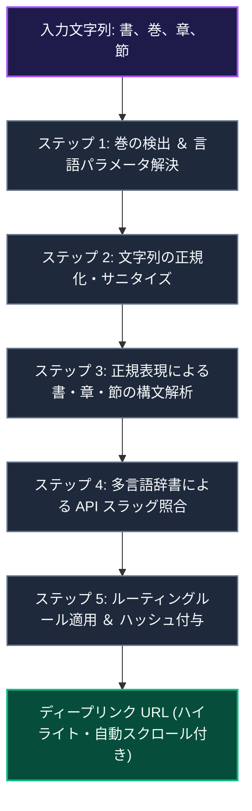

# 福音ライブラリ URL マッパー

::: tip インタラクティブ・アーキテクチャツアー
この機能のデータフローとステップ解説ツアーを体験できます：
- **オンライン（GitHubブラウザプレビュー）**: [インタラクティブツアーを開く (聖句リンク & 福音ライブラリ連携)](https://htmlpreview.github.io/?https://github.com/ScriptureHabit/scripture-habit/blob/main/docs/public/architecture-tour.html?tour=tour-newnote&lang=ja)
- **VitePress / ローカル**: [聖句リンク & 福音ライブラリ連携 の解説ツアーを開く](/architecture-tour.html?tour=tour-newnote&lang=ja)
:::

`Gospel Library Mapper` (`src/utils/gospel-library-mapper.ts`) は、ユーザー入力、聖句の引用、書（巻）、およびトピック文字列を、末日聖徒イエス・キリスト教会公式サイト上の公式学習 URL へ変換するユーティリティです。

文字列のクレンジング、書名と章節の構文解析を行い、多言語に対応したハイライト・自動スクロール付きディープリンクを構築します。

---

## 1. パイプラインアーキテクチャ

マッパーは、5 つの処理ステップを経てディープリンク URL を生成します。



### パイプラインの解説

1. **言語解決とクレンジング**  
   ユーザーの言語設定から教会公式の 3 文字クエリ（`jpn`, `eng`, `spa` 等）を導出し、全角数字や特殊記号を標準半角形式へ正規化します。
2. **構文解析と多言語スラッグ照合**  
   正規表現で書名・章番号・節範囲を切り出し、150 以上の多言語辞書（日本語・英語・スペイン語等）と照合して教会 URL スラッグ（例: `bofm/alma`）を特定します。
3. **ディープリンクの構築**  
   章 URL に加え、対象節のハイライトパラメータ（`&id=p...`）と自動スクロール用アンカーハッシュ（`#p...`）を結合して最終リンクを出力します。

---

## 2. エクスポート関数

### 1. `getGospelLibraryUrl(...)`
主要関数です。巻、章/節文字列、および言語コードを受け取り、公式 URL を構築します。
```typescript
getGospelLibraryUrl(
  volume: string | null | undefined,
  chapterInput: string | null | undefined,
  language: string = 'en'
): string | null
```

### 2. `getCategoryFromScripture(...)`
入力テキストから聖典カテゴリ（「モルモン書」「総大会」など）を特定します。
```typescript
getCategoryFromScripture(scriptureText: string | null | undefined): string
```

### 3. `getScriptureInfoFromText(...)`
マークダウン形式のスタディノートから構造化ヘッダー行（`**章:**` や `**聖句:**` 等）を抽出し、対応する URL を生成します。
```typescript
getScriptureInfoFromText(text: string | null | undefined): string | null
```

---

## 3. ステップごとの処理詳細

### ステップ 1: 巻（聖典）の検出と言語マッピング
- **多言語マッチング**: 英語、日本語、ポルトガル語、スペイン語、中国語、韓国語、ベトナム語、タイ語、タガログ語、スワヒリ語の各表記から巻を検出。
- **公式クエリ変換**: `'ja'` $\rightarrow$ `?lang=jpn`, `'en'` $\rightarrow$ `?lang=eng`, `'es'` $\rightarrow$ `?lang=spa` 等。
- **ベトナム語フォールバック**: 旧約・新約聖書のベトナム語ページが存在しないため、自動的に英語（`?lang=eng`）へフォールバック。

### ステップ 2: 正規化とサニタイズ
- 全角数字（`０-９`）を半角（`0-9`）へ変換。
- コロン（`：` $\rightarrow$ `:`）、読点（`、` $\rightarrow$ `,`）、全角空白（`\u3000` $\rightarrow$ ` `）、ダッシュ（`―` $\rightarrow$ `-`）を統一。
- 日本語の「第」「章」「節」などの接頭辞・接尾辞を正規化。

### ステップ 3: 正規表現による構文解析
```typescript
const match = cleanChapterInput.match(/(.*?)\s*(\d+)(?::([\d\s,-]+))?\s*$/);
```
- **書名** (`match[1]`): 書名部分。
- **章番号** (`match[2]`): 章の数値。
- **節** (`match[3]`): 単一節、範囲（例: `3-5`）、またはカンマ区切りの節リスト。

### ステップ 4: 多言語辞書マッピング
- **1 Nephi**: `"1 nephi"`, `"1 néfi"`, `"1ニーファイ"`, `"第1ニーファイ"`, `"尼腓一書"` $\rightarrow$ `1-ne`
- **Doctrine and Covenants**: `"doctrine and covenants"`, `"教義と聖約"`, `"d&c"` $\rightarrow$ `dc`

### ステップ 5: ルーティングルールとディープリンクの構築
- **標準聖典**: `https://www.churchofjesuschrist.org/study/scriptures/{volume}/{book}/{chapter}{suffix}`
- **教義と聖約**: `https://www.churchofjesuschrist.org/study/scriptures/dc-testament/dc/{chapter}{suffix}`
- **総大会**: `https://www.churchofjesuschrist.org/study/general-conference/{input}{langParam}`
- **節のハイライトとスクロール**:
  - ハイライト: `&id=p3-p5`（3〜5節を選択状態に指定）
  - スクロール: `#p3`（開始節の位置へブラウザを自動移動）

#### 生成例
- **入力**: `getGospelLibraryUrl("Book of Mormon", "Alma 32:21", "es")`
- **出力**: `https://www.churchofjesuschrist.org/study/scriptures/bofm/alma/32?lang=spa&id=p21#p21`

---

## 4. 関連ドキュメント

- [グループチャットの設計と実装](./groupchat-construction-guide.md)
- [ノート作成（NewNote）設計・実装ガイド](./newnote-construction-guide.md)
- [多言語対応 (i18n)](./logic-i18n.md)
