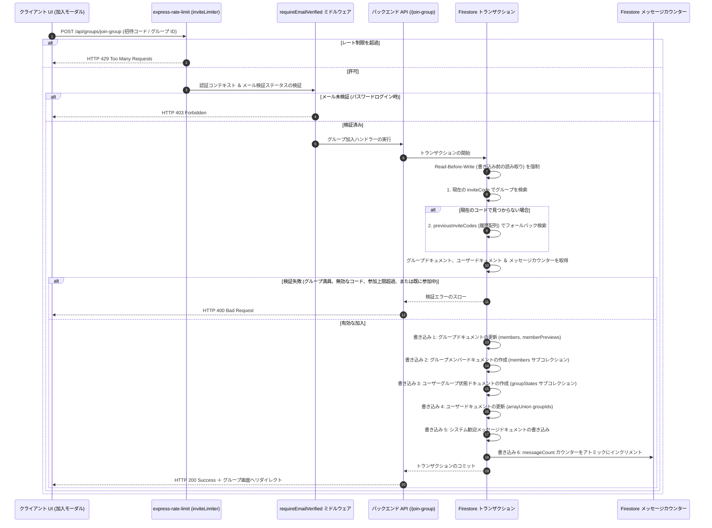

# グループ招待とメンバー加入パイプライン

このドキュメントでは、グループへの招待と加入（参加）プロセスについて説明します。データベースの整合性を保証し、招待リンクに対する総当たり（ブルートフォース）攻撃を防止し、地域化（ローカライズ）されたプレビューに対応するとともに、**無期限招待モデル（Zero Expiration Model）**と**過去リンクのエイリアス互換性（`previousInviteCodes`）**による人間中心の設計を実現しています。

---

## 🏗️ パイプラインの概要

加入パイプラインは、レート制限、認証ステータス、招待コードのエイリアス解決、および Firestore トランザクション書き込みを使用してリクエストを検証します：

---

## 🔒 招待リンクのセキュリティ ＆ 設計思想

招待リンクは学習グループへのアクセスを許可するため、以下のルールと人間中心の設計で保護されています：

### 1. 読みやすいコード
ユーザーによる入力間違い（`O` と `0` や、`I` と `1` の混同など）を防ぐため、招待コードには以下の32文字のアルファベット/数字を使用します：
`ABCDEFGHJKLMNPQRSTUVWXYZ23456789`
- **長さ**: 6文字。
- **組み合わせ**: 10億通り以上の一意のコード。

### 2. 重複チェック
グループを作成するかリンクを再生成する際、システムはランダムなコードを生成し、トランザクション内で Firestore にクエリを実行します。コードがすでに使用されている場合は、新しいコードを再試行します（最大10回試行）。

### 3. 無期限招待モデル（Permanent Invites）
- **設計思想**: 聖典学習グループは少人数の信頼ベースのサークルです。「24時間で期限切れ」といった厳しすぎるルールは、週末やメッセージアプリを介した招待で「リンクが開けない」というコミュニケーションの摩擦（気まずさ）を生みます。
- **無期限の有効性**: 招待コードはデフォルトで有効期限がありません（`inviteCodeExpiresAt: null`）。ユーザーはいつでも都合の良いタイミングでグループに参加できます。

### 4. 過去コードのエイリアス互換性（`previousInviteCodes`）
- メンバーが招待コードを再生成した場合、古い招待コードは自動的に `previousInviteCodes` 配列へ履歴として退避・保存されます。
- `/api/groups/group-preview/:inviteCode` および `/api/groups/join-group` は、まず現在の `inviteCode` を検索し、ヒットしなければ `previousInviteCodes` の `array-contains` でフォールバック検索を行います。
- **リンク切れ事故の防止 (Zero Broken Links)**: 誰かがコードを再生成しても、過去にLINEやメールで友達に送った招待リンクが無効化されず、常に同じグループへ案内されます。

### 5. 多層防御モデルによる安全性の担保
時間制限に頼る代わりに、以下の構造的な多層防御で安全性を維持しています：
- **定員制限**: グループは最大5人までに厳格に制限（`maxMembers: 5`）。満員になればリンクを持っていても入れません。
- **所属グループ数制限**: 1人のユーザーが所属できるグループ数は最大4個まで（`MAX_GROUPS_PER_USER: 4`）。
- **フラットなメンバーガバナンス**: グループ作成者（オーナー）だけでなく、メンバー全員が招待リンクのコピーや再生成を行え、放置メンバーの退出・キック管理も可能です。
- **アカウント認証**: メール確認済みアカウントまたは専用デモサンドボックスアカウントに限定。

### 6. レート制限 (`inviteLimiter`)
自動化された総当たり攻撃（スキャン）を防ぐため：
- **監視時間枠 (Window)**: 60分。
- **本番環境での制限**: 1 IP アドレスあたり1時間最大15回までの加入試行。
- **開発環境での制限**: 自動 E2E テスト等を支援するため、1時間あたり1,000回までの試行を許可。

---

## 📡 バックエンド API エンドポイント (`api_internal/routes/groups.ts`)

### 1. グループプレビュー (`GET /api/groups/group-preview/:inviteCode`)
ユーザーが加入する前に、プレビューカードにグループ名、説明、およびメンバー数を表示します。

* **一般公開アクセス**: ユーザーがログインする前にグループをプレビューできるよう、このエンドポイントは公開（認証不要）されています。
* **2段階検索（エイリアス解決）**: 現在の `inviteCode` を検索し、ヒットしない場合は `previousInviteCodes` 配列を検索します。
* **地域化 (ローカライズ)**: `req.query.language` または `req.query.lang` を読み取り、`groupData.translations[lang]` から翻訳されたグループ名と説明を返します。

### 2. コードの再生成 (`POST /api/groups/regenerate-invite-code`)
グループメンバーが新しいメイン招待コードを発行しつつ、過去のリンクの有効性を維持します。

* **メンバー保護**: リクエスト送信者の UID が `members` 配列に含まれているか、または `ownerUserId` と一致することを確認します。
* **履歴への退避**: 現在の `inviteCode` を `previousInviteCodes` 配列に追加してから新しいコードを設定します。
* **無期限設定**: `inviteCodeExpiresAt: null` を設定します。

---

## 🤝 同時実行に対して安全なグループ加入 (`POST /api/groups/join-group`)

データベースの競合状態（例：同時に複数のユーザーが加入した際にグループ容量の上限を超えてしまうなど）を防ぐため、グループへの加入処理は Firestore トランザクション内で実行されます：

### 1. 厳格な検証
- **コード解決**: `groupId`、`inviteCode`、または `previousInviteCodes` から対象グループを特定します。
- **容量制限**: グループサイズが `maxMembers`（デフォルトは5）以上の場合は `GROUP_FULL` で拒否します。
- **所属グループ数制限**: ユーザーが所属上限（`MAX_GROUPS_PER_USER = 4`）に達している場合は `MAX_GROUPS_LIMIT` で拒否します。
- **重複防止**: ユーザーがすでにグループの `members` リストに含まれている場合は `ALREADY_MEMBER` で拒否します。
- **サンドボックス隔離**: デモアカウントは専用デモグループのみ加入可能。本番アカウントはデモグループへ加入不可。
- **メール検証チェック**: メールアドレスの確認が完了していないパスワードログインユーザーを拒否します。

### 2. トランザクションでの書き込み
データの整合性を保証するため、以下の書き込み処理がアトミックに行われます：

1. **グループの更新**: `members` 配列にユーザーの UID を追加し、`membersCount` をインクリメントし、`memberPreviews` を更新します（最新の15名分に制限）。
2. **メンバーサブコレクション**: 加入時のタイムスタンプやユーザー設定を保存するため、`/groups/{groupId}/members/{uid}` ドキュメントを作成します。
3. **ユーザー状態**: 未読バッジ表示用に、ユーザーが読み取った最新のメッセージインデックスを追跡するための `/users/{uid}/groupStates/{groupId}` ドキュメントを作成します。
4. **ユーザープロフィール**: ユーザーの `groupIds` 配列に加入した `groupId` を `arrayUnion` で追加します。
5. **歓迎メッセージ**: システムメッセージ（`userJoined` タイプ）を `/groups/{groupId}/messages` に書き込みます。
6. **メッセージカウンター**: グループの `messageCount` をアトミックにインクリメントします。
