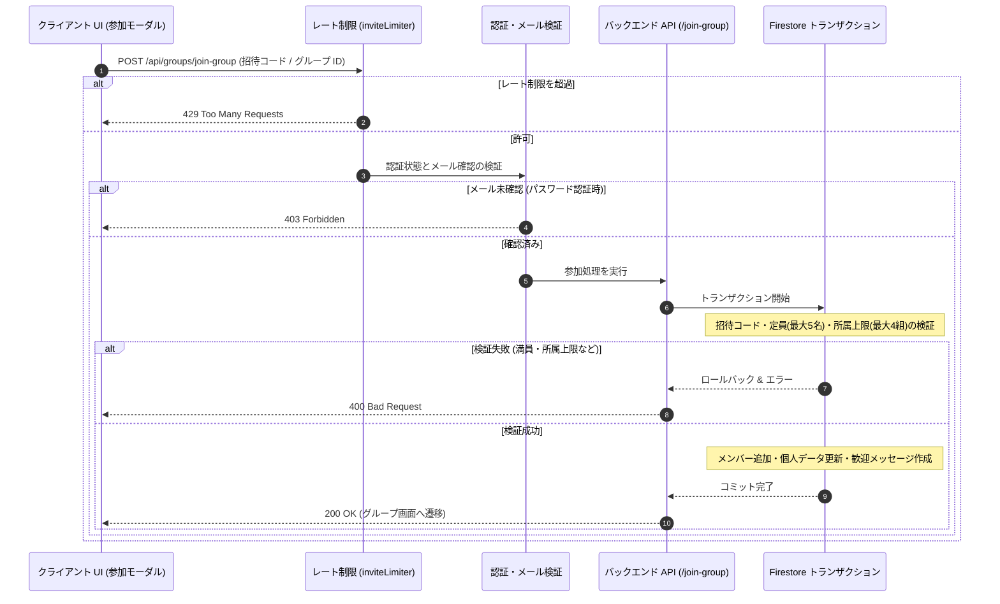

# グループ招待と参加の仕組み

::: tip インタラクティブ・アーキテクチャツアー
この機能のデータフローとステップ解説ツアーを体験できます：
- **オンライン（GitHubブラウザプレビュー）**: [インタラクティブツアーを開く (招待リンク & リダイレクト)](https://htmlpreview.github.io/?https://github.com/ScriptureHabit/scripture-habit/blob/main/docs/public/architecture-tour.html?tour=tour-invite&lang=ja)
- **VitePress / ローカル**: [招待リンク & リダイレクト の解説ツアーを開く](/architecture-tour.html?tour=tour-invite&lang=ja)
:::

このドキュメントでは、グループ招待リンクの生成、招待コードによる参加検証フロー、およびリンク互換性とセキュリティ設計について解説します。

---

## 1. 参加フローの概要

グループ参加処理は、レート制限、認証検証、および Firestore トランザクションによるアトミックコミットを通じて安全に実行されます。

### シーケンスの解説

1. **レート制限と認証の多重ガード**  
   総当たり攻撃を防ぐため IP / ユーザーごとのレート制限（1 時間最大 15 回）を適用し、メール確認済みトークンを検証します。

2. **トランザクション内での厳格な整合性検証**  
   同時参加による定員超過（最大 5 名）や所属上限超過（最大 4 グループ）を Firestore トランザクション内で排他的に検証します。

3. **アトミック更新と歓迎メッセージ作成**  
   メンバー追加、ユーザープロフィールの所属グループ更新、およびチャットへの歓迎メッセージ作成を一括でコミットします。

---

## 2. 招待リンクの設計と工夫

### ① 誤読を防止する文字セット
`O` と `0`、`I` と `1` などの混同を避けるため、視認性の高い 32 文字を採用しています。
`ABCDEFGHJKLMNPQRSTUVWXYZ23456789`
- **コード長**: 6 文字
- **空間容量**: 10 億通り以上

### ② 無期限招待（恒久リンク）
共有されたリンクが短期間で失効する利便性の低下を防ぐため、招待コードは原則として**有効期限なし**で運用されます。

### ③ 過去コードの互換性保持 (`previousInviteCodes`)
招待コードを再生成した場合でも、旧コードは `previousInviteCodes`（履歴配列）に自動保管されます。過去に共有されたリンクからアクセスした場合でも、正常にグループへ参加できます。

### ④ 安全性を保つ境界制御
- **定員制限**: グループは最大 5 名（`maxMembers: 5`）。満員時は参加を遮断。
- **所属上限**: 1 ユーザーあたりの所属数は最大 4 グループ（`MAX_GROUPS_PER_USER = 4`）。
- **レート制限**: 1 時間あたり最大 15 回の参加試行に制限。

---

## 3. バックエンド API エンドポイント (`api_internal/routes/groups.ts`)

### 1. グループプレビュー (`GET /api/groups/group-preview/:inviteCode`)
参加前にグループ名、説明、および参加人数を表示するための公開 API です。
- **2 段階検索**: 現在の `inviteCode` を検索し、不一致の場合は `previousInviteCodes` 履歴を照合。
- **多言語対応**: クライアントの言語設定に応じて翻訳済みのグループ名と説明を返却。

### 2. コードの再生成 (`POST /api/groups/regenerate-invite-code`)
新しい 6 桁コードを発行し、既存コードを履歴へ退避します。

### 3. グループ参加 (`POST /api/groups/join-group`)
Firestore トランザクション内で定員・所属上限・重複参加の検証と更新を一括実行します。

---

## 4. 関連ドキュメント

- [少人数グループ（最大5人）とピア・アカウンタビリティの心理学](./ux-small-groups-and-peer-accountability.md)
- [非アクティブ判定 & 自動整理](./inactivity-and-autokick.md)
- [グループチャット設計・実装ガイド](./groupchat-construction-guide.md)
