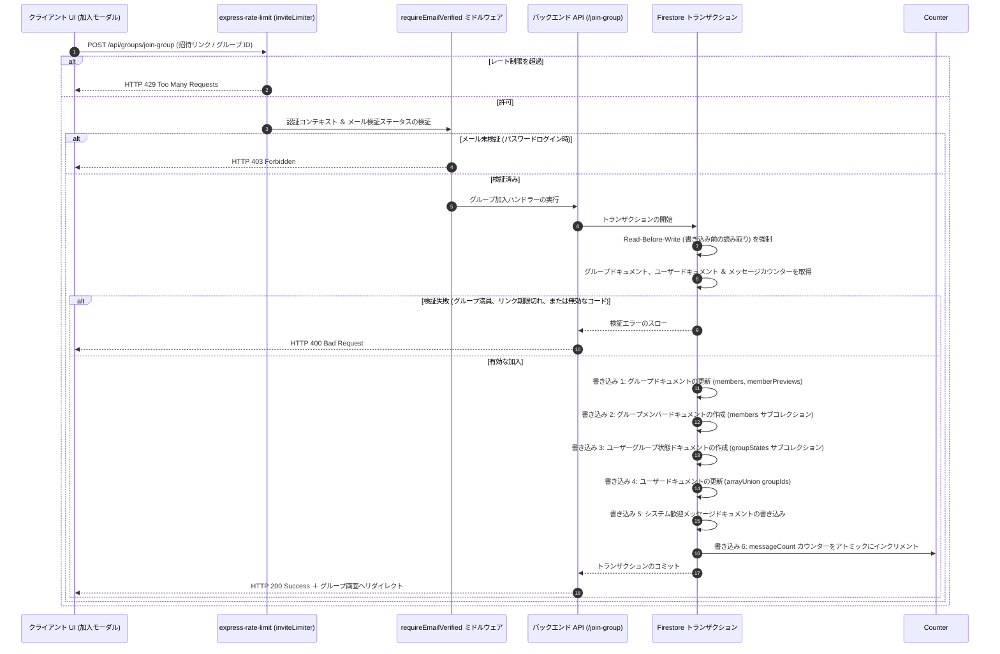

# グループ招待とメンバー加入パイプライン

このドキュメントでは、グループへの招待と加入（参加）プロセスについて説明します。データベースの整合性を保証し、招待リンクに対する総当たり（ブルートフォース）攻撃を防止し、地域化（ローカライズ）されたプレビューに対応します。

---

## 🏗️ パイプラインの概要

加入パイプラインは、レート制限、認証ステータス、および Firestore トランザクション書き込みを使用してリクエストを検証します：

---

## 🔒 招待リンクのセキュリティ

招待リンクは非公開グループへのアクセスを許可するため、以下のルールを使用して保護しています：

### 1. 読みやすいコード
ユーザーによる入力間違い（`O` と `0` や、`I` と `1` の混同など）を防ぐため、招待リンクには以下の32文字のアルファベット/数字を使用します：
`ABCDEFGHJKLMNPQRSTUVWXYZ23456789`
-   **長さ**: 6文字。
-   **組み合わせ**: 10億通り以上の一意のコード。

### 2. 重複チェック
グループを作成するかリンクを再生成する際、システムはランダムなコードを生成し、トランザクション内で Firestore にクエリを実行します。コードがすでに使用されている場合は、新しいコードを再試行します（最大10回試行）。

### 3. 有効期限
-   **デフォルトの有効期限**: 7日間。
-   **保存方法**: `inviteCodeExpiresAt` に Firestore タイムスタンプとして保存されます。
-   **検証**: 加入トランザクション時に `expiresAt < new Date()`（期限切れ）であればリクエストを拒否します。

### 4. レート制限 (`inviteLimiter`)
自動化された総当たり攻撃（スキャン）を防ぐため：
-   **監視時間枠 (Window)**: 60分。
-   **本番環境での制限**: 1時間あたり最大15回までの加入試行。
-   **開発環境での制限**: テストを支援するため、1時間あたり1,000回までの試行を許可。

---

## 📡 バックエンド API エンドポイント (`api_internal/routes/groups.ts`)

### 1. グループプレビュー (`GET /api/groups/group-preview/:inviteCode`)
ユーザーが加入する前に、プレビューカードにグループ名、説明、およびメンバー数を表示します。

*   **一般公開アクセス**: ユーザーがログインする前にグループをプレビューできるよう、このエンドポイントは公開（認証不要）されています。
*   **有効期限チェック**: 招待リンクの期限が切れている場合は `HTTP 410 Gone` を返します。
*   **地域化 (ローカライズ)**: `req.query.language` を読み取り、`groupData.translations[lang]` から翻訳されたグループの説明を返します。

### 2. コードの再生成 (`POST /api/groups/regenerate-invite-code`)
グループのオーナーが現在のコードを無効化し、新しいコードを生成できるようにします。

*   **オーナー保護**: リクエスト送信者の UID が、グループドキュメント内の `ownerUserId` と一致することを確認します。
*   **即時反映**: 古いコードを上書きすることで、そのコードを使用しようとするすべての試行を即座にブロックします。

---

## 🤝 同時実行に対して安全なグループ加入

データベースの競合状態（例：同時に複数のユーザーが加入した際にグループ容量の上限を超えてしまうなど）を防ぐため、グループへの加入処理は Firestore トランザクション内で実行されます：

### 1. 厳格な検証
-   **容量制限**: グループサイズが `maxMembers`（デフォルトは500）を超える場合は拒否します。
-   **所属グループ数制限**: ユーザーが所属上限である `MAX_GROUPS_PER_USER` に達している場合は拒否します。
-   **重複防止**: ユーザーがすでにグループの `members` リストに含まれているか確認します。
-   **メール検証チェック**: ユーザーがメールアドレスの検証（確認）を完了していない場合は拒否します。

### 2. トランザクションでの書き込み
データの整合性を保証するため、以下の書き込み処理がアトミックに行われます：

1.  **グループの更新**: `members` 配列にユーザーの UID を追加し、`membersCount` をインクリメントし、`memberPreviews` を更新します（最新の15名分に制限）。
2.  **メンバーサブコレクション**: 加入時のタイムスタンプやユーザー設定を保存するため、`/groups/{groupId}/members/{uid}` ドキュメントを作成します。
3.  **ユーザー状態**: 未読バッジ表示用に、ユーザーが読み取った最新のメッセージインデックスを追跡するための `/users/{uid}/groupStates/{groupId}` ドキュメントを作成します。
4.  **ユーザープロフィール**: ユーザーの `groupIds` 配列に加入した `groupId` を追加します。
5.  **歓迎メッセージ**: システムメッセージを作成します： `✨ **${nickname}** joined the group! Welcome!`。
