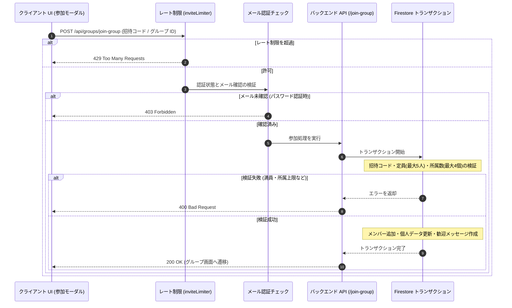

# グループ招待と参加の仕組み

このドキュメントでは、グループへの招待リンク生成、招待コードによる参加フロー、およびリンクの互換性と安全性を保つ設計について解説します。

---

## 1. 参加フローの概要

グループへの参加処理は、レート制限、メール認証確認、および Firestore トランザクションによる一括更新を通じて安全に処理されます。

---

## 2. 招待リンクの設計と工夫

### ① 読み間違いを防ぐコード文字セット
`O` と `0`、`I` と `1` などの入力ミスを防ぐため、招待コードには視認性の高い32文字を使用しています：
`ABCDEFGHJKLMNPQRSTUVWXYZ23456789`
- **長さ**: 6文字
- **パターン数**: 10億通り以上

### ② 無期限招待（リンク切れを起こさない設計）
メッセージアプリなどで共有された招待リンクが「24時間で無効」になると、後から開いたユーザーが参加できずコミュニケーションの障壁になります。そのため、招待コードは原則として**有効期限なし（無期限）**で運用されます。

### ③ 過去コードの互換性保持 (`previousInviteCodes`)
メンバーが招待コードを再生成した場合でも、古いコードは `previousInviteCodes`（履歴配列）に自動で保管されます。
過去にLINEやメールで送信した古い招待リンクからアクセスしても、リンク切れにならず同じグループへ参加できます。

### ④ 安全性を保つ制限
有効期限を設けない代わりに、以下のルールでグループを保護しています：
- **定員制限**: グループは最大5人（`maxMembers: 5`）。満員の場合はリンクを知っていても参加できません。
- **所属上限**: 1ユーザーが所属できるグループは最大4個まで（`MAX_GROUPS_PER_USER = 4`）。
- **レート制限**: 1つのIPアドレスからの過度な参加試行（ブルートフォース攻撃など）を制限（本番環境: 1時間あたり最大15回）。

---

## 3. バックエンド API エンドポイント (`api_internal/routes/groups.ts`)

### 1. グループプレビュー (`GET /api/groups/group-preview/:inviteCode`)
参加前にグループ名、説明、および参加人数を表示するための公開APIです。
- **2段階検索**: 現在の `inviteCode` で検索し、ヒットしない場合は `previousInviteCodes` 履歴を検索します。
- **多言語対応**: クライアントの言語設定に応じて、翻訳済みのグループ名と説明を返します。

### 2. コードの再生成 (`POST /api/groups/regenerate-invite-code`)
新しい招待コードを発行します。既存のコードは履歴（`previousInviteCodes`）に退避されるため、古いリンクも引き続き有効です。

### 3. グループへの参加 (`POST /api/groups/join-group`)
Firestore トランザクション内で実行され、同時参加による定員オーバーを防ぎます：
- **定員チェック**: 現在の人数が `maxMembers`（5人）以上の場合は拒否。
- **所属数チェック**: ユーザーの参加グループが4個以上の場合は拒否。
- **重複参加防止**: すでに参加中の場合は拒否。
- **一括更新**: メンバーリストへの追加、ユーザーの参加グループ一覧の更新、および歓迎メッセージの作成を一括で実行。

---

## 4. 関連ドキュメント

- [少人数グループ（最大5人）とピア・アカウンタビリティの心理学](./ux-small-groups-and-peer-accountability.md)
- [非アクティブ判定 & 自動整理](./inactivity-and-autokick.md)
- [グループチャット設計・実装ガイド](./groupchat-construction-guide.md)
