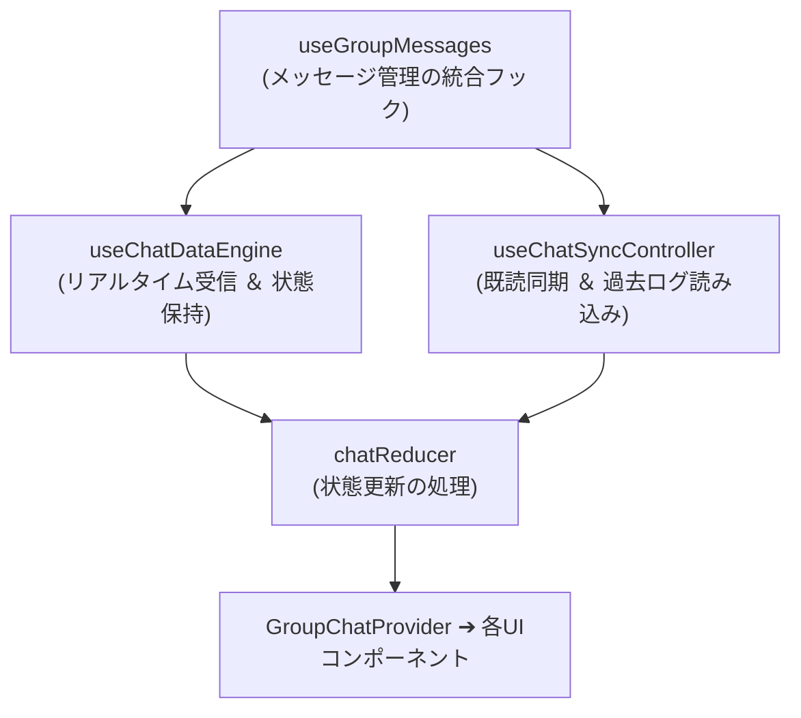

# グループチャット (`GroupChat`) の設計と実装

このドキュメントでは、グループチャットモジュール（`src/components/groupchat`）の構成、状態管理、4系統の Context 分割設計、および各種機能の実装について解説します。

---

## 1. 全体アーキテクチャの概要

`GroupChat` は、リアルタイムメッセージング、団結度メーター、応援送信、モーダル管理などを統括するコンポーネントです。

```
                       ┌─────────────────────────┐
                       │   GroupChatProvider     │
                       └────────────┬────────────┘
                                    │
    ┌──────────────────┬────────────┴─────────────┬──────────────────┐
    ▼                  ▼                          ▼                  ▼
ChatDataContext   ChatMessageActionsContext   ChatGroupActionsContext   ChatUIActionsContext
 (状態データ)        (メッセージ操作)          (グループ・メンバー操作)   (UI・スクロール)
    │                  │                          │                  │
    └──────────────────┴────────────┬─────────────┴──────────────────┘
                                    ▼
                         ┌───────────────────────┐
                         │   GroupChatContent    │
                         └──────────┬────────────┘
                                    │
          ┌─────────────────────────┼─────────────────────────┐
          ▼                         ▼                         ▼
    ChatHeader             MessageListContainer           GroupChatFooter
 (ヘッダー・団結度)         (スクロール・メッセージ一覧)  (返信表示・入力欄)
```

### Context 分割による再描画の最適化
メッセージ入力やスクロール操作で画面全体が再描画されないよう、Context を4つに分離しています：
1. **`ChatDataContext`**: メッセージ一覧、メンバー一覧、団結度などのデータ本体。
2. **`ChatMessageActionsContext`**: メッセージ送信・編集・削除・リアクション・翻訳などの操作関数。
3. **`ChatGroupActionsContext`**: グループ名変更・退出・削除などのグループ管理関数。
4. **`ChatUIActionsContext`**: スクロール制御や翻訳ヘルパーなどのUI操作。

---

## 2. フックの階層構造とデータフロー

`src/components/groupchat/hooks/core` 配下のフック群は、単方向データフローに従って設計されています：



- **`useChatDataEngine`**: Firestore の `onSnapshot` からデータを受信し、`chatReducer` へ dispatch します。
- **`useChatSyncController`**: 過去メッセージの追加読み込み（無限スクロール）や既読状態の同期を担当します。
- **`useGroupMessages`**: 上記2つのフックをまとめ、Context に渡す状態と操作関数を提供します。

---

## 3. 主な機能の実装

### ① 団結度（Unity）メーター ＆ 100% 達成演出 (`useUnityScore`)
- 当日の学習達成率を計算し、ヘッダーにパーセンテージを表示。
- 100% 達成時には紙吹雪アニメーション（`canvas-confetti`）が作動し、`/api/groups/announce-unity` へ通知リクエストを送信します。

### ② 応援（Cheer）機能 (`useCheerSystem`)
- まだ今日ノートを投稿していないメンバーに対して、ワンタップで励ましの通知（エール）を送信できます。

### ③ 聖句ディープリンク (`GospelLink`)
- チャット内の「モーサヤ 3:7」などの聖句参照を正規表現で検出し、公式の福音ライブラリ（アプリ / Web）を開くリンクへと自動変換します。

### ④ モーダル管理システム (`group-chat-modals.tsx`)
- メンバー一覧、招待コード表示、グループ編集、通報ダイアログなど、11種類のモーダルを中央のステート管理で一元制御します。

---

## 4. 関連ドキュメント

- [チャットとダッシュボードの同期](./feature-chat-dashboard.md)
- [団結度（Unity）の同期の仕組み](./unity-participation.md)
- [福音ライブラリマッパー](./gospel-library-mapper.md)
