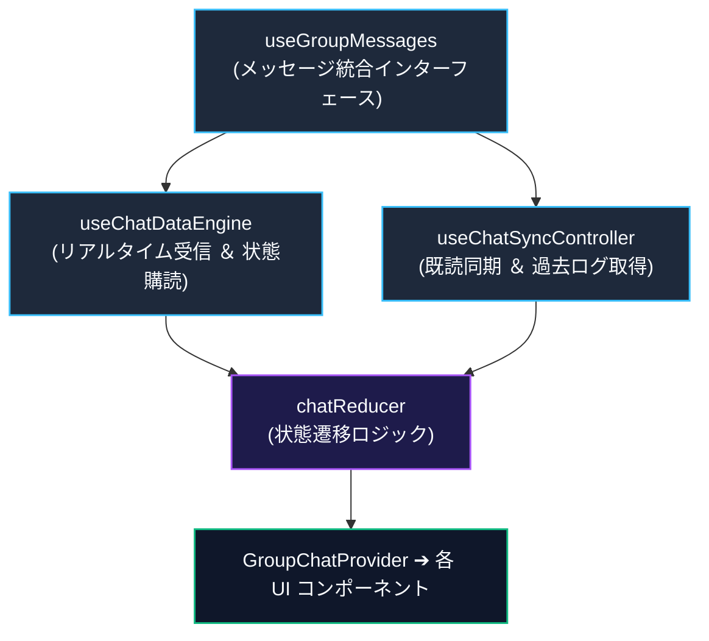

# グループチャット (`GroupChat`) の設計と実装

このドキュメントでは、グループチャットモジュール（`src/components/groupchat`）の構成、状態管理、4系統の Context 分割設計、および主要機能の実装について解説します。

---

## 1. 全体アーキテクチャの概要

`GroupChat` は、リアルタイムメッセージング、団結度メーター、エール送信、および各種モーダル管理を統括する複合コンポーネントです。

```
                       ┌─────────────────────────┐
                       │   GroupChatProvider     │
                       └────────────┬────────────┘
                                    │
    ┌──────────────────┬────────────┴─────────────┬──────────────────┐
    ▼                  ▼                          ▼                  ▼
ChatDataContext   ChatMessageActionsContext   ChatGroupActionsContext   ChatUIActionsContext
 (状態データ)        (メッセージ操作)          (グループ・メンバー操作)   (UI・スクロール)
    │                  │                          │                  │
    └──────────────────┴────────────┬─────────────┴──────────────────┘
                                    ▼
                         ┌───────────────────────┐
                         │   GroupChatContent    │
                         └──────────┬────────────┘
                                    │
          ┌─────────────────────────┼─────────────────────────┐
          ▼                         ▼                         ▼
    ChatHeader             MessageListContainer           GroupChatFooter
 (ヘッダー・団結度)         (スクロール・メッセージ一覧)  (返信表示・入力欄)
```

### Context 分割による再描画の局所化

テキスト入力やスクロールに伴う画面全体の不要な再描画を防ぐため、Context を 4 つに分離しています。

1. **`ChatDataContext`**: メッセージ配列、メンバー情報、団結度などのデータ本体。
2. **`ChatMessageActionsContext`**: メッセージの送信、編集、削除、リアクション、翻訳などの操作関数。
3. **`ChatGroupActionsContext`**: グループ名変更、退出、削除などのグループ管理関数。
4. **`ChatUIActionsContext`**: スクロール制御や翻訳ヘルパーなどの UI 操作関数。

---

## 2. フックの階層構造とデータフロー

`src/components/groupchat/hooks/core` 配下のフック群は、単方向データフローに沿って責務が分離されています。



### データフローの解説

1. **`useChatDataEngine`（リアルタイム受信）**  
   Firestore の `onSnapshot` リスナーを通じて最新メッセージやメンバー情報を受信し、`chatReducer` へアクションを dispatch します。

2. **`useChatSyncController`（同期制御）**  
   過去ログのページネーション取得（無限スクロール）や、サーバーへの既読ステータス送信を非同期に制御します。

3. **`useGroupMessages`（統合レイヤー）**  
   データエンジンと同期コントローラーを統合し、Context へ供給する状態とアクション関数を一元的に構築します。

---

## 3. 主要機能の実装

### ① 団結度（Unity）メーター ＆ 100% 達成演出 (`useUnityScore`)
- 当日の学習達成率を動的に計算し、ヘッダーにパーセンテージを表示します。
- 100% 達成時には紙吹雪演出（`canvas-confetti`）が作動し、`/api/groups/announce-unity` へ通知リクエストを送信します。

### ② エール（Cheer）機能 (`useCheerSystem`)
- 本日未投稿のメンバーに対し、ワンタップで励ましのプッシュ通知（エール）を送信します。

### ③ 聖句ディープリンク (`GospelLink`)
- チャット内の聖句参照（例:「モーサヤ 3:7」）を正規表現で検出し、公式福音ライブラリへのハイライト付きリンクへ自動変換します。

### ④ モーダル管理システム (`group-chat-modals.tsx`)
- メンバー一覧、招待コード表示、グループ編集、通報ダイアログなど、11 種類のモーダルを一元管理ステートにより排他的に制御します。

---

## 4. 関連ドキュメント

- [チャットとダッシュボードの同期](./feature-chat-dashboard.md)
- [団結度（Unity）の同期の仕組み](./unity-participation.md)
- [福音ライブラリマッパー](./gospel-library-mapper.md)
