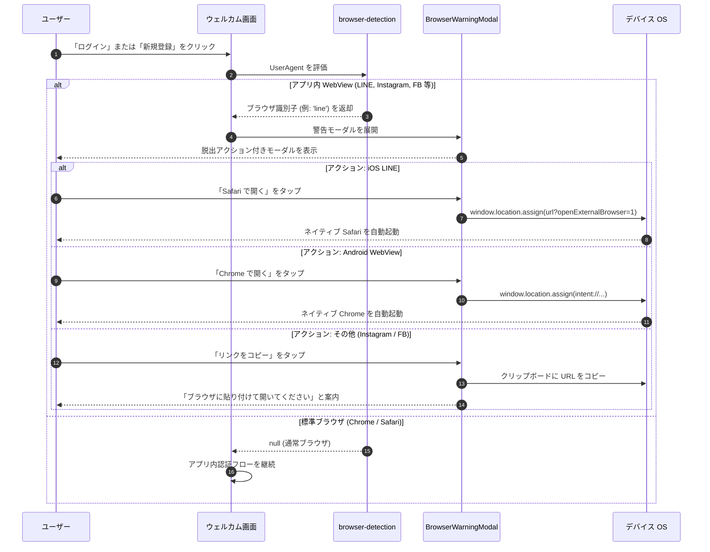

# PWA ＆ モバイルライフサイクル管理

> [!TIP]
> **インタラクティブ・アーキテクチャツアー**: [ブラウザでツアーを開く (PWA オフライン & アップデート)](https://htmlpreview.github.io/?https://github.com/ScriptureHabit/scripture-habit/blob/main/docs/public/architecture-tour.html?tour=tour-pwa&lang=ja)

このドキュメントでは、**Scripture Habit** における PWA の更新検知、プラットフォーム別のインストールプロンプト、およびアプリ内 WebView（LINE, Instagram 等）の回避制御について解説します。

---

## 1. PWA 更新ライフサイクル (`PWAUpdateHandler`)

クライアントのアセット整合性を維持し、旧バージョンのキャッシュ起因による不具合を防ぐため、Service Worker の待機戦略と更新通知トーストを連携させています。

```mermaid
sequenceDiagram
    autonumber
    participant Browser as ブラウザ
    participant Event as pwa-update-available イベント
    participant UI as PWAUpdateHandler トースト
    participant SW as Service Worker

    Browser->>SW: 新規 Service Worker スクリプトを取得
    SW-->>Browser: インストール完了 ('waiting' 状態で待機)
    Browser->>Event: Registration オブジェクト付きでイベント発行
    Event->>UI: 「アップデートが利用可能です」トーストを表示
    Note over UI: ユーザーが「アップデート」ボタンをクリック
    UI->>SW: postMessage({ type: 'SKIP_WAITING' })
    SW->>Browser: コントローラー切り替え ＆ キャッシュ更新
    rect rgb(30, 41, 59)
        Note over UI: 3秒のフォールバックタイマー
        UI->>Browser: location.reload() による強制リロード
    end
```



### ライフサイクルの解説

1. **バックグラウンド検出と待機状態**  
   新規デプロイ時に新しい Service Worker が検知されてインストールされますが、利用中のセッションを中断しないよう `waiting` 状態で待機します。
2. **更新トーストの提示**  
   `pwa-update-available` イベントを捕捉し、画面上に更新ボタンを提示します。
3. **明示的なアクティベーションと安全なリロード**  
   ボタン押下時に `SKIP_WAITING` を送信して新しいキャッシュを即時有効化します。万が一イベントが停滞した場合に備え、3 秒のタイマーでフォールバックリロードを実行します。

---

## 2. プラットフォーム別のインストールプロンプト

ユーザーの OS 環境（Android / iOS）を自動判別し、最適なインストール案内を提供します。

### 表示ルール
操作の妨げとならないよう、以下の条件をすべて満たす場合にのみプロンプトを表示します。
- `/dashboard` ルートを表示中。
- スタンドアロンモード（インストール済み）で起動されていない。
- 他のモーダルが開いていない。
- 前回閉じてから 7 日以上経過している（`localStorage` でクールダウン管理）。

### アダプティブ制御 (Android vs. iOS)

```
                      [ InstallPrompt マウント ]
                                 │
                  ┌──────────────┴──────────────┐
                  ▼                             ▼
         [ Android / Chrome ]            [ iOS / Safari ]
                  │                             │
      beforeinstallprompt を捕捉         4 秒の待機遅延 (UI 重なり防止)
                  │                             │
        ネイティブプロンプト起動ボタン      カスタム案内オーバーレイ表示
                  │                             │
      deferredPrompt.prompt() 実行       下部共有ボタンを指し示すポインタ表示
```

- **Android (Chrome)**: `beforeinstallprompt` イベントを保持し、ユーザーのタップ操作でネイティブダイアログを起動。
- **iOS (Safari)**: ネイティブ API が存在しないため、4 秒遅延後に「共有アイコン ➔ ホーム画面に追加」の手順を明示した視覚ポインターを表示。

---

## 3. アプリ内 WebView の検出と安全な脱出

SNS アプリ（LINE、Instagram、Facebook 等）の内蔵ブラウザは、Service Worker や通知、IndexedDB が制限されているケースがあります。

### ① アプリ内ブラウザの検出 (`src/utils/browser-detection.ts`)
`navigator.userAgent` を評価して以下のアプリを特定します。
- **LINE**: `/Line\//i`
- **Instagram**: `/Instagram/i`
- **Facebook & Messenger**: `/FBAN|FBAV/i` (iOS), `/FB_IAB/i` (Android)
- **WhatsApp**: `/WhatsApp/i`

### ② 脱出シーケンス



### シーケンスの解説

1. **認証前の早期検出**  
   「ログイン」「新規登録」タップ時に UserAgent を検査し、WebView の場合は認証画面に進む前に警告モーダルを展開します。
2. **プラットフォーム別ディープリンク脱出**  
   - iOS LINE: `?openExternalBrowser=1` クエリを付与して Safari を直接起動。
   - Android: `intent://` スキームを用いてデフォルトブラウザ（Chrome 等）を強制起動。
   - その他: クリップボードへコピーし、標準ブラウザでの手動貼り付けを案内。

---

## 4. 関連ドキュメント

- [全体アーキテクチャ](./architecture.md)
- [SEO ＆ メタデータ管理](./seo-and-meta-management.md)
- [ネットワーク ＆ パフォーマンス最適化](./network-performance-optimization.md)
