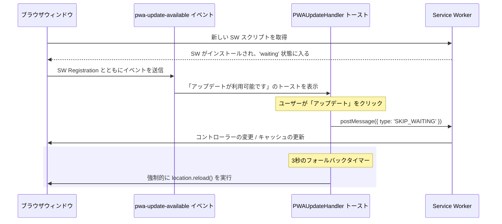
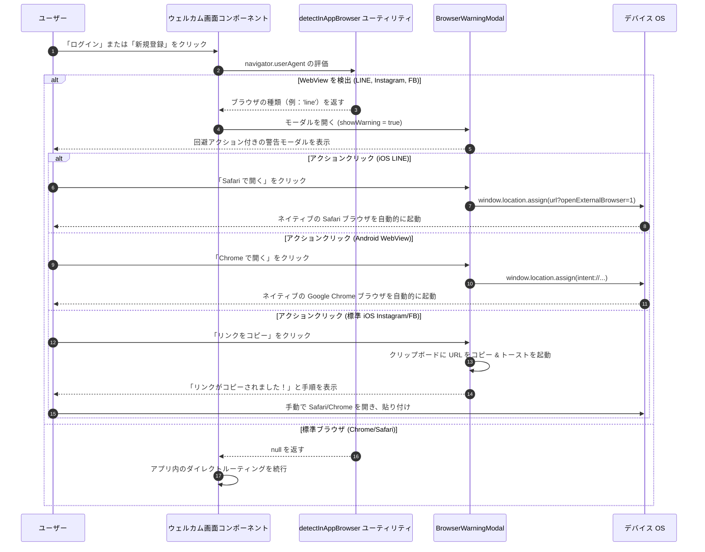

# PWA モバイルのライフサイクル

このドキュメントでは、**scripture-habit** アプリが PWA の更新、プラットフォームごとのインストールプロンプト、および WebView の設定をどのように処理するかについて説明します。

---

## 1. PWA 更新ライフサイクル (`PWAUpdateHandler`)

クライアントのアセットを最新の状態に保ち、エラーを防止するため、アプリは Service Worker のキャッシュ戦略と更新通知を組み合わせて使用しています。

### 更新フロー
1. **検出**: 新しいバージョンがデプロイされると、ブラウザは新しい Service Worker を検出します。
2. **待機**: アクティブなセッションを中断しないよう、新しい Service Worker は `waiting`（待機）状態に入ります。
3. **イベント**: アプリはカスタムイベント `pwa-update-available` をトリガーします。
4. **通知**: ユーザーに閉じることができない通知を表示します。
5. **更新の適用**: ユーザーが「アップデート」ボタンをクリックしたとき：
   - ボタンが無効（disabled）になり、読み込み状態が表示されます。
   - アプリは Service Worker に `SKIP_WAITING` メッセージを送信します。
   - 更新に時間がかかりすぎる場合に備えて、ページを強制的にリロードする 3 秒のフォールバックタイマーが設定されます。



---

## 2. プラットフォーム固有のインストールプロンプト

アプリは、ユーザーのオペレーティングシステムに基づいてカスタムの PWA インストールプロンプトを表示します。

### 表示ルール
ユーザーの邪魔にならないよう、プロンプトは以下の条件をすべて満たす場合にのみ表示されます：
* ユーザーが `/dashboard` ルートにいる。
* アプリがスタンドアロンモード（インストール済みモード）でまだ実行されていない。
* モーダルが現在開いていない。
* ユーザーが最後にプロンプトを閉じてから 7 日以上経過している（`localStorage` で追跡）。

### アダプティブ戦略 (Android vs. iOS)

```
                      [ InstallPrompt マウント ]
                                 │
                  ┌──────────────┴──────────────┐
                  ▼                             ▼
         [ プラットフォーム = Android ] [ プラットフォーム = iOS ]
                  │                             │
     BeforeInstallPromptEvent をキャプチャ     4秒遅延で待機 (UI 重なり防止)
                  │                             │
       ネイティブプロンプトボタンを表示          カスタム手順のオーバーレイを表示
                  │                             │
     deferredPrompt.prompt() をトリガー       ポインターが下部の共有バーを指示
```

### 2.1 Android (Chrome) フロー
1. ブラウザ固有の `beforeinstallprompt` イベントがキャプチャされます。
2. イベントが利用可能になると、アプリはクリーンなインストールバナーを表示します。
3. ボタンをクリックすると `deferredPrompt.prompt()` が呼び出され、ネイティブのインストールダイアログが表示されます。
4. ユーザーが応答した後、アプリはプロンプトの参照をリセットし、7 日間のクールダウンを開始します。

### 2.2 iOS (Safari) フロー
iOS Safari はネイティブのインストールイベントをサポートしていないため、アプリはカスタムの手順を表示します：
1. UI の重なりを防ぐため、プロンプトは 4 秒の遅延の後に表示されます。
2. オーバーレイが表示され、ユーザーに以下の操作を指示します：
   - Safari の**共有**アイコンをタップ。
   - **ホーム画面に追加** を選択。
3. ビジュアルポインターが Safari の下部アクションバーを指し示します。

---

## 3. アプリ内 WebView の安全性

ソーシャルネットワークやメッセージングアプリの内部からアプリを開くユーザーをサポートするため、アプリにはアプリ内 WebView 用の安全性チェックが含まれています。

### 4.1 アプリ内ブラウザ（In-App Browser）の問題
Facebook、Instagram、LINE、WhatsApp などのアプリ内ブラウザは、Web 機能を制限します。これらは、Service Worker、IndexedDB、および通知権限をブロックすることがよくあります。

### 4.2 アプリ内ブラウザの検出
アプリは、ユーザーエージェントのチェックを使用して `src/utils/browser-detection.ts` でアプリ内ブラウザを検出します：
- **LINE**: `/Line\//i` をチェック。
- **Instagram**: `/Instagram/i` をチェック。
- **Facebook & Messenger**: `/FBAN|FBAV/i` (iOS) および `/FB_IAB/i` (Android) をチェック。
- **WhatsApp**: `/WhatsApp/i` をチェック。
- **テスト用オーバーライド**: URL に `?debugBrowser=instagram` を追加することで、これらのモードをテストできます。

### 4.3 リダイレクト警告
アプリ内ブラウザ内部で強制的にリダイレクトを行うと、クラッシュやフリーズの原因となる可能性があります。代わりに：
- 自動的なリダイレクトは無効化されています。
- アプリ内ブラウザのユーザーが「ログイン」または「新規登録」をクリックすると、アプリは `BrowserWarningModal` を表示し、標準ブラウザでリンクを開く手順を提示します。

### 4.4 アプリ内ブラウザからの回避（脱出）
警告モーダルは、デバイスに応じて異なるオプションを提供します：

#### iOS LINE
- URL に `?openExternalBrowser=1` を付加します。
- LINE iOS はこのパラメータをインターセプトし、Safari で URL を自動的に開きます。

#### Android (すべてのアプリ内ブラウザ)
- URL プロトコルをネイティブの Android Intent に置き換えます：
   `intent://[host_and_path]#Intent;scheme=https;action=android.intent.action.VIEW;end`
- これにより、Android OS はデフォルトのブラウザ（Chrome など）でリンクを強制的に開きます。

#### クリップボードへのフォールバック
- `navigator.clipboard.writeText()` を使用して URL をクリップボードにコピーします。
- ホストアプリによってブラウザの自動起動がブロックされている場合のバックアップとして役立ちます。

---

## 4. WebView 回避（脱出）シーケンス


