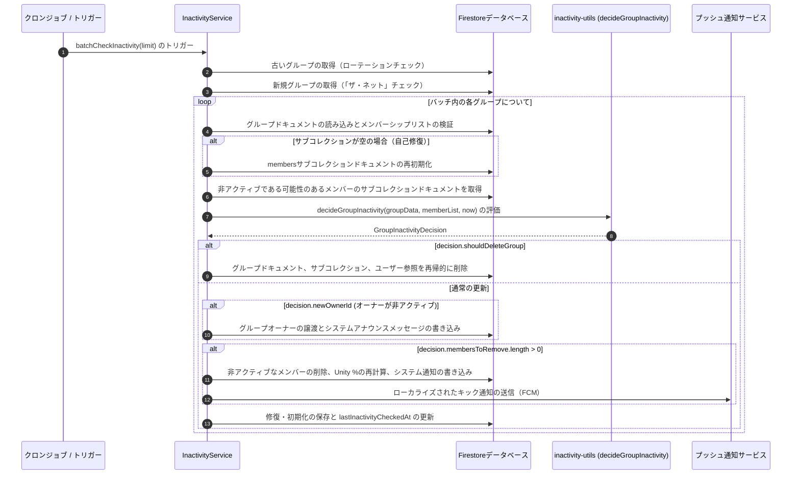

# 非アクティブ＆自動キックエンジン

このドキュメントでは、自動化された非アクティブ検出および自動キックシステムについて説明します。このシステムは、グループをアクティブに保ち、空のグループをクリーンアップし、オーナーが非アクティブになった場合にグループオーナーシップを譲渡するためにバックグラウンドで動作します。

---

## 🏗️ アーキテクチャの概要

非アクティブエンジンは次の2つの部分で構成されています。
1.  **`InactivityService` (`api_internal/services/inactivity-service.ts`)**: データベースクエリ、バッチ更新、通知、およびタスクのスケジューリングを処理します。
2.  **`inactivity-utils` (`api_internal/lib/inactivity-utils.ts`)**: データベースへのサイドエフェクト（副作用）を持たない計算ロジックを含むヘルパーファイルです。これにより、単体テストを確実に行うことができます。



---

## ⏰ スケジューラの戦略

Firestoreのタイムアウトを回避し、データベースのコストを削減するため、システムは次の2つの検索方法を使用します。

1.  **ローテーションキュー（Rotational Queue）**:
    `lastInactivityCheckedAt` を昇順でソートして、制限された数のグループをクエリします。これにより、すべてのグループが定期的にチェックされます。
2.  **「ザ・ネット」（"The Net"）**:
    `lastInactivityCheckedAt` フィールドを持たない、最も新しく作成された20個のグループをクエリします。これにより、新しいグループが迅速にチェックされます。

---

## 🛠️ 自動キックしきい値の解決

システムは、メンバーの**最新のアクティビティタイムスタンプ**を特定し、それをしきい値と比較することによって、メンバーがアクティブかどうかをチェックします。

### 1. アクティビティの定義
システムは、次の5つのフィールドからアクティビティ日付を収集します。
-   `joinedAt`: メンバーがグループに参加した日付。
-   `lastActiveAt` / `memberLastActive`: ユーザーが最後にグループを開いた日時。
-   `lastPostAt` / `lastNoteAt`: ユーザーが最後にスタディノートを投稿した日時。
-   `lastReadAt` / `memberLastReadAt`: ユーザーが最後にチャットメッセージを読んだ日時。

これらの日付のうち最新のものが `lastActiveTime` として使用されます。

### 2. しきい値の優先順位
ユーザーがキックされるまでに許容される日数は、以下の設定を順番にチェックすることによって決定されます。

```
[優先順位 1] ユーザー固有のオーバーライド (memberData.kickThreshold)
     │
     └──> [優先順位 2] グループ固有のメンバーオーバーライド (groupData.memberKickThresholds[uid])
              │
              └──> [優先順位 3] グループのグローバルペース (groupData.pace)
                       │
                       └──> [優先順位 4] システムデフォルト (3日間)
```

### 3. 自動キックの無効化
しきい値が **`0`** に設定されている場合、そのメンバーの自動キックは無効になります。彼らは常にアクティブとして扱われ、キックされることはありません。

---

## 🩹 データベースの自己修復

エンジンは、チェック中に整合性のないデータを自動的に修復します。

### 1. サブコレクションの復旧
グループドキュメントの `members` 配列にメンバーが存在するにもかかわらず、Firestoreの `members` サブコレクションが空である場合（バッチエラーやテスト用リセットが原因）、システムはこれを検出し、不足しているメンバーシップドキュメントを自動的に書き込みます。

### 2. joinedAt タイムスタンプの修復
メンバーの `joinedAt` 日付が未来に設定されているか、またはエラーが含まれている場合、システムはそれをドキュメントの作成日および履歴アクティビティと比較します。そして、`joinedAt` を記録された中で最も古いアクティビティ日に自動的に修復します。

---

## 👑 オーナーシップの譲渡とグループの削除

グループオーナーが非アクティブになった場合：

*   **オーナーシップの譲渡**:
    オーナーが非アクティブであるが、他にアクティブなメンバーが存在する場合、システムは**最も長く在籍しているアクティブなメンバー**（`activeMemberIds[0]`）にオーナーシップを譲渡します。通知メッセージ（`notifications.ownership_transferred`）がグループに投稿されます。
*   **グループの削除**:
    オーナーが非アクティブであり、**他にアクティブなメンバーが残っていない**場合、グループは削除されます。システムはグループドキュメントとそのサブコレクションを削除し、ユーザーのドキュメントからグループ参照を削除します。

---

## 🔔 メンバーのキック通知フロー

メンバーが非アクティブのために削除されると：
1.  システムはグループの `members` リストからそのメンバーのUIDを削除し、`members` サブコレクション内のそのドキュメントを削除します。
2.  ユーザーの `groupIds` および `groupStates` にあるグループ参照を削除します。
3.  残りのグループメンバーにシステムメッセージを投稿します。
4.  キックされたユーザーのFCMプッシュトークンを取得し、非アクティブのために削除されたことを説明するローカライズされた通知（`notifications.kick_title` / `notifications.kick_body`）を送信します。これにより、後で再参加することができます。
