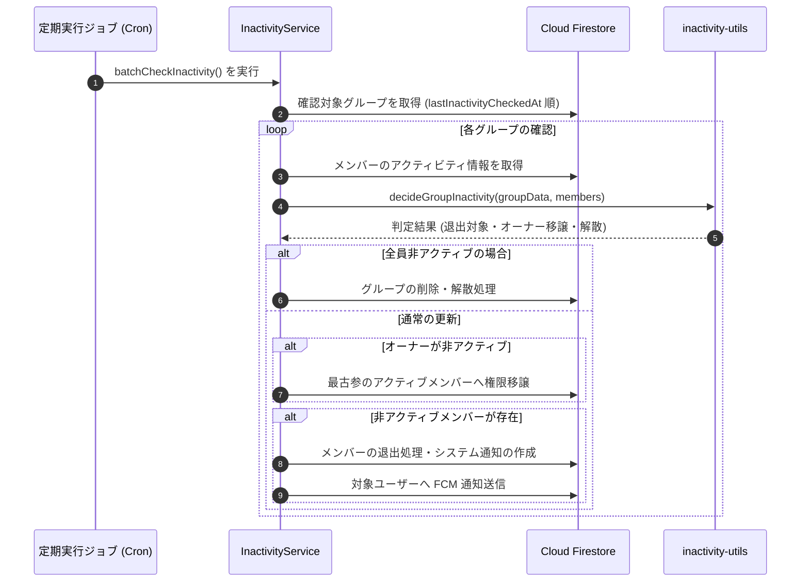

# 非アクティブ判定 ＆ 自動整理システム

::: tip インタラクティブ・アーキテクチャツアー
この機能のデータフローとステップ解説ツアーを体験できます：
- **オンライン（GitHubブラウザプレビュー）**: [インタラクティブツアーを開く (グループ設定 & メンバー管理)](https://htmlpreview.github.io/?https://github.com/ScriptureHabit/scripture-habit/blob/main/docs/public/architecture-tour.html?tour=tour-groupoptions&lang=ja)
- **VitePress / ローカル**: [グループ設定 & メンバー管理 の解説ツアーを開く](/architecture-tour.html?tour=tour-groupoptions&lang=ja)
:::

このドキュメントでは、長期間活動のないメンバーの判定アルゴリズム、自動退出処理、オーナー権限の自動移譲、および休眠グループのパージ機能について解説します。

---

## 1. システムの構成

非アクティブ判定は、データベース操作を担当するサービス層と、純粋関数で構成された判定ロジック層に分離されています。
1. **`InactivityService` (`api_internal/services/inactivity-service.ts`)**: データベースの検索、一括更新、FCM 通知送信、および定期実行の制御。
2. **`inactivity-utils` (`api_internal/lib/inactivity-utils.ts`)**: 判定基準の計算を行う純粋関数群（単体テストが容易な設計）。

### シーケンスの解説

1. **バッチ取得と巡回**  
   定期 Cron により `batchCheckInactivity()` がトリガーされ、最終確認日時が古いグループを優先的に取得します。

2. **純粋関数による判定**  
   `inactivity-utils` が各メンバーの最終活動日時としきい値を照合し、退出対象・オーナー権限移譲先・解散判定を導出します。

3. **アトミック更新と通知**  
   Firestore 上でメンバー退出とシステム通知をコミットし、該当ユーザーへ再参加を促す FCM プッシュ通知を送信します。

---

## 2. スキャンの仕組み

データベースへの負荷を抑えつつ確実に巡回するため、以下の方式を採用しています。

1. **ローテーション巡回**: 最終確認日時（`lastInactivityCheckedAt`）が古い順にグループをバッチ取得し、偏りなく巡回します。
2. **新規グループの優先チェック**: 作成直後で未確認のグループを最優先で走査します。

---

## 3. 非アクティブの判定基準

ユーザーの**最新の活動日時**をもとに、しきい値を超過しているかを判定します。

### ① 活動日時の定義
以下のうち、最も新しいタイムスタンプを「最終活動日時」として採用します。
- グループへの参加日時 (`joinedAt`)
- グループ画面の最終表示日時 (`lastActiveAt`)
- スタディノートの最終投稿日時 (`lastPostAt`)
- チャットメッセージの最終閲覧日時 (`lastReadAt`)

### ② 判定猶予期間（しきい値）の優先順位
自動退出までの猶予日数は、以下の優先度で決定されます。
1. ユーザー個別の設定
2. グループ内での個別設定
3. グループ全体のペース設定
4. **システムのデフォルト（3日間）**

※しきい値が `0` の場合、自動退出は無効化され、永続的な在籍が維持されます。

---

## 4. オーナー権限の移譲とグループの解散

- **オーナー権限の自動移譲**:  
  オーナーが非アクティブとなり、他にアクティブメンバーが存在する場合、**グループ在籍期間が最も長いアクティブメンバー**にオーナー権限が自動引き継ぎされます。
- **休眠グループの解散**:  
  全員が長期間非アクティブとなった場合、休眠グループとして自動的に削除・整理されます。

---

## 5. 退出時の処理と通知

メンバーが自動退出となった場合：
1. グループのメンバー配列およびサブコレクションから削除。
2. グループチャット内にシステム通知メッセージを作成。
3. 対象ユーザーへ多言語対応の FCM プッシュ通知（「いつでも再参加できます」）を配信。

---

## 6. 関連ドキュメント

- [少人数グループ（最大5人）とピア・アカウンタビリティの心理学](./ux-small-groups-and-peer-accountability.md)
- [定期メンテナンスジョブ (Cron)](./maintenance-cron.md)
- [グループ招待 & 参加処理](./group-invites.md)
