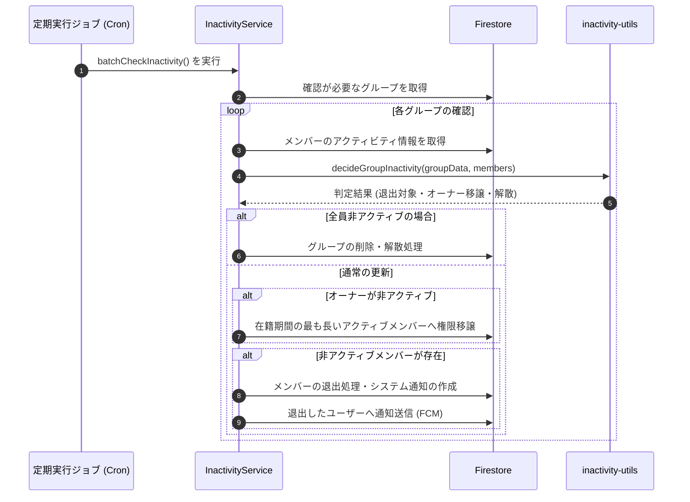

# 非アクティブ判定 ＆ 自動整理システム

このドキュメントでは、長期間活動のないメンバーの判定、自動退出処理、オーナー権限の自動移譲、および不要になったグループの整理機能について解説します。

---

## 1. システムの構成

非アクティブ判定は以下の2つのモジュールで構成されています：
1. **`InactivityService` (`api_internal/services/inactivity-service.ts`)**: データベースの検索、一括更新、通知送信、および定期実行の管理。
2. **`inactivity-utils` (`api_internal/lib/inactivity-utils.ts`)**: 判定基準の計算を行う純粋関数群（単体テストが容易な設計）。

---

## 2. スキャンの仕組み

データベースへの負荷を抑えながら確実にチェックを行うため、2つの方法を組み合わせてグループを巡回します：

1. **ローテーション巡回**:
   最終確認日時（`lastInactivityCheckedAt`）が古い順にグループを取得し、定期的にすべてのグループをチェックします。
2. **新規グループの優先チェック**:
   作成されたばかりで一度もチェックされていないグループを優先的に確認します。

---

## 3. 非アクティブの判定基準

ユーザーの**最新の活動日時**をもとに、しきい値を超えているかを判定します。

### ① 活動日時の定義
以下のうち、最も新しい日時を「最終活動日時」とみなします：
- グループへの参加日 (`joinedAt`)
- グループ画面を開いた日時 (`lastActiveAt`)
- スタディノートを投稿した日時 (`lastPostAt`)
- チャットメッセージを読んだ日時 (`lastReadAt`)

### ② 判定期間（しきい値）の優先順位
自動退出までの猶予日数は、以下の優先順位で決定されます：
1. ユーザー個別の設定
2. グループ内での個別設定
3. グループ全体のペース設定
4. **システムのデフォルト（3日間）**

※しきい値が `0` に設定されている場合は、自動退出は無効化され、常に在籍状態が維持されます。

---

## 4. オーナー権限の移譲とグループの解散

- **オーナーの自動移譲**:
  グループのオーナーが長期間活動しておらず、他にアクティブなメンバーがいる場合、**最も長くグループに在籍しているアクティブメンバー**にオーナー権限が自動で引き継がれます。
- **グループの解散**:
  オーナーを含む全員が長期間非アクティブになった場合、幽霊グループとして自動的に削除・整理されます。

---

## 5. 退出時の処理と通知

メンバーが非アクティブにより退出となった場合：
1. グループのメンバー一覧から削除されます。
2. グループチャット内にシステムメッセージを投稿します。
3. 退出となったユーザーへ、「長期間活動がなかったため退出となりました。いつでも再参加できます」というプッシュ通知（ローカライズ対応）を送信します。

---

## 6. 関連ドキュメント

- [少人数グループ（最大5人）とピア・アカウンタビリティの心理学](./ux-small-groups-and-peer-accountability.md)
- [定期メンテナンスジョブ (Cron)](./maintenance-cron.md)
- [グループ招待 & 参加処理](./group-invites.md)
