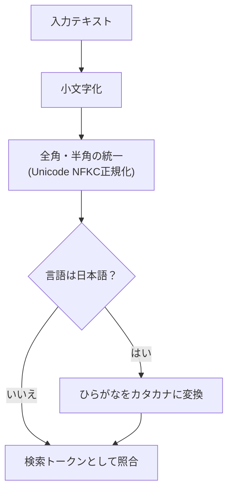
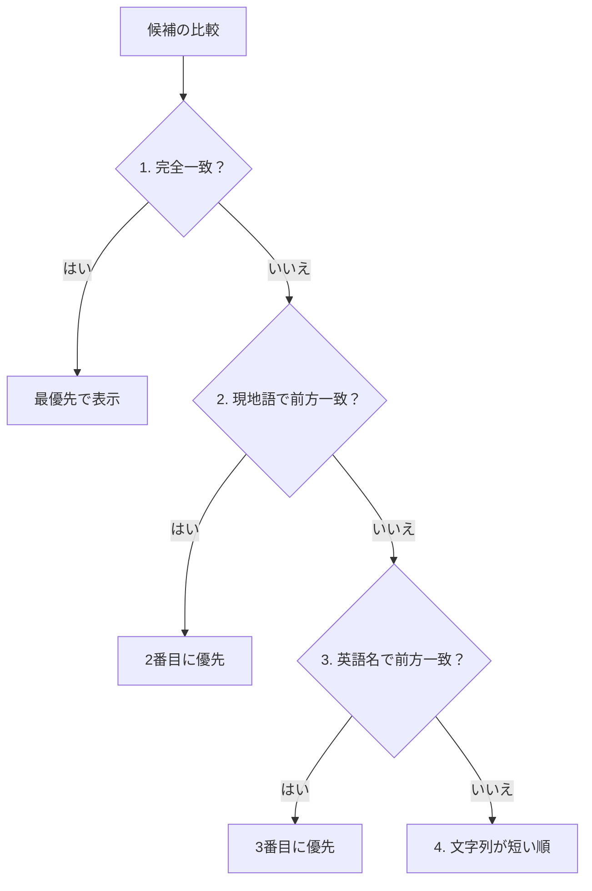

# 聖典書籍の入力補完（サジェスト）の仕組み

このドキュメントでは、スタディノート作成時に聖典名（書籍名）を入力した際、リアルタイムで適切な候補を表示する入力補完エンジン（`src/utils/suggestion-utils.ts`）の仕組みについて解説します。

---

## 1. 入力文字の正規化

大文字・小文字、全角・半角、およびひらがな・カタカナの違いを気にせず検索できるように、入力された文字列を正規化します。

### ① 全角・半角の統一
`normalize('NFKC')` を使用し、全角アルファベットや全角数字を半角に揃えます。

### ② ひらがな ⇄ カタカナ変換（日本語対応）
聖典の書名は公式にはカタカナ（例: `アルマ`、`ニーファイ`）で表記されますが、ユーザーはひらがな（`あるま`、`にーふぁい`）で入力することがよくあります。
言語が日本語（`ja`）の場合、ひらがなの文字コードをカタカナに自動変換して照合するため、変換キーを押さなくても候補が表示されます。

### ③ 漢字書籍の読み仮名対応
「創世記（そうせいき）」「第三ニーファイ」「信仰箇条」など、名前に漢字を含む書籍についても、ひらがな・カタカナの読み（`KANJI_BOOK_READINGS`）と照合することで、漢字に変換せずに入力しても候補にヒットします。

---

## 2. 4段階の優先度ソート

検索された候補は、最も意図に近いものが上位に来るように並び替えられます：

1. **完全一致**: 入力と名前がぴったり一致するものを最優先。
2. **現地語の前方一致**: 「ある」と入力した際に「アルマ書」などが優先。
3. **英語名の前方一致**: 英語のスペルや略称で入力した場合のサポート。
4. **文字数が短い順**: 同じ一致条件であれば、名前が短い書籍を上位に表示（モバイル画面でのタップしやすさを向上）。

---

## 3. 表示件数の制限

検索結果は **最大10件** に制限されます。画面が候補で埋まるのを防ぎ、スマートフォンでも快適に選択できるようにしています。

---

## 4. 関連ドキュメント

- [ノート作成（NewNote）設計・実装ガイド](./newnote-construction-guide.md)
- [福音ライブラリマッパー](./gospel-library-mapper.md)
