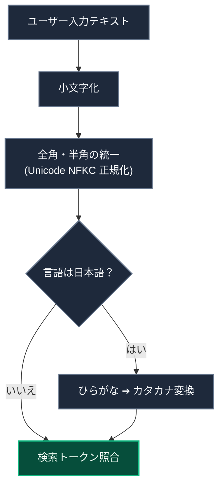
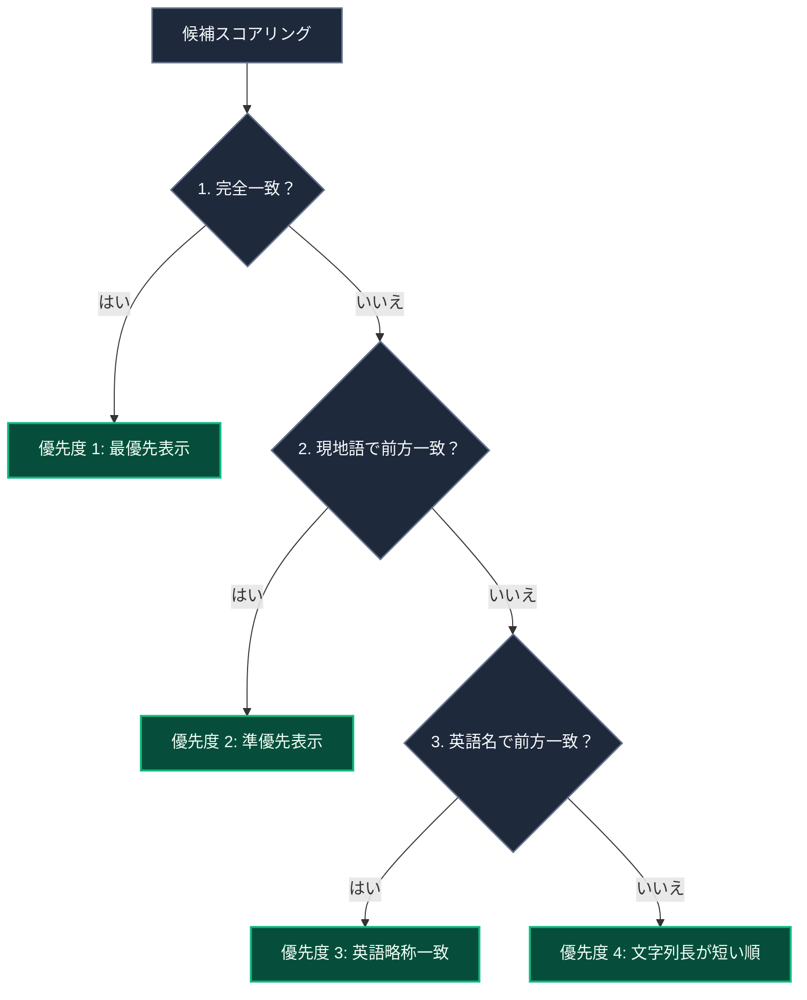

# 聖典書籍の入力補完（サジェスト）の仕組み

このドキュメントでは、スタディノート作成時に聖典名（書籍名）を入力した際、リアルタイムで適切な候補を提示する入力補完エンジン（`src/utils/suggestion-utils.ts`）について解説します。

---

## 1. 入力文字の正規化パイプライン

大文字・小文字、全角・半角、およびひらがな・カタカナの差異を吸収するため、入力文字列を多段階で正規化します。

### 正規化フローの解説

1. **Unicode NFKC 正規化**  
   全角アルファベットや全角数字を標準半角文字へ統一します。
2. **ひらがな・カタカナ相互変換**  
   日本語環境において「あるま」等のひらがな入力を「アルマ」へと動的に変換し、変換確定前のタイピングでも即座にヒットさせます。
3. **漢字書籍の読み仮名照合**  
   「創世記（そうせいき）」「信仰箇条（しんこうかじょう）」などの漢字書籍に対し、事前定義された読み仮名マップ（`KANJI_BOOK_READINGS`）を照合します。

---

## 2. 4段階の優先度ソートアルゴリズム

抽出された候補群は、ユーザーの意図に合致するよう 4 段階のヒューリスティクスでソートされます。

### ソート基準の解説

1. **完全一致**: 入力文字列と書名が完全に一致するものを最上位に配置。
2. **現地語の前方一致**: 「ある」入力時に「アルマ書」等を上位表示。
3. **英語名の前方一致**: 英語スペルや標準略称（"1-ne" 等）による入力を支援。
4. **文字列長によるタイブレーク**: 一致条件が同等である場合、短い書籍名を優先してモバイル画面での視認性を向上。

---

## 3. 表示件数の制限

モバイル端末における UI の専有を防ぐため、候補一覧の表示件数は**最大 10 件**に制限されます。

---

## 4. 関連ドキュメント

- [ノート作成（NewNote）設計・実装ガイド](./newnote-construction-guide.md)
- [福音ライブラリマッパー](./gospel-library-mapper.md)
