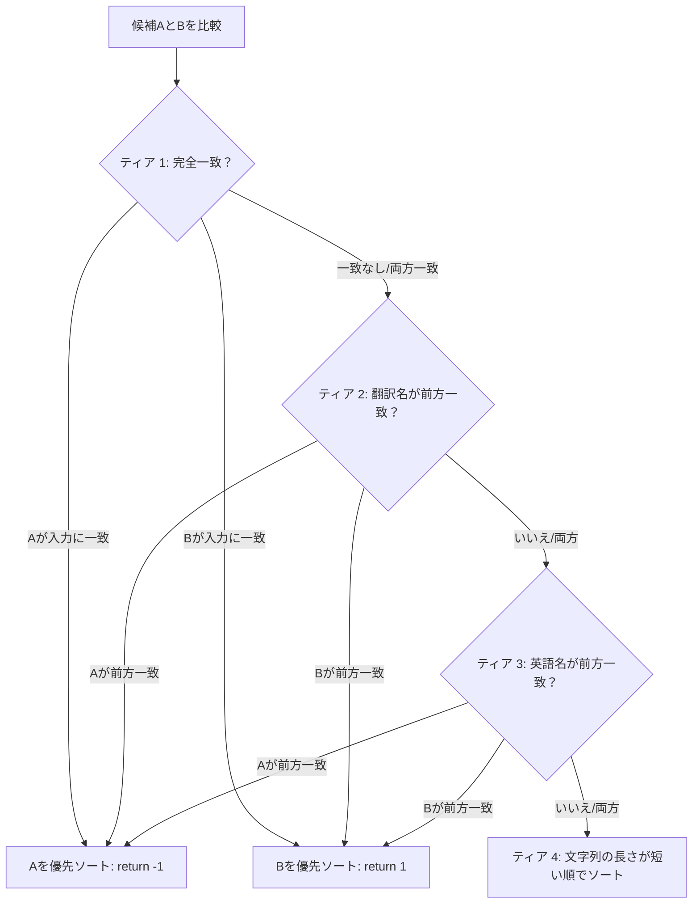

# 聖典の書 インクリメンタル提案エンジン

このドキュメントでは、`src/utils/suggestion-utils.ts` に配置されている **聖典の書 提案エンジン (Book Suggestion Engine)** の検索マッチング、テキストの正規化、およびソートロジックについて詳しく説明します。

このエンジンは、ユーザーが聖典の参照を入力する際に、高速でリアルタイムのタイピング提案（オートコンプリート）を提供します。

---

## 1. 聖典各巻の範囲＆ディクショナリ

提案の検索は、選択された聖典（Volume）に基づいてフィルタリングされます。エンジンは、以下の特定のパスの下に書（Book）を整理します。

* **モルモン書**: 15書（ニーファイ一書からモロナイ書まで）
* **旧約聖書**: 39書（創世記からマラキ書まで）
* **新約聖書**: 27書（マタイによる福音書からヨハネの黙示録まで）
* **高価な真珠**: 5書（モーセ書から信仰箇条まで）
* **教義と聖約**: 標準的な略称（「D&C」）
* **儀式と宣言**: 特定のカスタムドキュメント（「家族：世界への宣言」、「生けるキリスト」など）

---

## 2. 多言語テキストの正規化

大文字と小文字の区別、文字幅、または地域の綴り（スペル）に関係なく検索マッチングが機能するように、入力値は標準の NFKC ルールを使用して正規化されます。

```
       [ テキストの生入力 ]
               │
               ▼
       [ 小文字への変換 ]
               │
               ▼
     [ NFKC Unicode正規化 ]
    (全角・半角の違いを解決)
               │
               ▼
      [ 言語 == 'ja'? ]
          ┌────┴────┐
        はい       いいえ
          ▼         │
   [ ひらがな→カタカナ ]  │
    (文字コードのシフト) │
          └────┬────┘
               ▼
     [ 正規化された検索トークン ]
```

### Unicode と大文字・小文字の正規化
すべての入力文字列と対象となる書の名前は、以下を使用してクリーンアップされます。
```typescript
let res = str.toLowerCase().normalize('NFKC');
```
* **`NFKC` 正規化**: 全角のアルファベット、2バイトの数値、および句読点を、標準の半角（1バイト）文字に標準化します。

### 日本語固有の音声マッピング
日本語の検索における一般的な課題は、公式の聖典ではカタカナ（例：`アルマ`、`ニーファイ`）が使用されているのに対し、ユーザーはひらがな（例：`あるま`、`にーふぁい`）で本の名前を入力することです。

これを解決するために、現在のアクティブな言語が日本語（`'ja'`）の場合、エンジンは正規表現による変換を使用して、**自動的にひらがなをカタカナに直接変換**します。
```typescript
if (language === 'ja') {
    res = res.replace(/[\u3041-\u3096]/g, m => String.fromCharCode(m.charCodeAt(0) + 0x60));
}
```
* **メカニズム**: ひらがな文字（Unicodeブロック `U+3041` から `U+3096`）はメモリ内でシフトされ、カタカナのUnicodeブロックに直接マッピングされます。これにより、即座のオートコンプリートマッチングが可能になります。

### 漢字書籍のフォネティック（読み方）マッピング
「創世記（そうせいき）」や「第三ニーファイ（だいさんにーふぁい）」、「信仰箇条（しんこうかじょう）」のように、タイトルに漢字が含まれる書籍について、ユーザーがひらがなやカタカナで読みを入力してもヒットするように、`KANJI_BOOK_READINGS` 辞書を保持しています。

1. 入力された「ひらがな」を自動的にカタカナに変換
2. 漢字書籍のカタカナ読み（例: `"ダイサンニーファイ"`）と照合
3. ユーザーが漢字に変換しなくても、ひらがな・カタカナ入力のままで即座にオートコンプリート候補を表示

---

## 3. 4段階の優先順位ソートアルゴリズム

いったん書がフィルタリングされると、最も関連性の高い候補が最初に表示されるように、**4段階の優先順位カスケード**を使用してソートされます。



### 優先順位ティア:
1. **ティア 1: 完全一致（Exact Match）**
   * 書の翻訳名がユーザーの入力と完全に一致する場合、リストの最上部に配置されます。
2. **ティア 2: 翻訳名の前方一致（Translated Prefix Match）**
   * 翻訳名がユーザーの入力で*始まる*書が次に配置されます。
3. **ティア 3: 英語名の前方一致（English Prefix Match）**
   * 英語名がユーザーの入力で*始まる*書がその次に優先されます。これは、バイリンガルのユーザーや、英語の略称を入力しているユーザーを助けます。
4. **ティア 4: 文字列の長さが短い順（Shortest String Length First）**
   * 2つの書が同じレベルで一致する場合、**翻訳名がより短い**ものが最初に配置されます。
   * *例*: `Ma` で検索すると、`Mark`（マルコによる福音書）や `Matthew`（マタイによる福音書）のような短い書が `1 Thessalonians`（テサロニケ人への第一の手紙）よりも上位にソートされ、モバイル画面で選択しやすくなります。

---

## 4. 検索結果の上限制限（Capping）

ソート後、提案リストは `.slice(0, 10)` を使用して切り捨てられます。

リストを**最大10個の提案**に制限することで、インターフェースをすっきりと保ち、低速なモバイルデバイスでのレンダリングパフォーマンスを向上させます。
