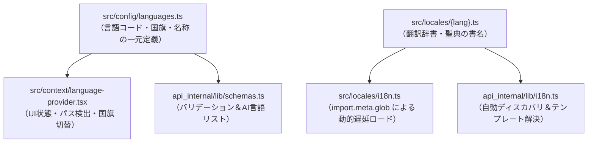

# 多言語化（I18n）＆ローカライズ

Scripture Habitは、グローバルなユーザー向けに設計されています。ローカライズシステムにより、すべてのユーザーが希望する言語（英語、日本語、スペイン語、タガログ語など）でアプリを使用できるようになります。

言語定義と翻訳辞書は**単一の情報源（SSOT: Single Source of Truth）**として一元化・DRY（Don't Repeat Yourself）化されており、フロントエンド・バックエンド・AI翻訳機能の間で完全に同期されています。

---

## 🏛️ アーキテクチャ: SSOT（一元管理）構成

---

## 🎨 フロントエンドアーキテクチャ: 言語コンテキスト＆プロバイダー

フロントエンドのローカライズは、以下の構成で管理されています：
- **`src/config/languages.ts`**: 全言語のメタデータ（コード、名称、国旗アイコン、LDSコード）を一元定義。
- **`src/context/language-context.ts`**: 型定義と言語コンテキストのインスタンスを宣言。
- **`src/context/language-provider.tsx`**: URLパス、ストレージ、ブラウザ設定からの言語自動検出、動的ロード、および翻訳キャッシュを管理。
- **`src/locales/i18n.ts`**: `import.meta.glob` を使用して必要な言語辞書ファイルのみをオンデマンドで動的インポート（遅延ロード）。

### 1. 翻訳ヘルパー `t()`
以下を提供するカスタムフックです：
- **変数挿入**: `"{name} added a note"` のような動的テキストをサポートします。
- **英語へのフォールバック**: 選択中の言語で翻訳キーが不足している場合、UIを空白のままにするのではなく、英語（`en`）の翻訳を安全にフォールバック表示します。

### 2. 聖典の書の翻訳
複数の言語で聖典の書の名前を正しく表示するために、マッピング関数を使用します：
- 書の名前は標準キーを使用して保存されます。
- UIは `translateBookName(bookName)` を使用して、ユーザーの言語設定に基づいて「Book of Mormon」を「モルモン書」や「Libro de Mórmon」として表示します（各辞書ファイルの `books` オブジェクトから取得）。

---

## ⚙️ バックエンドローカライズ: 自動ディスカバリシステム

バックエンド（`api_internal/lib/i18n.ts`）は、システムメッセージ、プッシュ通知、およびAI指示書（AIプロンプト）の翻訳を管理します。

### 翻訳バンドルの自動読み込み
バックエンド専用の辞書ディレクトリを持たず、フロントエンドと共通の `src/locales/` を直接自動スキャン（Auto-discovery）します：
- **型安全性**: `src/config/languages.ts` から `SupportedLanguage` 型を自動導出し、スキーマ検証（Zod）と完全一致させます。
- **動的テキスト**: 通知テンプレート内の `{nickname}` や `{streak}` などのプレースホルダーを置き換えます。

---

## 🤖 AIローカライズ: コンテンツ翻訳

ユーザーが作成したスタディノートは、静的ファイルを使用するのではなく、Gemini AIによって動的に翻訳されます。

### 1. 言語検出
アプリは、ノートの言語が閲覧者の希望する言語と異なるかどうかを検出します。

### 2. AI翻訳エンドポイント (`/api/ai/translate`)
- バックエンドはターゲット言語（`targetLanguage`）を識別します。
- `api_internal/lib/schemas.ts` の `languageNames`（`src/config/languages.ts` から自動導出）に基づき、AIプロンプトに正しい言語名を注入します。
- **キャッシュ**: 翻訳結果はメッセージドキュメントに直接保存されるため、言語ごとに1回だけ翻訳が実行されます。

---

## 🌍 サポートされている言語（全10言語）

| コード | 言語名 (現地表記) | 英語名 | 国旗 | LDSコード |
| :--- | :--- | :--- | :---: | :--- |
| `en` | English | English | 🇺🇸 | `eng` |
| `ja` | 日本語 | Japanese | 🇯🇵 | `jpn` |
| `pt` | Português | Portuguese | 🇧🇷 | `por` |
| `zho` (zh) | 繁體中文 | Chinese (Traditional) | 🇹🇼 | `zho` |
| `es` | Español | Spanish | 🇪🇸 | `spa` |
| `vi` | Tiếng Việt | Vietnamese | 🇻🇳 | `vie` |
| `th` | ไทย | Thai | 🇹🇭 | `tha` |
| `ko` | 한국語 | Korean | 🇰🇷 | `kor` |
| `tl` | Tagalog | Tagalog | 🇵🇭 | `tgl` |
| `sw` | Kiswahili | Swahili | 🇰🇪 | `swa` |

---

## 🚀 新しい言語の追加（DRYな追加手順）

言語設定と辞書が一元化されているため、わずか2ステップでフロントエンド・バックエンド・AIのすべてに新しい言語が反映されます：

1. **言語定義の追加 (`src/config/languages.ts`)**:
   `LANGUAGES` 配列に新しい言語の設定オブジェクト（`code`, `name`, `englishName`, `flag`, `ldsCode` 等）を追加します。
   > [!NOTE]
   > この追加により、バックエンドのバリデーションスキーマ（`schemas.ts`）、UIの言語切り替えメニュー、AI翻訳の対応言語リストが自動的に更新されます。

2. **翻訳辞書ファイルの作成 (`src/locales/{code}.ts`)**:
   `src/locales/` 配下に新しい言語ファイル（例：フランス語なら `fr.ts`）を作成し、UIテキストおよび `books`（聖典の書名）を記述します。
   > [!TIP]
   > - **フロントエンド**: `src/locales/i18n.ts` の `import.meta.glob` により、登録不要で自動的に動的読み込み対象になります。
   > - **バックエンド**: `api_internal/lib/i18n.ts` が起動時に `src/locales/` を自動スキャンするため、個別の登録作業は不要です。
