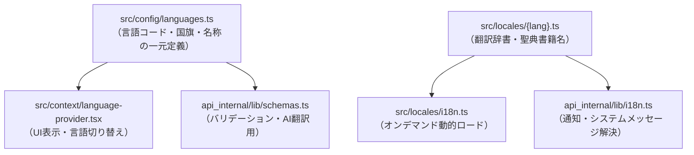

# 多言語対応（i18n）の仕組み

Scripture Habit は、世界中のユーザーが母国語で学習できるように多言語対応（11言語）をサポートしています。

言語設定と翻訳辞書は一元管理（`src/locales/`）されており、フロントエンド、バックエンド、および AI 翻訳機能の間で完全に同期されています。

---

## 1. 全体アーキテクチャ

---

## 2. フロントエンド側の仕組み

- **`src/config/languages.ts`**: 言語コード、言語名、国旗アイコン、教会公式サイト用の言語コードを一元定義。
- **`src/context/language-provider.tsx`**: ブラウザ設定や保存された言語をもとに初期化し、動的に辞書をロード。
- **`src/locales/i18n.ts`**: `import.meta.glob` を使用して、必要な言語の辞書ファイルのみをオンデマンド（遅延ロード）で読み込みます。

### ① 翻訳関数 `t()`
- **動的パラメータの埋め込み**: `"{name}さんがノートを投稿しました"` などの変数を安全に展開。
- **英語へのフォールバック**: 翻訳キーが未翻訳の場合でも、空白にならず英語（`en`）のテキストがフォールバック表示されます。

### ② 聖典名の多言語変換
聖典の書名は標準キーで保存され、表示時にユーザーの言語に応じた書名（例: "Book of Mormon" → "モルモン書" / "Libro de Mórmon"）に自動変換されます。

---

## 3. バックエンド側の仕組み (`api_internal/lib/i18n.ts`)

バックエンドでもフロントエンドと同じ `src/locales/` の辞書を直接参照し、プッシュ通知やシステムメッセージの多言語化を行っています。

---

## 4. AIによる動的翻訳 (`/api/ai/translate`)

ユーザーが投稿したスタディノートは、Gemini AI によって閲覧者の言語へリアルタイム翻訳されます。
- **キャッシュ機能**: 翻訳結果はメッセージドキュメント内に保存され、同一言語への翻訳が重複して実行されるのを防ぎます。

---

## 5. サポート言語一覧（全11言語）

| コード | 言語名 (現地表記) | 英語名 | 国旗 | 教会LDSコード |
| :--- | :--- | :--- | :---: | :--- |
| `en` | English | English | 🇺🇸 | `eng` |
| `ja` | 日本語 | Japanese | 🇯🇵 | `jpn` |
| `pt` | Português | Portuguese | 🇧🇷 | `por` |
| `zho` | 繁體中文 | Chinese (Traditional) | 🇹🇼 | `zho` |
| `es` | Español | Spanish | 🇪🇸 | `spa` |
| `vi` | Tiếng Việt | Vietnamese | 🇻🇳 | `vie` |
| `th` | ไทย | Thai | 🇹🇭 | `tha` |
| `ko` | 한국어 | Korean | 🇰🇷 | `kor` |
| `tl` | Tagalog | Tagalog | 🇵🇭 | `tgl` |
| `sw` | Kiswahili | Swahili | 🇰🇪 | `swa` |
| `it` | Italiano | Italian | 🇮🇹 | `ita` |

---

## 6. 新しい言語の追加手順

1. **辞書ファイルの作成 (`src/locales/{code}.ts`)**:
   `src/locales/` 配下に新しい言語辞書（例: `fr.ts`）を作成します。
2. **同期スクリプトの実行**:
   `npm run i18n:sync` を実行すると、`src/config/languages.ts` およびバックエンドのスキーマに新しい言語が自動登録されます。

---

## 7. 関連ドキュメント

- [AI 統合 (Gemini)](./feature-ai-integration.md)
- [プッシュ通知システム](./feature-notifications.md)
