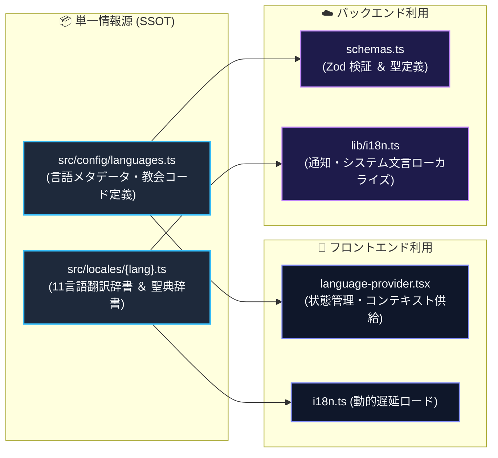

# 多言語対応（i18n）の仕組み

Scripture Habit は、世界各地のユーザーが母国語で学習できるよう全 11 言語に対応しています。

言語設定および翻訳辞書は `src/locales/` を単一情報源（SSOT）として一元管理され、フロントエンド、バックエンド、および AI 翻訳パイプラインの間で整合性を保っています。

---

## 1. 全体アーキテクチャ

### アーキテクチャの解説

1. **単一情報源（SSOT）による辞書の一元管理**  
   `src/locales/` 内の辞書ファイルを唯一の真実とし、フロントエンドとバックエンドが共通の定義を共有します。
2. **フロントエンドでの動的遅延ロード**  
   初期バンドルサイズを抑えるため、`import.meta.glob` を用いて現在の言語辞書のみをオンデマンドで取得します。
3. **バックエンドでの多言語通知生成**  
   FCM プッシュ通知やシステムメッセージの作成時、ユーザーの登録言語に応じた辞書を直接参照してローカライズ文字列を生成します。

---

## 2. フロントエンド側の仕組み

- **`src/config/languages.ts`**: 言語コード、現地語表記、国旗、教会公式クエリ（`jpn`, `eng` 等）を定義。
- **`src/context/language-provider.tsx`**: ブラウザ環境や保存設定をもとに初期化し、UI 全体に翻訳コンテキストを提供。
- **`src/locales/i18n.ts`**: 動的インポートにより、必要な辞書のみを非同期ロード。

### ① 翻訳関数 `t()`
- **パラメータ展開**: `"{name}さんがノートを投稿しました"` などの変数を型安全に展開。
- **フォールバック保証**: 未翻訳キーが存在する場合、自動的に英語（`en`）テキストをフォールバック表示。

### ② 聖典名の多言語変換
聖典の書名は標準キーで永続化され、表示時にユーザーのロケールに合わせて動的に変換されます（例: `"Book of Mormon"` $\rightarrow$ `"モルモン書"` / `"Libro de Mórmon"`）。

---

## 3. バックエンド側の仕組み (`api_internal/lib/i18n.ts`)

同一の `src/locales/` 辞書を直接インポートし、通知タイトルや本文、システムメッセージを多言語で生成します。

---

## 4. AI による動的翻訳 (`/api/ai/translate`)

ユーザーが投稿した学習ノートは、閲覧者の要求に応じて Gemini 3.1 Flash-Lite によりオンデマンド翻訳されます。結果はメッセージドキュメント内にキャッシュされ、重複した API コストを防止します。

---

## 5. サポート言語一覧（全11言語）

| コード | 言語名 (現地表記) | 英語名 | 国旗 | 教会 LDS コード |
| :--- | :--- | :--- | :---: | :--- |
| `en` | English | English | 🇺🇸 | `eng` |
| `ja` | 日本語 | Japanese | 🇯🇵 | `jpn` |
| `pt` | Português | Portuguese | 🇧🇷 | `por` |
| `zho` | 繁體中文 | Chinese (Traditional) | 🇹🇼 | `zho` |
| `es` | Español | Spanish | 🇪🇸 | `spa` |
| `vi` | Tiếng Việt | Vietnamese | 🇻🇳 | `vie` |
| `th` | ไทย | Thai | 🇹🇭 | `tha` |
| `ko` | 한국어 | Korean | 🇰🇷 | `kor` |
| `tl` | Tagalog | Tagalog | 🇵🇭 | `tgl` |
| `sw` | Kiswahili | Swahili | 🇰🇪 | `swa` |
| `it` | Italiano | Italian | 🇮🇹 | `ita` |

---

## 6. 新規言語の追加手順

1. **辞書ファイルの作成 (`src/locales/{code}.ts`)**: `src/locales/` 配下に新規言語ファイルを作成。
2. **同期スクリプトの実行**: `npm run i18n:sync` を実行し、言語定義とバックエンドスキーマへ自動反映。

---

## 7. 関連ドキュメント

- [AI 統合 (Gemini)](./feature-ai-integration.md)
- [プッシュ通知システム](./feature-notifications.md)
