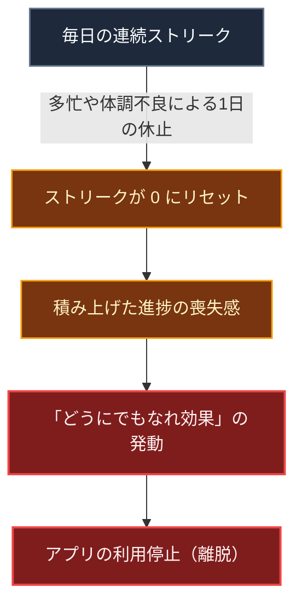
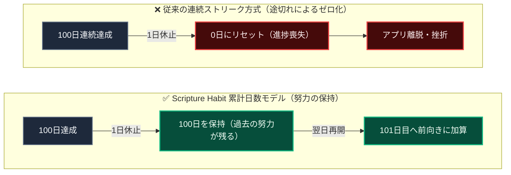
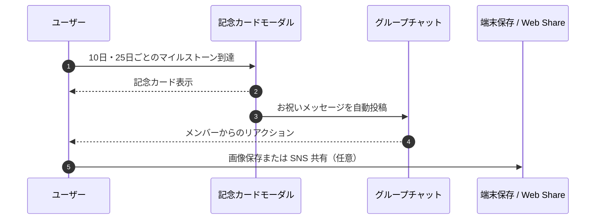

# マイルストーン達成 ＆ リテンションの心理学

> [!TIP]
> **インタラクティブ・アーキテクチャツアー**: [ブラウザでツアーを開く (マイルストーン達成 & カプセル報酬)](https://htmlpreview.github.io/?https://github.com/ScriptureHabit/scripture-habit/blob/main/docs/public/architecture-tour.html?tour=tour-milestone&lang=ja)

このドキュメントでは、10日および25日刻み（25日、50日、75日、100日...）のマイルストーン判定、記念画像カードの生成・共有機能、および行動経済学に基づいた継続支援設計について解説します。

---

## 1. 従来の「連続ストリーク」が抱える課題

多くの習慣化アプリでは「連続達成日数（Streak）」が主要な指標として用いられますが、完全な連続性に過度に依存すると以下の心理的摩擦が生じます。



### 心理的メカニズムの解説

1. **損失回避（Loss Aversion）**  
   何かを失う痛みは得る喜びよりも大きく評価されます。100日積み上げた記録が1日の休止で「0」に戻ることで、過去の努力全体が無価値になったと錯覚させます。

2. **「どうにでもなれ効果」（What-the-Hell Effect）**  
   ルールが一度途切れたことを契機に、「すべてが無駄になった」と努力自体を放棄してしまう心理バイアスです。ストリーク切れによる離脱は個人の意志ではなく、この設計上の欠陥に起因します。

---

## 2. 累計学習日数モデルへの移行

Scripture Habit では、連続日数への過剰なプレッシャーを排除するため、**「これまでの累計学習日数（`daysStudiedCount`）」**を主要な指標として評価します。



### 比較解説

- **過去の努力の不可逆性**: 1日休止しても、これまで積み重ねた日数はそのまま残存します。
- **再開障壁の低減**: 「100日積み上げた事実」が手元に残るため、いつでも翌日から前向きに再開できます。

---

## 3. マイルストーンの間隔設計（10日 ＋ 25日刻み）

マイルストーン間隔は、習慣形成のフェーズに合わせて段階的に設計されています。

```
[Day 1] ───→ [Day 10 (初期離脱防止)] ───→ [Day 25] ───→ [Day 50] ───→ [Day 75] ───→ [Day 100] ...
              ▲                             ▲           ▲           ▲           ▲
        初期の成功体験（Quick Win）              約3〜4週間ごとの適正目標（中だるみ防止）
```

1. **初期 10 日間（Quick Win）**  
   最も離脱率の高い最初の 2 週間を乗り越えるため、到達しやすい 10 日目を第 1 の関門として設定します。
2. **以降 25 日ごと（目標勾配効果の維持）**  
   目標が近づくほどモチベーションが高まる「目標勾配効果（Goal Gradient Effect）」を活用し、約 3〜4 週間ごとに次の節目を配置して中だるみを予防します。

---

## 4. 記念カードによる達成の可視化

マイルストーン達成時には、モーダル（[`MilestoneModal`](file:///c:/Users/dazhi/code/scripture-habit/src/components/milestone/milestone-modal.tsx)）と記念カード（[`MilestoneCard`](file:///c:/Users/dazhi/code/scripture-habit/src/components/milestone/milestone-card.tsx)）が描画されます。

```
┌────────────────────────────────────────────────────────┐
│               ✨ SCRIPTURE HABIT ✨                    │
│                                                        │
│                    🏆 50 DAYS 🏆                       │
│                                                        │
│               "山田太郎 achieved a milestone            │
│               of 50 total days of study."              │
│                                                        │
│                  DATE: 2026-08-27                      │
│               https://scripturehabit.app               │
└────────────────────────────────────────────────────────┘
```

- **自己効力感（Self-Efficacy）の強化**: 積み重ねた努力を画像カードとして具現化し、継続の自信を補強します。
- **他者比較の排除**: ランキングによる競争ではなく、過去の自分に対する積み上げを祝福します。

---

## 5. シェアとグループでのお祝い

記念カードは、個人での保存に加え、所属グループへも適度な頻度で通知されます。



### シーケンスの解説

1. **マイルストーン達成の検知**  
   ノート投稿時に判定ロジックが走り、節目に達した場合は記念カードモーダルが展開されます。
2. **グループへの自動告知**  
   毎回の投稿でチャットを埋めることなく、節目（10日、25日刻み）のみお祝いメッセージが流れるため、メンバー同士の自然な励まし合いを促します。
3. **柔軟な共有手段**  
   Web Share API または `html-to-image` を用いた画像保存により、ワンタップで手元に保存または外部共有が可能です。

---

## 6. 実装の概要

| 役割 | 対象ファイル | 説明 |
| :--- | :--- | :--- |
| **判定ロジック** | [`src/utils/milestone.ts`](file:///c:/Users/dazhi/code/scripture-habit/src/utils/milestone.ts) | 10日および25の倍数日をマイルストーンとして判定 |
| **状態管理** | [`src/store/use-milestone-store.ts`](file:///c:/Users/dazhi/code/scripture-habit/src/store/use-milestone-store.ts) | モーダルの開閉状態とマイルストーンデータの保持 |
| **UI コンポーネント** | [`src/components/milestone/`](file:///c:/Users/dazhi/code/scripture-habit/src/components/milestone/) | 記念カードの描画および画像ダウンロード・共有機能 |
| **バックエンド連携** | [`api_internal/services/note-service.ts`](file:///c:/Users/dazhi/code/scripture-habit/api_internal/services/note-service.ts) | ノート投稿時のマイルストーン判定とチャットへのお祝い投稿 |

---

## 7. 関連ドキュメント

- [AI振り返りレターの心理学的効用とリテンション](./ux-ai-reflection-letters.md)
- [少人数グループ（最大5人）とピア・アカウンタビリティの心理学](./ux-small-groups-and-peer-accountability.md)
- [ノート投稿 & ストリーク計算](./logic-note-posting.md)
- [チャット & ダッシュボード同期](./feature-chat-dashboard.md)
