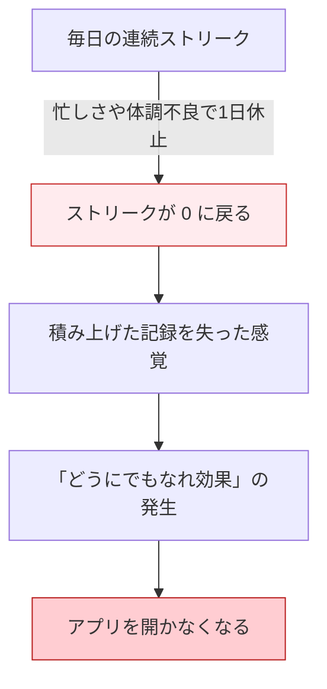
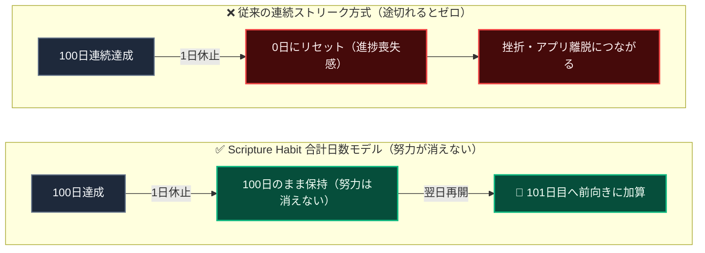
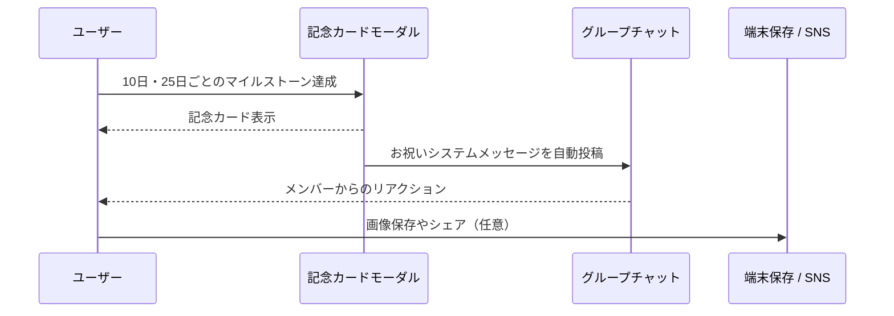

# マイルストーン達成 ＆ リテンションの心理学

Scripture Habit では、**10日および25日刻み（25日、50日、75日、100日...）のマイルストーン達成機能**と、**記念画像の生成・共有機能（[`src/utils/milestone.ts`](file:///c:/Users/dazhi/code/scripture-habit/src/utils/milestone.ts)）**を導入しています。

この設計は、連続記録の途切れによる挫折を防ぎ、ユーザーが無理なく学習を続けられるように、行動経済学や習慣形成の知見を参考にして作られています。

---

## 1. 従来の「連続ストリーク」が抱える課題

多くの習慣化アプリでは、「連続達成日数（Streak）」を伸ばすことが主なモチベーションとして使われています。しかし、連続記録に頼りすぎると以下のような心理的ハードルが生まれます。



### 損失回避（Loss Aversion）の影響
行動経済学では、何かを失うことの心理的痛みは、同等のものを得る喜びよりも大きく感じられることが知られています。
例えば100日続けてきた記録が1日休んだだけで「0日」にリセットされると、過去の100日分の努力まで無駄になったように感じてしまいます。

### 「どうにでもなれ効果」（What-the-Hell Effect）
心理学で言われる「どうにでもなれ効果（目標不達成効果）」とは、一度ルールが途切れたことをきっかけに、「もういいや」と努力自体をやめてしまう現象です。
ストリークが途切れたユーザーが離脱しやすいのは、意志の強さの問題ではなく、この心理が働くためです。

---

## 2. 合計日数（累積日数）モデルへの移行

Scripture Habit では、連続日数への過度なプレッシャーを減らすため、**「これまでに学習した合計日数（`daysStudiedCount`）」**をメインの指標として表示・祝福する仕組みを採用しています。



- **過去の努力が消えない安心感**: 1日休んでも、これまで積み上げた日数はそのまま残ります。
- **再開しやすさ**: 「今まで100日読んできたのだから、また今日から再開しよう」と前向きに習慣へ戻ることができます。

---

## 3. マイルストーンの間隔設計（10日 ＋ 25日刻み）

マイルストーンを「10日」と「以降25日ごと」に設定している理由には、習慣化の段階に応じた狙いがあります。

```
[Day 1] ───→ [Day 10 (最初の関門突破)] ───→ [Day 25] ───→ [Day 50] ───→ [Day 75] ───→ [Day 100] ...
              ▲                             ▲           ▲           ▲           ▲
        初期の成功体験（離脱防止）               約3〜4週間ごとの適度な目標設定
```

### ① 最初の10日：習慣化の初期関門を突破する（Quick Win）
習慣を始めるときに最も脱落しやすいのは最初の1〜2週間です。
3日や7日ではまだ実感が湧きにくく、30日は始めたばかりの人には遠すぎます。10日は「少し頑張れば届き、自分も続けられそうだ」と手応えを感じやすいタイミングです。

### ② 以降25日ごと：目標勾配効果（Goal Gradient Effect）の維持
目標に近づくほどやる気が高まる心理効果（目標勾配効果）を活用しています。
次の目標が50日後や100日後だと遠すぎて中だるみしやすくなりますが、「25日（約3〜4週間）」というスパンであれば、常に次の達成が手の届く範囲に見え、モチベーションを保ちやすくなります。

---

## 4. 記念カードによる達成の可視化

マイルストーン達成時には、モーダル（[`MilestoneModal`](file:///c:/Users/dazhi/code/scripture-habit/src/components/milestone/milestone-modal.tsx)）と記念カード（[`MilestoneCard`](file:///c:/Users/dazhi/code/scripture-habit/src/components/milestone/milestone-card.tsx)）が表示されます。

```
┌────────────────────────────────────────────────────────┐
│               ✨ SCRIPTURE HABIT ✨                    │
│                                                        │
│                    🏆 50 DAYS 🏆                       │
│                                                        │
│               "山田太郎 achieved a milestone            │
│               of 50 total days of study."              │
│                                                        │
│                  DATE: 2026-08-27                      │
│               https://scripturehabit.app               │
└────────────────────────────────────────────────────────┘
```

- **自己効力感（Self-Efficacy）の向上**: 自分の努力がきちんとした形（画像カード）として可視化されることで、「自分は継続できている」という自信につながります。
- **他人との比較ではなく自分の成長を称える**: ランキングや競争ではなく、過去の自分に対する積み上げを祝福するため、無理のない継続を促します。

---

## 5. シェアとグループでのお祝い

記念カードは、個人で楽しむだけでなく、手軽に共有できる設計になっています。



- **グループ内での適度な共有**: 毎回の投稿でチャットを埋めるのではなく、マイルストーン達成時にお祝いメッセージが流れることで、メンバー同士が自然に励まし合えます。
- **手軽な画像保存と共有**: Web Share API や画像保存（html-to-image）により、ワンタップで手元に保存したり、SNSに投稿したりできます。

---

## 6. 実装の概要

| 役割 | 対象ファイル | 説明 |
| :--- | :--- | :--- |
| **判定ロジック** | [`src/utils/milestone.ts`](file:///c:/Users/dazhi/code/scripture-habit/src/utils/milestone.ts) | 10日、および25の倍数日をマイルストーンとして判定 |
| **状態管理** | [`src/store/use-milestone-store.ts`](file:///c:/Users/dazhi/code/scripture-habit/src/store/use-milestone-store.ts) | モーダルの開閉とマイルストーンデータの保持 |
| **UIコンポーネント** | [`src/components/milestone/`](file:///c:/Users/dazhi/code/scripture-habit/src/components/milestone/) | 記念カードの描画と画像ダウンロード・共有機能 |
| **バックエンド連携** | [`api_internal/services/note-service.ts`](file:///c:/Users/dazhi/code/scripture-habit/api_internal/services/note-service.ts) | ノート投稿時のマイルストーン判定とチャットへのお祝い投稿 |

---

## 7. 関連ドキュメント

- [AI振り返りレターの心理学的効用とリテンション](./ux-ai-reflection-letters.md)
- [少人数グループ（最大5人）とピア・アカウンタビリティの心理学](./ux-small-groups-and-peer-accountability.md)
- [ノート投稿 & ストリーク計算](./logic-note-posting.md)
- [チャット & ダッシュボード同期](./feature-chat-dashboard.md)
