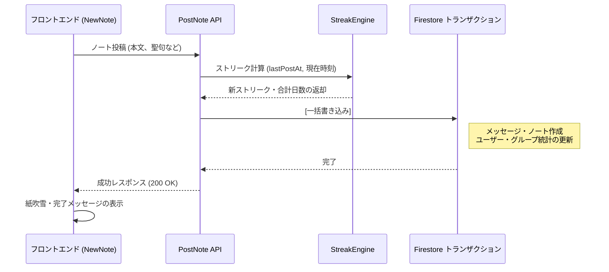

# ノート投稿 & ストリーク計算のロジック

このドキュメントでは、スタディノートの投稿処理の流れ、タイムゾーンを考慮したストリーク（継続日数）の判定、およびレベル計算の仕組みについて解説します。

---

## 1. ストリーク判定エンジン (`api_internal/lib/streak-engine.ts`)

ユーザーの学習継続を正確に判定するため、タイムゾーンや生活リズムの違い（深夜の学習など）を考慮した判定ロジックを使用しています。

### 基本ルール
ノートが投稿されると、ユーザーが設定している `timeZone`（未設定時は `'UTC'`）をもとに以下の手順で計算します：

1. **現地日付の判定**:
   Node.js の `Intl` API を使用して、サーバー時刻からユーザーの現在の日付文字列（例: `'2026-05-22'`）を取得します。
2. **同日内の重複カウント防止**:
   1日に複数回投稿してもストリークが増えすぎないよう、前回の投稿日（`lastPostDate`）がすでに今日である場合は、ノートは保存されますがストリーク数は増加しません（`streakUpdated = false`）。
3. **ストリーク継続の条件**:
   新しい日付でノートが投稿された場合、次のいずれかを満たしていればストリークが **+1** されます：
   - **連続した日付**: 前回の投稿日が「昨日」である。
   - **36時間の猶予期間**: 前回の投稿から **36時間以内** である（`hoursSinceLastPost <= 36`）。

   ※どちらも満たさない場合は、ストリークが `1` にリセットされます。
4. **最高ストリークの記録**:
   新しいストリークが過去最高記録（`highestStreak`）を更新した場合、自動的に更新されます。

### 判定の具体例
- **深夜の学習**: 月曜の朝8:00に投稿し、次回が火曜の夜22:00（38時間後）だった場合、36時間は経過していますが「月曜→火曜」と日付が連続しているためストリークは維持されます。
- **タイムゾーンの移動**: 海外旅行などで日付が1日飛んでしまった場合でも、前回の投稿から36時間以内であれば猶予期間としてストリークが継続します。

```typescript
const isTargetDay = lastPostDate === yesterday;
const withinGracePeriod = lastTimeMillis > 0 && hoursSinceLastPost <= 36;

if (isTargetDay || withinGracePeriod) {
    newStreak += 1;
    isConsecutive = true;
} else {
    newStreak = 1; // リセット
}
```

---

## 2. ノート投稿トランザクションの流れ

データの整合性を保ちながら処理を高速化するため、ノートの投稿は Firestore のトランザクション（`db.runTransaction()`）内で実行されます。

1. **参加確認**: ユーザー自身の `userData.groupIds` を確認し、グループへの所属を検証します。
2. **ストリーク計算**: `StreakEngine` で新しいストリーク数と合計学習日数を計算します。
3. **メッセージ作成**: `groups/{id}/messages` にチャット用メッセージを追加します。
4. **個人ノートの保存**: `users/{uid}/notes` に個人用アーカイブとしてノートを保存します。
5. **ユーザー情報の更新**: `totalNotes`、`lastPostAt`、`streakCount` などを更新します。
6. **グループ統計の更新**: `FieldValue.increment` を使って、メッセージ件数やノート件数を直接加算します。

---

## 3. トランザクション後のバックグラウンド処理

トランザクションを素早く完了させるため、以下の処理は投稿完了後に非同期で実行されます：

1. **プッシュ通知の送信**: グループメンバーのFCMトークンを取得し、バックグラウンドで通知を送信します。
2. **団結度（Unity）の更新**: その日のグループ全体の参加率を非同期で再計算します。

---

## 4. データベース処理コストの内訳（5人グループの場合）

ユーザー1人が5人グループ（送信者1人 + 他メンバー4人）にノートを投稿する際の、Firestore 読み書き回数の目安です：

### 書き込み（合計: 8回）
- **トランザクション内（7回）**:
  1. ユーザープロフィールの更新 (`/users/{uid}`)
  2. 個人ノートの作成 (`/users/{uid}/notes/{noteId}`)
  3. チャットメッセージの作成 (`/groups/{gid}/messages/{messageId}`)
  4. グループ統計の更新 (`/groups/{gid}`)
  5. メンバー状態の更新 (`/groups/{gid}/members/{uid}`)
  6. 読了カウンターの更新 (`/users/{uid}/groupStates/{gid}`)
  7. 最新メッセージキャッシュの更新 (`/groups/{gid}/messages_latest/latest`)
- **非同期バックグラウンド（1回）**:
  8. グループ団結度の更新 (`/groups/{gid}`)

*(※マイルストーン達成時は、お祝い告知メッセージの作成でトランザクション内書き込みが +1 されます)*

### 読み取り（合計: 7回）
- **トランザクション内（2回）**: ユーザープロフィール、最新メッセージキャッシュ
- **非同期バックグラウンド（5回）**: グループメタデータ（1回）、他メンバー4人の通知用トークン（4回）

---

## 5. レベルの計算方法

ユーザーのレベルは、学習した合計日数をもとに計算されます：

$$\text{Level} = \lfloor \frac{\text{daysStudiedCount}}{7} \rfloor + 1$$

- **週単位での進行**: 7日分学習するごとにレベルが 1 上がります。
- **計算の最適化**: `level` をデータベースに保存するのではなく、クライアント側（画面描画時）に `daysStudiedCount` から動的に算出することで、書き込み回数とストレージコストを削減しています。

---

## 6. 投稿シーケンス図



---

## 7. マイルストーン達成とお祝い通知

連続記録が途切れたときの心理的挫折を防ぐため、アプリは**合計学習日数（`daysStudiedCount`）**をメインの指標として表示・祝福します。

- **通常日の投稿**: グループチャットに「〇〇さんがノートを投稿しました！」と通知します。
- **マイルストーン達成日**: 以下の節目に達した際、特別なお祝いメッセージが自動投稿されます。
  - **初回マイルストーン**: **10日**
  - **継続マイルストーン**: 以降 **25日ごと**（25日、50日、75日、100日、125日...）

設計の意図や心理学的な背景については [マイルストーン達成 & リテンション心理学](./logic-milestone-retention.md) を参照してください。

---

## 8. 関連ドキュメント

- [マイルストーン達成 & リテンション心理学](./logic-milestone-retention.md)
- [ダッシュボード ＆ マイノート設計ガイド](./dashboard-mynotes-construction-guide.md)
- [Firestore トランザクション & カウンター設計](./firestore-transactions-counters.md)
- [プッシュ通知システム](./feature-notifications.md)
