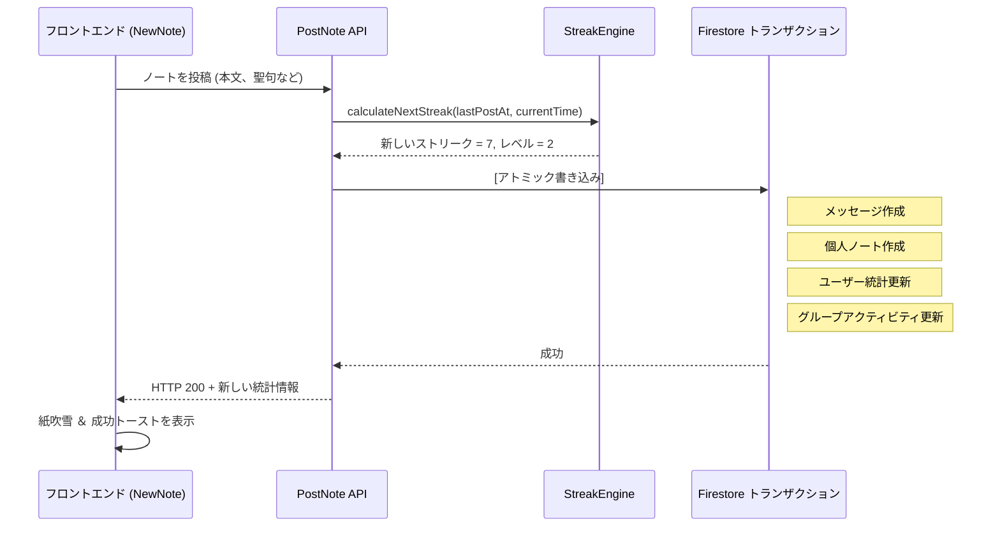

# ノート投稿とストリークのロジック

このドキュメントでは、ユーザーがスタディノートを投稿する方法と、ストリーク（継続日数）およびレベルの計算ロジックについて説明します。

---

## 🔥 ストリークエンジン (`api_internal/lib/streak-engine.ts`)

アプリは、ユーザーのストリークを計算するために**ハイブリッドストリークエンジン（Hybrid Streak Engine）**を使用しています。これにより、タイムゾーンの変更や深夜の学習習慣によるストリークの途切れを防ぎます。

### コア計算ルール
ユーザーがノートを投稿すると、システムはユーザーのローカルな `timeZone`（デフォルトは `'UTC'`）を使用してストリークを計算します：

1.  **ローカル日付の解決**:
    エンジンは、Nodeの `Intl` API を使用して、現在のサーバー時刻と24時間前の時刻をユーザーのローカル日付文字列（例：`'2026-05-22'`）に変換します。
2.  **同日重複インクリメントの防止（ガード）**:
    ユーザーが1日に何度もストリークを増やすのを防ぐため：
    - ユーザーの `lastPostDate` がすでに「今日」である場合、ノートは保存されますが、ストリーク数は増加しません（`streakUpdated = false`）。
3.  **ストリーク継続の判定**:
    新しい日にノートが投稿された場合、以下のいずれかの条件を満たしていればストリークは**1増加**します：
    - **連続したカレンダー日**: ユーザーの `lastPostDate` が正確に「昨日」である。
    - **36時間の猶予期間**: 前回の投稿からの経過時間が**36時間以下**である（`hoursSinceLastPost <= 36`）。
    
    どちらの条件も満たさない場合、ストリークは**1にリセット**されます。
4.  **最長ストリーク (Highest Streak)**:
    新しいストリークが `highestStreak` を超えた場合、システムは `highestStreak` を更新します。

### メリットの具体例
- **深夜の学習**: ユーザーが月曜日の午前8:00に投稿し、その次の投稿が火曜日の午後10:00（38時間後）だったとします。36時間を経過していますが、連続したカレンダー日（月曜日 -> 火曜日）であるため、ストリークは維持されます。
- **タイムゾーンの移動**: タイムゾーンを越えて移動するユーザーがカレンダー上の1日を逃してしまった場合でも、36時間という物理的な時間枠（猶予期間）によって保護されます。

### アルゴリズムコード
```typescript
const isTargetDay = lastPostDate === yesterday;
const withinGracePeriod = lastTimeMillis > 0 && hoursSinceLastPost <= 36;

if (isTargetDay || withinGracePeriod) {
    newStreak += 1;
    isConsecutive = true;
} else {
    newStreak = 1; // Reset streak
}
```

---

## 💎 分解された投稿トランザクションステップ（読み取り最適化）

パフォーマンスを最大化し、トランザクションロックの競合を防ぐため、ノートの投稿は Firestore の `db.runTransaction()` 内部で実行され、**トランザクション中でのグループドキュメントの読み取りは0回**となっています：

1.  **メンバーシップ検証（読み取り不要）**: `groupRef.get()` をバイパスし、ユーザー自身の `userData.groupIds` 配列と照合することで、ユーザーがグループに所属していることを検証します。
2.  **統計情報の計算**: `StreakEngine` を呼び出して、新しい `streakCount` と更新情報を取得します。
3.  **メッセージの作成**: `groups/{id}/messages` にメッセージドキュメントを追加します。
4.  **個人ノートの同期**: 個人アーカイブ用に、ノートを `users/{uid}/notes` に複製（コピー）します。
5.  **ユーザープロフィールの更新**: ユーザープロフィールドキュメント上で `totalNotes` をインクリメントし、`lastPostAt`、`streakCount` などを更新します。
6.  **アトミックグループ更新（書き込みのみ）**: `FieldValue.increment` および `FieldValue.arrayUnion` を使用して、メタデータカウンター（`messageCount`、`noteCount`）やタイムスタンプ配列をブラインド書き込み（読み取りを行わない直接書き込み）で更新します。

---

## 🤝 トランザクション後の非同期クリーンアップと更新

ブロッキングを伴わないすべての計算、プッシュ通知の配信処理、および毎日のアクティビティのリセットは、トランザクションコンテキスト外の**トランザクション後のバックグラウンド処理**に延期されます：

1.  **プッシュ通知送信のためのメンバー取得**: 通知対象となるグループメンバーのリストは、トランザクションコンテキスト外のバックグラウンドタスクで取得され、トランザクションロックを回避します。
2.  **遅延式のデイリーリセット ＆ 団結力（Unity）の計算**:
    - 毎晩の CRON スイープ（一斉処理）によってすべてのグループ統計をリセットする代わりに、システムは新しいカレンダー日の最初のノート投稿時に、`dailyActivity` の日付をリセットする処理を**遅延（Lazy）実行**します。
    - 団結力（`unityPercentage`）の割合はトランザクション外で動的に計算され、非同期に更新されます。これにより、重いクエリがチャット投稿トランザクションを失速させるのを防ぎます。

---

## 🏆 レベル計算とUI最適化

ユーザーのレベルは以下の数式を使用して計算されます：
`Level = floor(daysStudiedCount / 7) + 1`

- **週次ペース**: 重複しない7日間の学習を行うことで、ユーザーのレベルが1上がります。
- **オンザフライ計算（書き込みの最適化）**:
  冗長なデータベース書き込みを排除し、Firestore のストレージコストを最小限に抑えるため、`level` field は `users` ドキュメントに直接**保存されません**。
  代わりに、クライアントアプリケーションが React のレンダリングフェーズ内で、ユーザーの実際の `daysStudiedCount` フィールドを使用して、レベルを動的に計算します（例: `DashboardOverview` や `UserProfileModal` の内部）。
- **リーダーボードのパフォーマンス**: 基本となるソートキー（`daysStudiedCount`）が線形にスケールし、Firestore でネイティブにインデックス付けされているため、リーダーボードやランキングは依然として効率的にソート可能です。データベースに重複するプロパティを持たせることなく、高速な応答速度を確保します。

---

## 🚦 投稿フロー図


