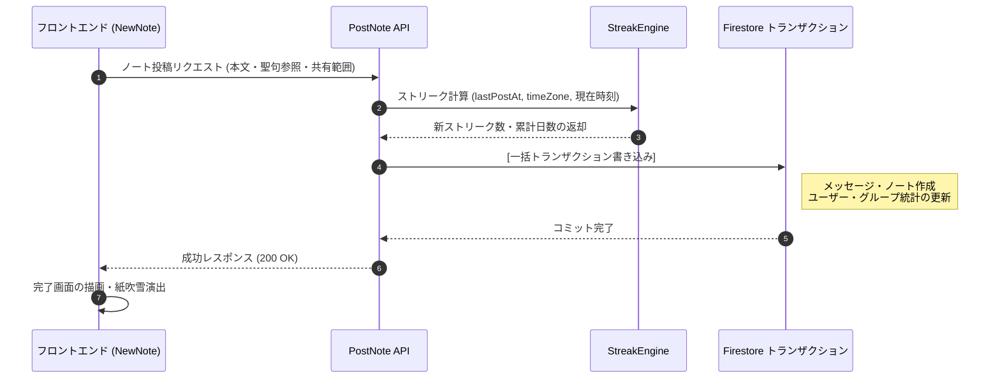

# ノート投稿 & ストリーク計算のロジック

::: tip インタラクティブ・アーキテクチャツアー
この機能のデータフローとステップ解説ツアーを体験できます：
- **オンライン（GitHubブラウザプレビュー）**: [インタラクティブツアーを開く (新規ノート作成 & 投稿フロー)](https://htmlpreview.github.io/?https://github.com/ScriptureHabit/scripture-habit/blob/main/docs/public/architecture-tour.html?tour=tour-newnote&lang=ja)
- **VitePress / ローカル**: [新規ノート作成 & 投稿フロー の解説ツアーを開く](/architecture-tour.html?tour=tour-newnote&lang=ja)
:::

このドキュメントでは、スタディノートの投稿処理パイプライン、タイムゾーンを考慮したストリーク（継続日数）の判定アルゴリズム、およびレベル計算の仕組みについて解説します。

---

## 1. ストリーク判定エンジン (`api_internal/lib/streak-engine.ts`)

ユーザーの学習継続を正確に判定するため、タイムゾーンや深夜の学習サイクルを考慮した判定ロジックを採用しています。

### 基本ルール
ノートが投稿されると、ユーザーの `timeZone`（未設定時は `'UTC'`）をもとに以下の手順で計算します。

1. **現地日付の判定**  
   Node.js の `Intl` API を使用し、サーバー時刻からユーザーの現在の日付文字列（例: `'2026-05-22'`）を動的に割り出します。
2. **同日内の重複カウント防止**  
   1日に複数回投稿した場合でもストリークが増加しないよう、前回の投稿日（`lastPostDate`）がすでに本日である場合はストリーク数を維持します（`streakUpdated = false`）。
3. **ストリーク継続の条件**  
   新しい日付でノートが投稿された場合、以下のいずれかを満たしていればストリークを **+1** します。
   - **連続した日付**: 前回の投稿日が「昨日」である。
   - **36時間の猶予期間**: 前回の投稿から **36 時間以内** である（`hoursSinceLastPost <= 36`）。

   ※いずれも満たさない場合、ストリークは `1` にリセットされます。
4. **最高ストリークの更新**  
   新しいストリークが過去最高記録（`highestStreak`）を上回った場合、自動的に最高記録を更新します。

### 判定の具体例
- **深夜の学習**: 月曜朝 8:00 に投稿し、次回が火曜夜 22:00（38 時間後）の場合、36 時間は超過していますが「月曜→火曜」と日付が連続しているためストリークは継続します。
- **タイムゾーンの移動**: 国際移動等で日付が 1 日飛んだ場合でも、前回の投稿から 36 時間以内であれば猶予期間としてストリークが維持されます。

```typescript
const isTargetDay = lastPostDate === yesterday;
const withinGracePeriod = lastTimeMillis > 0 && hoursSinceLastPost <= 36;

if (isTargetDay || withinGracePeriod) {
    newStreak += 1;
    isConsecutive = true;
} else {
    newStreak = 1; // リセット
}
```

---

## 2. ノート投稿トランザクションの流れ

データの整合性を保証するため、ノートの投稿は Firestore のアトミックトランザクション（`db.runTransaction()`）内で実行されます。

1. **所属検証**: ユーザー自身の `userData.groupIds` を照合し、グループへの所属権限を確認します。
2. **ストリーク計算**: `StreakEngine` により、新しいストリーク数と合計学習日数を算出します。
3. **チャットメッセージ作成**: `groups/{id}/messages` にノート共有メッセージを追加します。
4. **個人アーカイブ保存**: `users/{uid}/notes` に個人用スタディノートを保存します。
5. **ユーザー情報の更新**: `totalNotes`、`lastPostAt`、`streakCount`、`daysStudiedCount` を一括更新します。
6. **グループ統計の加算**: `FieldValue.increment` を用い、メッセージ数やノート数をアトミックに加算します。

---

## 3. トランザクション後の非同期バックグラウンド処理

トランザクションの競合とレスポンス遅延を抑えるため、以下の処理はコミット完了後に非同期で実行されます。

1. **プッシュ通知のマルチキャスト送信**: グループメンバーの FCM トークンを取得し、バックグラウンドで一括配信します。
2. **団結度（Unity）の再計算**: 当日のグループ全体の参加率を非同期で更新します。

---

## 4. データベース処理コストの内訳（5人グループの場合）

ユーザー 1 人が 5 人グループ（本人 1 名 + メンバー 4 名）にノートを投稿する際の、Firestore 読み書き回数の内訳です。

### 書き込み（合計: 8回）
- **トランザクション内（7回）**:
  1. ユーザープロフィールの更新 (`/users/{uid}`)
  2. 個人ノートの作成 (`/users/{uid}/notes/{noteId}`)
  3. チャットメッセージの作成 (`/groups/{gid}/messages/{messageId}`)
  4. グループ統計の更新 (`/groups/{gid}`)
  5. メンバー状態の更新 (`/groups/{gid}/members/{uid}`)
  6. 既読カウンターの更新 (`/users/{uid}/groupStates/{gid}`)
  7. 最新メッセージキャッシュの更新 (`/groups/{gid}/messages_latest/latest`)
- **非同期バックグラウンド（1回）**:
  8. グループ団結度の更新 (`/groups/{gid}`)

*(※マイルストーン達成時は、お祝い告知メッセージの作成によりトランザクション内書き込みが +1 されます)*

### 読み取り（合計: 7回）
- **トランザクション内（2回）**: ユーザープロフィール、最新メッセージキャッシュ
- **非同期バックグラウンド（5回）**: グループメタデータ（1回）、他メンバー 4 名の通知用トークン（4回）

---

## 5. レベルの算出アルゴリズム

ユーザーのレベルは、学習した合計日数（`daysStudiedCount`）をもとに算出されます。

$$\text{Level} = \lfloor \frac{\text{daysStudiedCount}}{7} \rfloor + 1$$

- **週単位での進行**: 7 日分学習を重ねるごとにレベルが 1 進行します。
- **オンデマンド算出**: `level` をデータベースに永続化せず、クライアント側で `daysStudiedCount` から動的に算出することで、書き込み回数とストレージコストを削減しています。

---

## 6. 投稿シーケンス図



### シーケンスの解説

1. **リクエストとパラメータの送出**  
   フロントエンドで入力されたノート本文、聖句の章節、および共有範囲パラメータをバックエンド API へ送信します。

2. **タイムゾーン対応のストリーク判定**  
   `StreakEngine` がユーザーの現地時刻と前回の投稿日時をもとに、日付の連続性と 36 時間の猶予期間を評価して最新のメトリクスを算出します。

3. **アトミックコミットと画面描画**  
   Firestore トランザクション内で個人ノートとチャットメッセージを同時に生成し、統計値を更新します。成功レスポンスを受信したフロントエンドは即座に達成演出を実行します。

---

## 7. マイルストーン達成とお祝い通知

連続記録の途切れによる心理的挫折を防ぐため、**累計学習日数（`daysStudiedCount`）**を主要な指標として祝福します。

- **通常投稿**: グループチャットにノート共有メッセージを投稿します。
- **マイルストーン達成時**: 以下の節目に到達した際、システムお祝いメッセージが自動投稿されます。
  - **初回マイルストーン**: **10日**
  - **継続マイルストーン**: 以降 **25日ごと**（25日、50日、75日、100日、125日...）

設計思想の詳細については [マイルストーン達成 & リテンション心理学](./logic-milestone-retention.md) をご覧ください。

---

## 8. 関連ドキュメント

- [マイルストーン達成 & リテンション心理学](./logic-milestone-retention.md)
- [ダッシュボード ＆ マイノート設計ガイド](./dashboard-mynotes-construction-guide.md)
- [Firestore トランザクション & カウンター設計](./firestore-transactions-counters.md)
- [プッシュ通知システム](./feature-notifications.md)
