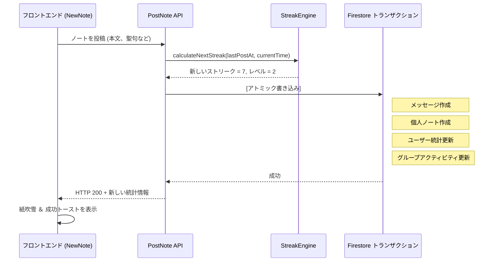

# ノート投稿とストリークのロジック

このドキュメントでは、ユーザーがスタディノートを投稿する方法と、ストリーク（継続日数）およびレベルの計算ロジックについて説明します。

---

## ストリークエンジン (`api_internal/lib/streak-engine.ts`)

アプリは、ユーザーのストリークを計算するために**ハイブリッドストリークエンジン（Hybrid Streak Engine）**を使用しています。これにより、タイムゾーンの変更や深夜の学習習慣によるストリークの途切れを防ぎます。

### コア計算ルール
ユーザーがノートを投稿すると、システムはユーザーのローカルな `timeZone`（デフォルトは `'UTC'`）を使用してストリークを計算します：

1.  **ローカル日付の解決**:
    エンジンは、Nodeの `Intl` API を使用して、現在のサーバー時刻と24時間前の時刻をユーザーのローカル日付文字列（例：`'2026-05-22'`）に変換します。
2.  **同日重複インクリメントの防止（ガード）**:
    ユーザーが1日に何度もストリークを増やすのを防ぐため：
    - ユーザーの `lastPostDate` がすでに「今日」である場合、ノートは保存されますが、ストリーク数は増加しません（`streakUpdated = false`）。
3.  **ストリーク継続の判定**:
    新しい日にノートが投稿された場合、以下のいずれかの条件を満たしていればストリークは**1増加**します：
    - **連続したカレンダー日**: ユーザーの `lastPostDate` が正確に「昨日」である。
    - **36時間の猶予期間**: 前回の投稿からの経過時間が**36時間以下**である（`hoursSinceLastPost <= 36`）。
    
    どちらの条件も満たさない場合、ストリークは**1にリセット**されます。
4.  **最長ストリーク (Highest Streak)**:
    新しいストリークが `highestStreak` を超えた場合、システムは `highestStreak` を更新します。

### メリットの具体例
- **深夜の学習**: ユーザーが月曜日の午前8:00に投稿し、その次の投稿が火曜日の午後10:00（38時間後）だったとします。36時間を経過していますが、連続したカレンダー日（月曜日 -> 火曜日）であるため、ストリークは維持されます。
- **タイムゾーンの移動**: タイムゾーンを越えて移動するユーザーがカレンダー上の1日を逃してしまった場合でも、36時間という物理的な時間枠（猶予期間）によって保護されます。

### アルゴリズムコード
```typescript
const isTargetDay = lastPostDate === yesterday;
const withinGracePeriod = lastTimeMillis > 0 && hoursSinceLastPost <= 36;

if (isTargetDay || withinGracePeriod) {
    newStreak += 1;
    isConsecutive = true;
} else {
    newStreak = 1; // Reset streak
}
```

---

## 分解された投稿トランザクションステップ（読み取り最適化）

パフォーマンスを最大化し、トランザクションロックの競合を防ぐため、ノートの投稿は Firestore の `db.runTransaction()` 内部で実行され、**トランザクション中でのグループドキュメントの読み取りは0回**となっています：

1.  **メンバーシップ検証（読み取り不要）**: `groupRef.get()` をバイパスし、ユーザー自身の `userData.groupIds` 配列と照合することで、ユーザーがグループに所属していることを検証します。
2.  **統計情報の計算**: `StreakEngine` を呼び出して、新しい `streakCount` と更新情報を取得します。
3.  **メッセージの作成**: `groups/{id}/messages` にメッセージドキュメントを追加します。
4.  **個人ノートの同期**: 個人アーカイブ用に、ノートを `users/{uid}/notes` に複製（コピー）します。
5.  **ユーザープロフィールの更新**: ユーザープロフィールドキュメント上で `totalNotes` をインクリメントし、`lastPostAt`、`streakCount` などを更新します。
6.  **アトミックグループ更新（書き込みのみ）**: `FieldValue.increment` および `FieldValue.arrayUnion` を使用して、メタデータカウンター（`messageCount`、`noteCount`）やタイムスタンプ配列をブラインド書き込み（読み取りを行わない直接書き込み）で更新します。

---

## トランザクション後の非同期クリーンアップと更新

ブロッキングを伴わないすべての計算、プッシュ通知の配信処理、および毎日のアクティビティのリセットは、トランザクションコンテキスト外の**トランザクション後のバックグラウンド処理**に延期されます：

1.  **プッシュ通知送信のためのメンバー取得**: 通知対象となるグループメンバーのリストは、トランザクションコンテキスト外のバックグラウンドタスクで取得され、トランザクションロックを回避します。
2.  **遅延式のデイリーリセット ＆ 団結力（Unity）の計算**:
    - 毎晩の CRON スイープ（一斉処理）によってすべてのグループ統計をリセットする代わりに、システムは新しいカレンダー日の最初のノート投稿時に、`dailyActivity` の日付をリセットする処理を**遅延（Lazy）実行**します。
    - 団結力（`unityPercentage`）の割合はトランザクション外で動的に計算され、非同期に更新されます。これにより、重いクエリがチャット投稿トランザクションを失速させるのを防ぎます。

---

## Firestoreオペレーションコスト監査（ノート投稿）

予算の予測可能性を維持し、Firestoreの読み書き（Read/Write）パターンを検証・監査するため、ユーザーがスタディノートを**1つのグループ**に投稿する際の正確な理論上のオペレーション内訳を以下に示します（※自分を含めて5人のグループ（送信者1人 + 受信者4人）であると仮定します）。

### 1. 書き込み（合計：8回）

#### トランザクション内（7回）
1.  **ユーザープロフィールの更新 (`/users/{uid}`)**: `totalNotes`のインクリメント、`lastPostAt` およびストリーク情報の更新。
2.  **個人ノートの新規作成 (`/users/{uid}/notes/{noteId}`)**: マスターアーカイブ用ノートドキュメントの新規作成。
3.  **チャットメッセージの新規作成 (`/groups/{gid}/messages/{messageId}`)**: チャット画面に表示するメッセージドキュメントの新規作成。
4.  **グループ統計の更新 (`/groups/{gid}`)**: メッセージカウントおよびノートカウントのインクリメント。
5.  **メンバーサブコレクションの更新 (`/groups/{gid}/members/{uid}`)**: 投稿者自身の最終活動ステータス等の更新。
6.  **ユーザーグループ状態の更新 (`/users/{uid}/groupStates/{gid}`)**: ユーザー自身のグループ読了カウンター等のインクリメント。
7.  **最新メッセージキャッシュの更新 (`/groups/{gid}/messages_latest/latest`)**: 高速ロード用の最新25件のメッセージ配列の更新。

#### トランザクション外の非同期バックグラウンド処理（1回）
8.  **グループ団結力（Unity）の更新 (`/groups/{gid}`)**: `dailyActivity` の日付チェックと `unityPercentage` の非同期更新。

*(※累積学習マイルストーンを達成した場合は、お祝いのシステムお知らせメッセージを挿入するため、トランザクション内の書き込みがさらに1回追加されます。)*

### 2. 読み取り（合計：7回）

#### トランザクション内（2回）
1.  **ユーザープロフィールの取得 (`/users/{uid}`)**: ストリーク判定およびレベルの計算に必要。
2.  **最新メッセージキャッシュの取得 (`/groups/{gid}/messages_latest/latest`)**: 新しいメッセージを既存のキャッシュ配列の末尾に追加するために必要。

#### トランザクション外の非同期バックグラウンド処理（5回）
3.  **グループメタデータの取得 (`/groups/{gid}`)**: 通知を送信するグループメンバー一覧を特定するために必要。
4.  **通知用宛先ユーザーのトークン ＆ 言語取得 (`/users/{memberUid}`) × 4回**: 自分以外のグループメンバー4人へプッシュ通知を届けるため、それぞれのFCMトークンと通知用言語を取得するために必要。

---

## レベル計算とUI最適化

ユーザーのレベルは以下の数式を使用して計算されます：
`Level = floor(daysStudiedCount / 7) + 1`

- **週次ペース**: 重複しない7日間の学習を行うことで、ユーザーのレベルが1上がります。
- **オンザフライ計算（書き込みの最適化）**:
  冗長なデータベース書き込みを排除し、Firestore のストレージコストを最小限に抑えるため、`level` field は `users` ドキュメントに直接**保存されません**。
  代わりに、クライアントアプリケーションが React のレンダリングフェーズ内で、ユーザーの実際の `daysStudiedCount` フィールドを使用して、レベルを動的に計算します（例: `DashboardOverview` や `UserProfileModal` の内部）。
- **リーダーボードのパフォーマンス**: 基本となるソートキー（`daysStudiedCount`）が線形にスケールし、Firestore でネイティブにインデックス付けされているため、リーダーボードやランキングは依然として効率的にソート可能です。データベースに重複するプロパティを持たせることなく、高速な応答速度を確保します。

---

## 投稿フロー図



---

## 合計学習日数マイルストーン ＆ ダッシュボード指標の移行

ユーザーの心理的負荷を軽減し、ストリーク（連続日数）の途切れによるモチベーション低下（1日休んだだけでリセットされる落胆）を防ぐため、アプリは**合計学習日数（daysStudiedCount）**をベースにした祝福モデルへと完全移行しました：

1. **ダッシュボードとプロフィールの指標表示**:
   ダッシュボードのメインカードやプロフィールの表示において、従来の「連続達成日数（`streakCount`）」に代わり、ユーザーがこれまでに学習した**「合計日数（`daysStudiedCount`）」**を最も目立つ指標として表示するように変更されました。
2. **マスコットのお祝いメッセージ**:
   ノート投稿時、マスコットキャラクターの吹き出しはユーザーの累積日数をもとに「すごい！合計{streak}日達成！」といった温かいお祝いメッセージを動的に表示します。
3. **グループチャットへのシステム告知の最適化**:
   ノート投稿時、通常日はグループチャットに「〇〇さんがノートを投稿しました！！」という標準告知メッセージを投稿し、ユーザーが以下の**合計学習マイルストーン**を達成した記念日には特別なお祝いメッセージ（「〇〇さんが合計XX日目のノート投稿を達成しました！みんなでお祝いしましょう！」）を自動投稿します。
   - **初期マイルストーン**: **10日**
   - **定期的な継続マイルストーン**: 以降 **25日ごと**（25日、50日、75日、100日、125日、150日...）
   - ※ 記念画像生成・共有機能（`src/utils/milestone.ts`）の達成条件と完全に一致しています。設計哲学とリテンション心理学の詳細は [マイルストーン達成 & リテンション心理学](./logic-milestone-retention.md) を参照してください。

