# メンテナンス & バッチジョブ

**scripture-habit** プラットフォームでは、非アクティブなユーザーの管理、古いデータの整理（クリーンアップ）、統計情報の同期を行うために、自動化されたバックグラウンドジョブ（cron）を使用しています。

---

## 1. 非アクティブチェック

**非アクティブチェック（Inactivity Check）** ジョブ（`/api/cron/check-inactive-users`）は、グループのアクティブな状態を維持するために、非アクティブなユーザーをグループから削除（キック）します。

### 1.1 ローテーションベースのスキャン
データベースの負荷を最小限に抑えるため、システムはグループをローテーションでスキャンします：
- `lastInactivityCheckedAt` でソートされた 100 件のグループを取得します（古い順）。
- まだこのタイムスタンプを持っていない新しいグループを優先してチェックします。
- これにより、すべてのグループが少なくとも数日間に 1 回はチェックされます。

### 1.2 アクティビティマーカー
ユーザーが非アクティブであるとみなされるのは、以下のすべての日付が `kickThreshold`（デフォルトは 3 日間）よりも古い場合です：
- `lastNoteAt`: 最後にスタディノート（学習ノート）を投稿した日時。
- `lastPostAt`: 最後にメッセージを送信した日時。
- `joinedAt`: グループに参加した日時（新規メンバーの猶予期間として機能）。

### 1.3 非アクティブユーザーのクリーンアップ
ユーザーがキックされると：
- `groups` コレクション内のユーザーのメンバーシップ情報が削除されます。
- ユーザーの個人プロファイルにある `groupIds` 配列が更新されます。
- 空きスペースを確保するために、`users` サブコレクション内の該当する `groupStates` レコードが削除されます。
- エラーを防止するため、`joinedAt` タイムスタンプを持たないレガシーメンバー（過去のデータ）のドキュメントにはデフォルト値が設定されます。

---

## 2. グループ所有権の移行（オーナー昇格）

グループのオーナーが非アクティブになった場合：
1.  **選出**: システムがすべてのアクティブなメンバーを特定します。
2.  **昇格**: 最もアクティブ、または最も長く在籍しているメンバーが新しいオーナーに昇格します。
3.  **削除**: アクティブなメンバーが一人も残っていない場合、グループはメッセージや統計情報とともに削除されます。

---

## 3. メッセージのアーカイブ (バケットパターン)

グループチャットにメッセージが増えすぎると、リアルタイムクエリが遅くなり、データベースのコストが増加します。これを防ぐために、`ArchiveService` はバックグラウンドタスク（`/api/archive-old-messages`）を実行し、**バケットパターン（Bucket Pattern）** を使用して古いメッセージをアーカイブします。

### 3.1 アーカイブパイプライン (`ArchiveService.ts`)
cron ジョブは **30日** より古いグループメッセージを検出し、チャンク単位でアーカイブします：
- **チャンキング**: メッセージは 50 件ずつのチャンクにまとめられます（`BUCKET_SIZE = 50`）。
- **決定論的なバケット ID**: 複数のタスクが同時に実行された際の重複登録を防ぐため、各バケットには一意の ID が付与されます：
  `bucket_${timeMillis}_${firstMsg.id.substring(0, 8)}`
  - `timeMillis`: チャンク内の最も古いメッセージのタイムスタンプ。
  - `firstMsg.id`: チャンク内の最初のメッセージの ID。

### 3.2 トランザクションベースの移行
データの安全性を確保するため、各チャンクは Firestore トランザクションを使用して移行されます：
1. **チェック**: トランザクションは `/groups/{groupId}/message_buckets/{bucketId}` が既に存在するかどうかを確認します。存在する場合、そのチャンクはスキップされます。
2. **書き込み**: トランザクションは、メッセージデータ、件数（最大 50 件）、および `groupId` をバケットドキュメントに書き込みます。
3. **削除**: トランザクションは、元の 50 件のメッセージドキュメントを `/groups/{groupId}/messages/{messageId}` から削除します。
4. **コミット**: トランザクションがコミットされます。いずれかのステップが失敗した場合、データの一貫性を保つためにトランザクション全体がロールバックされます。

### 3.3 アーカイブ履歴の読み込み
ユーザーが過去にスクロールして古いメッセージを読む場合：
- バックエンドの `/api/history` エンドポイントがアクティブなメッセージを取得します。
- ユーザーが最も古いアクティブなメッセージを超えてスクロールすると、アプリは最新のアーカイブバケットを読み込みます。
- サーバーは Firestore Bundles を使用してこのデータをパッケージ化し、クライアントに送信するため、UI は古いメッセージを表示できます。

---

## 4. カウンターの同期

パフォーマンス向上のため、非正規化されたカウンター（`messageCount`、`noteCount`）を使用しています。これらのカウンターは、時折実際の数とずれてしまう（ドリフトする）ことがあります。
- **再カウント**: 24 時間アクティビティがないグループについて、システムはドキュメントを数え直して統計情報を検証します。

### 4.1 アーカイブバケットを含めた再カウント
アーカイブされたメッセージはアクティブな `messages` サブコレクションから削除されるため、アクティブなドキュメントだけを数えるのでは不十分です。再カウント処理では、アクティブなメッセージとアーカイブされたメッセージを合算します：
1. `/groups/{groupId}/messages` 内のアクティブなメッセージドキュメントをカウントします。
2. `/groups/{groupId}/message_buckets` 内のすべてのバケットドキュメントの `.count` 値を合計します。
3. 合計を算出します: `総メッセージ数 = アクティブなメッセージ数 + 合計(bucket.count)`。
4. Firestore 内のグループの `messageCount` プロパティを更新します。

---

## 5. セキュリティ & シークレットの検証

すべての cron エンドポイントは、リクエストヘッダーに `CRON_SECRET` トークンを必要とします（`Authorization: Bearer <secret>`）。これにより、承認されたサービス（Vercel Cron や GitHub Actions など）のみがメンテナンスや管理ジョブを実行できるようになります。

---

## 6. データの整合性 & 自己修復同期ジョブ

ネットワークエラー、レースコンディション（競合状態）、または中断されたクライアントによる長期的なデータの劣化を防ぐため、バックエンドには自己修復（Self-Healing）を行うバックグラウンド同期ジョブが含まれています。

### 6.1 ユーザー統計およびメンバーシップの検証 (`/api/cron/sync-user-stats`)
このジョブは、アクティブなユーザー（過去 24 時間以内に投稿したユーザー）を 100 件のバッチ単位で対象とし、その統計情報を物理データベースの絶対的な真実と一致させます：
- **物理カウントの検証**:
  - ユーザーの `notes` サブコレクション内のドキュメントをカウントし、`users/{uid}/totalNotes` を更新します。
  - `targetUid == uid` である `cheers` コレクション内のドキュメントをカウントし、`users/{uid}/cheersReceived` を更新します。
- **不要なメンバーシップの整理（自己修復）**:
  - ユーザーの `groupIds` 配列を取得し、`db.getAll` を使用して、対応する `groups/{groupId}/members/{uid}` ドキュメントが実際に存在するか確認します。
  - グループが削除されたか、ユーザーがキックされたにもかかわらず、ユーザープロファイルが更新されていなかった場合、システムはユーザーの `groupIds` 配列からグループ ID を**自動的に削除**し、古い `users/{uid}/groupStates/{groupId}` 状態ドキュメントを削除します。
  - すべての操作は、**400件の操作**ごとにコミットされる Firestore Batches を使用して書き込まれます。

### 6.2 不要な Cheers のクリーンアップ (`/api/cron/cleanup-orphaned-cheers`)
アカウントやグループが削除されると、ソーシャルインタラクションノード（Cheers）が孤立（親要素がない状態に）することがあります。
- **孤立ノードの整理（スイーパー）**:
  - `lastCheckedAt` でソートされた 200 件の Cheers を取得します（チェックが最も古いものから順に）。
  - `db.getAll` を並行して使用し、関連する `groupId`、`senderUid`、および `targetUid` が Firestore にまだ存在するかどうかを検証します。
- **自動削除**:
  - 関連するエンティティのいずれかが欠落している場合、Cheer ドキュメントは即座に削除されます。
  - すべてのエンティティが有効な場合、Cheer の `lastCheckedAt` タイムスタンプが現在時刻に更新され、キューの最後に移動します。

---

## 7. 診断 & 模擬実行 (ドライラン)

### 7.1 非アクティブチェックのシミュレーション (`/api/cron/test-inactive-check/:groupId`)
データベースを変更することなく、グループの非アクティブ状態をレビューするための安全な読み取り専用の診断 API を開発者や管理者に提供します。
- **シミュレートされるアクション**: すべてのメンバーの非アクティブメトリクスを計算し、実際の非アクティブ cron が*どのような*アクション（修復、初期化、維持、または削除）を実行するかを報告します。
- **ゴーストメンバーの検出**: 「ゴーストメンバー」（ルートグループの `members` 配列には存在するが、`groups/{groupId}/members` サブコレクション内に対応するドキュメントがないユーザー）を明示的に特定し、自動修復の対象としてマークします。

---

## 8. データ整理 & 自己修復メンテナンスフロー

```mermaid
flowchart TD
    subgraph Archiving [ArchiveService: デイリー Cron]
        Cron[Cron トリガー: /api/archive-old-messages] --> FetchOld[30日以上前のメッセージを取得]
        FetchOld --> Partition[BUCKET_SIZE = 50 のチャンクに分割]
        Partition --> LoopChunks[各チャンクをループ処理...]
        LoopChunks --> GenId[一意のバケット ID を生成: bucket_timestamp_msgPrefix]
        GenId --> StartTx[Firestore トランザクションを開始]
        StartTx --> CheckExist{DB にバケットが存在する？}
        CheckExist -->|はい| Skip[チャンクをスキップ / 重複防止]
        CheckExist -->|いいえ| SetBucket[transaction.set message_buckets/bucketId]
        SetBucket --> DeleteOld[transaction.delete 元のメッセージ]
        DeleteOld --> CommitTx[トランザクションをコミット / アトミック移動]
    end

    subgraph Recount [CounterService: 再カウントループ]
        TriggerRecount[再カウント実行] --> ActiveCount[アクティブな messages サブコレクションのドキュメント数をカウント]
        ActiveCount --> FetchBuckets[message_buckets サブコレクションの全ドキュメントを取得]
        FetchBuckets --> SumBuckets[bucket.count プロパティを合計]
        SumBuckets --> Total[合計 = アクティブ数 + バケットの合計カウント]
        Total --> UpdateGroup[グループの非正規化状態 group.messageCount を更新]
    end

    subgraph SelfHealing [自己修復: データ同期]
        TriggerSync[同期実行: /api/cron/sync-user-stats] --> PhysicalCount[ノート/Cheers のカウント数を検証・更新]
        PhysicalCount --> ParallelCheck[ユーザーのグループ所属関係を並行チェック]
        ParallelCheck --> PruneOrphans[不要なグループ ID & groupStates を削除]
    end
```

