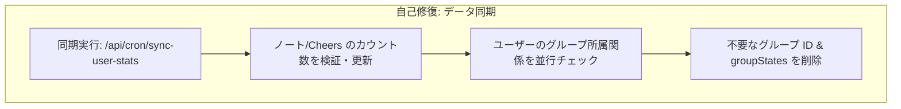

# メンテナンス & バッチジョブ

**scripture-habit** プラットフォームでは、非アクティブなユーザーの管理、古いデータの整理（クリーンアップ）、統計情報の同期を行うために、自動化されたバックグラウンドジョブ（cron）を使用しています。

---

## 1. 非アクティブチェック

**非アクティブチェック（Inactivity Check）** ジョブ（`/api/cron/check-inactive-users`）は、グループのアクティブな状態を維持するために、非アクティブなユーザーをグループから削除（キック）します。

### 1.1 ローテーションベースのスキャン
データベースの負荷を最小限に抑えるため、システムはグループをローテーションでスキャンします：
- `lastInactivityCheckedAt` でソートされた 100 件のグループを取得します（古い順）。
- まだこのタイムスタンプを持っていない新しいグループを優先してチェックします。
- これにより、すべてのグループが少なくとも数日間に 1 回はチェックされます。

### 1.2 アクティビティマーカー
ユーザーがグループ内で以下のいずれかを行うと、アクティビティが記録されます：
- メッセージを送信する。
- ノート（学びのメモ）を投稿する（該当グループに共有する場合）。
- ログインする、またはグループ画面を開く。
これらのアクションを行うと、`groups/{groupId}/members/{uid}` ドキュメントの `lastActiveAt` フィールドが現在時刻に更新されます。

### 1.3 キックしきい値と削除
スキャン中、システムはメンバー全員の `lastActiveAt` を評価します：
1. **ステータス判定**: メンバーが一定期間（デフォルトは 3 日間）非アクティブである場合、そのメンバーは「非アクティブ」とみなされます。
2. **所有者の特別扱い**: グループ所有者（オーナー）はキックされませんが、非アクティブカウンターが増加します。
3. **自動キック**: 非オーナーが非アクティブ状態になると、グループから自動的に削除されます。
4. **グループの削除**: グループメンバーが全員非アクティブになった場合（メンバー数が 0 になるか、残った唯一のメンバーであるオーナーが非アクティブしきい値に達した場合）、グループおよびそのすべてのメッセージ・メンバーサブコレクションが自動的に削除（パージ）されます。

---

## 2. グループ所有権の移行（オーナー昇格）

グループのオーナーが非アクティブになった場合：
1.  **選出**: システムがすべてのアクティブなメンバーを特定します。
2.  **昇格**: 最もアクティブ、または最も長く在籍しているメンバーが新しいオーナーに昇格します。
3.  **削除**: アクティブなメンバーが一人も残っていない場合、グループはメッセージや統計情報とともに削除されます。

---

## 3. メッセージの TTL (Time-To-Live)

グループチャットにメッセージが増えすぎると、リアルタイムクエリが遅くなり、データベースのコストが増加します。これを防ぐために、`messages` コレクショングループに対して Firestore TTL（Time-To-Live）を設定します。

- **自動削除**: すべてのメッセージドキュメントには、作成から30日後の時刻を示す `expireAt` フィールドが付与されます。
- **バックグラウンド削除**: 現在時刻が `expireAt` を超えると、Firestore は自動的に対象ドキュメントを削除します。
- **ノートの保護**: グループチャット内の共有ノートコピー（`isNote: true` メッセージ）は TTL で削除されますが、`/users/{uid}/notes/{noteId}` に保存されているユーザーのオリジナルノートは永久に保持されます。

---

## 4. セキュリティ & シークレットの検証

すべての cron エンドポイントは、リクエストヘッダーに `CRON_SECRET` トークンを必要とします（`Authorization: Bearer <secret>`）。これにより、承認されたサービス（Vercel Cron や GitHub Actions など）のみがメンテナンスや管理ジョブを実行できるようになります。

---

## 5. データの整合性 & 自己修復同期ジョブ

ネットワークエラー、レースコンディション（競合状態）、または中断されたクライアントによる長期的なデータの劣化を防ぐため、バックエンドには自己修復（Self-Healing）を行うバックグラウンド同期ジョブが含まれています。

### 5.1 ユーザー統計およびメンバーシップの検証 (`/api/cron/sync-user-stats`)
このジョブは、アクティブなユーザー（過去 24 時間以内に投稿したユーザー）を 100 件のバッチ単位で対象とし、その統計情報を物理データベースの絶対的な真実と一致させます：
- **物理カウントの検証**:
  - ユーザーの `notes` サブコレクション内のドキュメントをカウントし、`users/{uid}/totalNotes` を更新します。
  - `targetUid == uid` である `cheers` コレクション内のドキュメントをカウントし、`users/{uid}/cheersReceived` を更新します。
- **不要なメンバーシップの整理（自己修復）**:
  - ユーザーの `groupIds` 配列を取得し、`db.getAll` を使用して、対応する `groups/{groupId}/members/{uid}` ドキュメントが実際に存在するか確認します。
  - グループが削除されたか、ユーザーがキックされたにもかかわらず、ユーザープロファイルが更新されていなかった場合、システムはユーザーの `groupIds` 配列からグループ ID を**自動的に削除**し、古い `users/{uid}/groupStates/{groupId}` 状態ドキュメントを削除します。
  - すべての操作は、**400件の操作**ごとにコミットされる Firestore Batches を使用して書き込まれます。

### 5.2 不要な Cheers のクリーンアップ (`/api/cron/cleanup-orphaned-cheers`)
アカウントやグループが削除されると、ソーシャルインタラクションノード（Cheers）が孤立（親要素がない状態に）することがあります。
- **孤立ノードの整理（スイーパー）**:
  - `lastCheckedAt` でソートされた 200 件の Cheers を取得します（チェックが最も古いものから順に）。
  - `db.getAll` を並行して使用し、関連する `groupId`、`senderUid`、および `targetUid` が Firestore にまだ存在するかどうかを検証します。
- **自動削除**:
  - 関連するエンティティのいずれかが欠落している場合、Cheer ドキュメントは即座に削除されます。
  - すべてのエンティティが有効な場合、Cheer の `lastCheckedAt` タイムスタンプが現在時刻に更新され、キューの最後に移動します。

### 5.3 AI パートナーグループのデイリーノート自動投稿 (`/api/cron/post-ai-daily-notes`)
AI パートナー学習グループ（`isAiGroup: true`）に対して、毎日の聖句ノートを自動生成・投稿します：
- **自動投稿**: `AiDailyNoteService` と Gemini AI を使用して、読書プランに基づいた学習ノートを自動投稿します。
- **メッセージキャッシュ同期**: 投稿後、最新メッセージキャッシュ（`messages_latest/latest`）を自動で再計算・同期し、チャットのリアルタイムプレビューを常に最新に保ちます。

### 5.4 デモ用匿名サンドボックスの自動破棄 (`/api/cron/cleanup-demo-sandboxes`)
一時的なデモ環境のデータがデータベースに蓄積されるのを防ぎます：
- **TTL 有効期限判定**: 1時間（`DEMO_TTL_MS`）以上経過した匿名デモアカウント（`isAnonymousDemo: true`）を自動抽出します。
- **完全削除**: デモグループ、ユーザーサブコレクションの再帰削除（`recursiveDelete`）を実行し、Firebase Auth の匿名アカウントも削除して完全消去します。

---

## 6. 診断 & 模擬実行 (ドライラン)

### 6.1 非アクティブチェックのシミュレーション (`/api/cron/test-inactive-check/:groupId`)
データベースを変更することなく、グループの非アクティブ状態をレビューするための安全な読み取り専用の診断 API を開発者や管理者に提供します。
- **シミュレートされるアクション**: すべてのメンバーの非アクティブメトリクスを計算し、実際の非アクティブ cron が*どのような*アクション（修復、初期化、維持、または削除）を実行するかを報告します。
- **ゴーストメンバーの検出**: 「ゴーストメンバー」（ルートグループの `members` 配列には存在するが、`groups/{groupId}/members` サブコレクション内に対応するドキュメントがないユーザー）を明示的に特定し、自動修復の対象としてマークします。

---

## 7. データ整理 & 自己修復メンテナンスフロー

