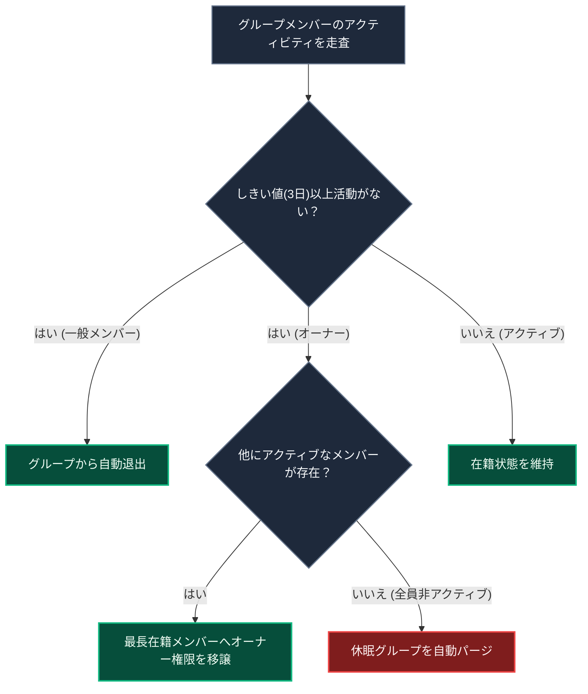

# 定期メンテナンス ＆ Cron ジョブ

このドキュメントでは、休眠メンバーの自動退出、グループオーナー権限の自動移譲、データ整合性の自動修復、および Firestore TTL によるメッセージ自動削除について解説します。

---

## 1. 定期ジョブの一覧

すべての Cron ジョブは `Authorization: Bearer <CRON_SECRET>` ヘッダーにより保護され、Vercel Cron を通じて定期実行されます。

| エンドポイント | 実行頻度 | 主な役割 |
| :--- | :--- | :--- |
| `/api/cron/check-inactive-users` | 毎日 (00:00 UTC) | 3日以上非アクティブなメンバーの自動退出・オーナー移譲 |
| `/api/cron/sync-user-stats` | 毎日 | ノート総数や所属グループの不整合を自動修復 |
| `/api/cron/cleanup-orphaned-cheers` | 毎日 | 削除済みユーザー・グループに関連する不要なエールデータを整理 |
| `/api/cron/post-ai-daily-notes` | 毎日 | AI パートナーグループへの日課ノート自動投稿 |
| `/api/cron/cleanup-demo-sandboxes` | 毎時 | 1時間以上経過したデモ用匿名アカウントの自動削除 |

---

## 2. 非アクティブユーザーの自動退出 ＆ オーナー交代

グループの休眠化を防ぎ、アクティブな相互作用を維持するための自動化フローです。

### 自動化フローの解説

1. **アクティビティの判定**  
   ノート投稿、メッセージ閲覧、画面アクティブ化で更新される `lastActiveAt` をもとに非アクティブ状態を判定します。
2. **権限移譲と退出**  
   一般メンバーは自動退出となり、オーナーが非アクティブの場合はグループ最古参のアクティブメンバーへオーナー権限が自動委譲されます。
3. **休眠グループのパージ**  
   メンバー全員が非アクティブとなったグループは、データベースから安全に削除・解散されます。

---

## 3. チャット履歴の自動整理 (Firestore TTL)

チャットメッセージには作成から 30 日後に自動失効する `expireAt` タイムスタンプが付与され、Google Cloud Firestore の TTL 機能によりバックグラウンドで自動パージされます（※個人のスタディノートアーカイブは永久保持されます）。

---

## 4. 関連ドキュメント

- [非アクティブ自動退出ロジック](./inactivity-and-autokick.md)
- [CI/CD ＆ メンテナンス自動化](./cicd-maintenance-automation.md)
- [データベース ＆ セキュリティ設計](./database-security.md)
