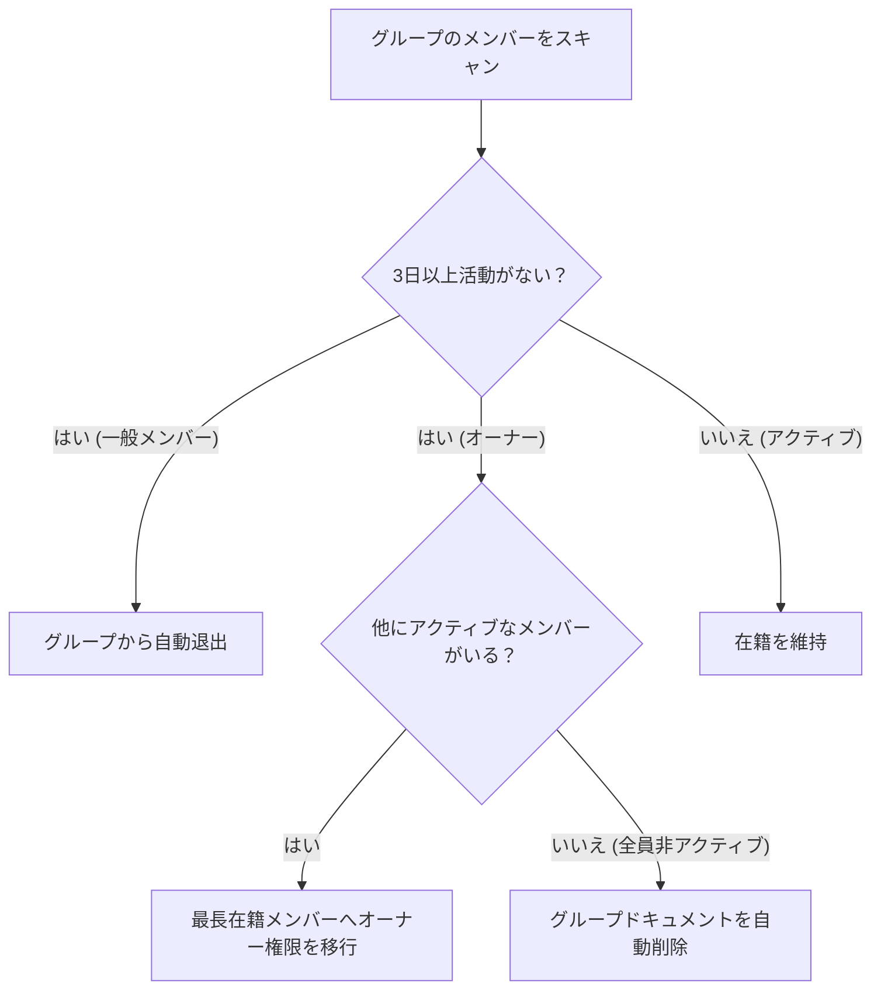

# 定期メンテナンス ＆ Cron ジョブ

このドキュメントでは、非アクティブユーザーの自動退出、グループオーナーの自動交代、データの整合性同期、および Firestore TTL によるメッセージ自動削除について解説します。

---

## 1. 定期ジョブの一覧

すべての Cron ジョブは `Authorization: Bearer <CRON_SECRET>` ヘッダーにより認証され、定期的に実行されます：

| エンドポイント | 実行頻度 | 主な役割 |
| :--- | :--- | :--- |
| `/api/cron/check-inactive-users` | 毎日 (00:00 UTC) | 3日以上非アクティブなメンバーの自動退出・オーナー交代 |
| `/api/cron/sync-user-stats` | 毎日 | ノート総数や所属グループの不整合を自動修復 |
| `/api/cron/cleanup-orphaned-cheers` | 毎日 | 削除済みユーザー・グループに関連する不要な応援データを整理 |
| `/api/cron/post-ai-daily-notes` | 毎日 | AI パートナーグループへの日課ノート自動投稿 |
| `/api/cron/cleanup-demo-sandboxes` | 毎時 | 1時間以上経過したデモ用匿名アカウントの自動削除 |

---

## 2. 非アクティブユーザーの自動退出 ＆ オーナー交代

グループの過疎化を防ぎ、アクティブな学習環境を保つための仕組みです：

- **アクティビティの判定**: ノート投稿、チャット送信、アプリへのログインで `lastActiveAt` が更新されます。
- **孤立グループの整理**: 全員が非アクティブになったグループは、Firestore のサブコレクションを含めて自動的に削除されます。

---

## 3. チャット履歴の自動整理 (Firestore TTL)

チャットメッセージは作成から 30 日後に自動失効する `expireAt` タイムスタンプが付与され、Firestore の TTL 機能によりバックグラウンドで自動削除されます。
（※ユーザーのマイノート画面にある個人の学習記録は永久に保持されます）

---

## 4. 関連ドキュメント

- [非アクティブ自動退出ロジック](./inactivity-and-autokick.md)
- [CI/CD ＆ メンテナンス自動化](./cicd-maintenance-automation.md)
- [データベース ＆ セキュリティ設計](./database-security.md)
