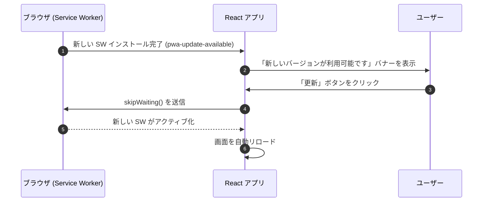

# 監視 ＆ オブザーバビリティ

このドキュメントでは、Sentry によるエラー追跡、パフォーマンストレース、不要なエラーログの抑制、および PWA の更新管理について解説します。

---

## 1. Sentry によるエラー追跡とパフォーマンス監視

アプリケーションのエラーやパフォーマンス低下を検知するため、フロントエンド・バックエンド双方で Sentry を導入しています：

- **パフォーマンストレース (`tracesSampleRate: 0.1`)**:
  リクエストの 10% をサンプリングし、レスポンスの遅い API やレンダリングのボトルネックを特定。
- **セッションリプレイ (`replaysOnErrorSampleRate: 1.0`)**:
  エラー発生時のユーザー操作（直前の一連の挙動）を記録し、問題再現を容易にします。
- **トランザクション名の正規化**:
  URL パラメータを含むルート（`/api/groups/:groupId` など）は抽象化されたパス名で記録し、メトリクスが分散するのを防止。

---

## 2. ログノイズの抑制 (`ignoreErrors`)

ユーザーの通常操作に伴う想定内のエラー（キャンセル等）は Sentry への送信を抑制し、重要なエラーの埋没を防ぎます：

- **`AbortError`**: 画面遷移やタブの切り替えで通信が中断された場合のエラー。
- **`permission-denied` (ログアウト時)**: ログアウト直後に Firestore リスナーが切断される際の一時的なエラー。

---

## 3. PWA の更新通知ライフサイクル

Service Worker の新しいバージョンが検出された際、ユーザーへスムーズに更新を促します：

---

## 4. 関連ドキュメント

- [全体アーキテクチャ](./architecture.md)
- [API 設計 & エラーハンドリング](./api-middleware-error-handling.md)
- [CI/CD ＆ メンテナンス自動化](./cicd-maintenance-automation.md)
