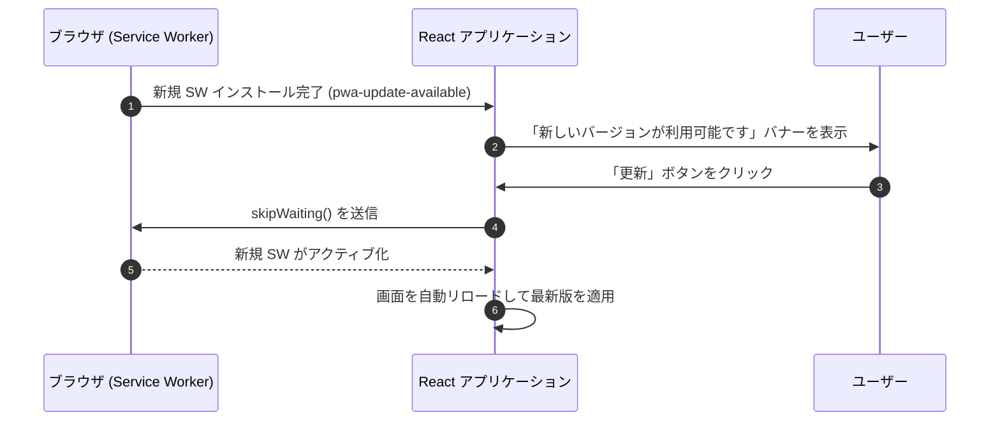

# 監視 ＆ オブザーバビリティ

このドキュメントでは、Sentry によるエラー追跡、分散パフォーマンストレース、ログノイズの抑制フィルター、および PWA 更新ライフサイクルの監視体制について解説します。

---

## 1. Sentry によるエラー追跡とパフォーマンス監視

フロントエンドおよびバックエンド双方で Sentry を統合し、エラー検知とレイテンシ分析を実施しています。

- **パフォーマンストレース (`tracesSampleRate: 0.1`)**:  
  全リクエストの 10% をサンプリングし、API レスポンスの遅延やレンダリングボトルネックを特定します。
- **セッションリプレイ (`replaysOnErrorSampleRate: 1.0`)**:  
  エラー発生時のユーザー操作（直前の UI 挙動）を記録し、迅速な不具合再現を可能にします。
- **トランザクション名の正規化**:  
  動的パラメータを含むパス（`/api/groups/:groupId` 等）を抽象化名で集約し、メトリクス集計の分散を防ぎます。

---

## 2. ログノイズの抑制 (`ignoreErrors`)

ユーザーの通常操作に伴う想定内のキャンセルイベントをフィルターし、重要アラートの埋没を防止します。

- **`AbortError`**: 画面遷移やタブ切り替えに伴う通信中断。
- **`permission-denied` (ログアウト時)**: サインアウト直後に Firestore リスナーが破棄される際の一時的切断。

---

## 3. PWA の更新通知ライフサイクル

Service Worker の新規バージョン検出時、セッションを損なわずに更新を適用するライフサイクルです。

### ライフサイクルの解説

1. **バックグラウンド検知**  
   ブラウザが新しい Service Worker のインストールを完了すると、アプリへ `pwa-update-available` イベントが届きます。
2. **非侵入型の通知**  
   ユーザーの作業を妨げないバナーを表示し、明示的な更新アクションを受け付けます。
3. **安全なアクティベーション**  
   `skipWaiting()` により新しいキャッシュへ切り替え、ページをリロードして最新アセットを即時適用します。

---

## 4. 関連ドキュメント

- [全体アーキテクチャ](./architecture.md)
- [API 設計とエラー処理](./api-middleware-error-handling.md)
- [CI/CD ＆ メンテナンス自動化](./cicd-maintenance-automation.md)
